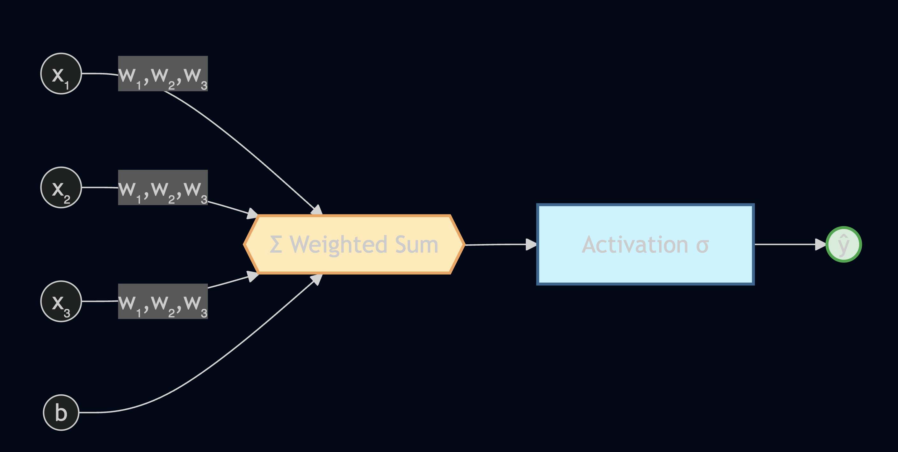
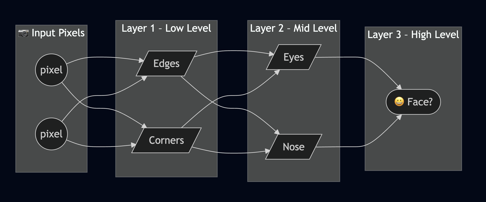
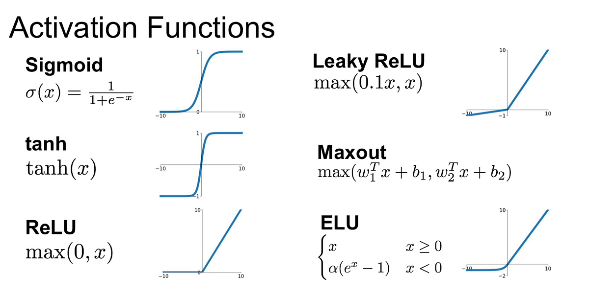
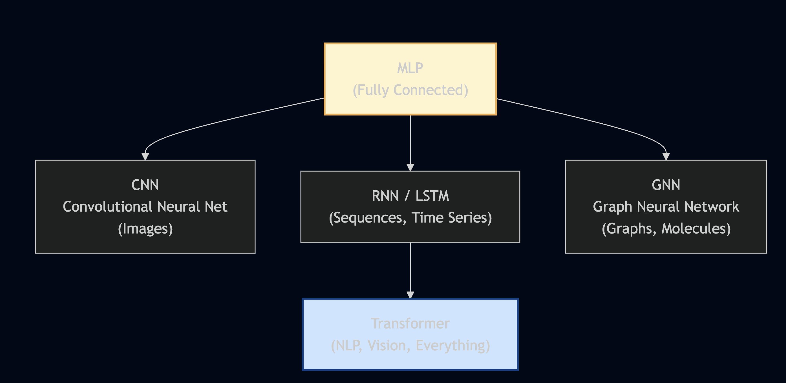

# 📘 Deep Learning Basics — Notes

## 📚 Table of contents
1. [Neurons: Biology → Math](#sec-1)
2. [Perceptron as a Linear Classifier + the XOR crisis](#sec-2)
3. [MLP: Why stacking layers creates power](#sec-3)
4. [Activation functions (the non-linearity)](#sec-4)
5. [Training loop: forward → loss → backprop → update](#sec-5)
6. [Optimization: learning rate + optimizers](#sec-6)
7. [Generalization: overfitting + regularization](#sec-7)
8. [Modern architecture primer](#sec-8)
9. [Quick revision sheet](#sec-9)
10. [Practice set](#sec-10)
11. [Appendix: glossary, resources, common bugs](#sec-app)

---

## 🔤 Notation cheat sheet
| Symbol | Meaning |
|---|---|
| $x$ | input features (numbers you feed into the model) |
| $w$ | weights (learned importance of each feature) |
| $b$ | bias (learned offset / threshold shift) |
| $z$ | **logit** = pre-activation value ($w^Tx+b$) |
| $\sigma$ | activation function (e.g., sigmoid, ReLU) |
| $\hat{y}$ | prediction |
| $\mathcal{L}$ | loss (how wrong we are) |
| $\eta$ | learning rate |

---

## 🧠 1. Neurons: Biology → Math

Welcome! Today we are crossing the bridge from Classical Machine Learning into Deep Learning. To build artificial intelligence, we first need to look at the only intelligent machine we know that actually works: **the human brain**.

In biology, a single brain cell is called a neuron. It has three main parts:
1. **Dendrites:** These are the receivers. They listen for signals from other neurons.
2. **The Soma (Cell Body):** This is the processor. It gathers all the incoming signals.
3. **The Axon:** This is the transmitter. If the accumulated signal is strong enough, the neuron 'fires' an electrical pulse down the axon to the next neuron.

### 🧠 Biological Neuron Diagram

### 🔁 Mapping to mathematics

| Biology (The Brain) | Artificial Intelligence (Math) | Why do we need this? |
| ------------------- | ------------------------------ | -------------------- |
| **Dendrites**       | Inputs ($x_1, x_2$)            | We need raw data (like pixels of an image) to feed our system. |
| **Synapse Strength**| Weights ($w_1, w_2$)           | Some signals are more important than others! Weights act as a 'volume knob' for each input. |
| **Soma**            | Summation ($\Sigma$)           | We need to mathematically add all the signals together. |
| **Axon Threshold**  | Bias ($b$)                     | The neuron needs a minimum signal level before it fires. Bias sets that threshold. |
| **Firing / No Firing** | Activation Function $\sigma$ | A non-linear on/off switch to enable complex patterns. |
| **Axon**            | Output ($\hat{y}$)             | The final decision: 'Yes, it's a dog' or 'No, it's a cat'. |

---

### 💡 The core equation (one neuron)
$$
\hat{y} = \sigma\!\left(\sum_{i=1}^{n} w_i x_i + b\right) = \sigma(\mathbf{w}^T \mathbf{x} + b)
$$

This equation is an **artificial neuron** (a perceptron).

**Important idea:** deep learning is not “new math” — it’s *this same computation repeated many times* + learned using gradients.

#### Vector form (how we actually implement it)
- Inputs: $\mathbf{x} \in \mathbb{R}^n$
- Weights: $\mathbf{w} \in \mathbb{R}^n$

Then:
$$
z = \mathbf{w}^T\mathbf{x} + b, \qquad \hat{y} = \sigma(z)
$$

### 🧮 Worked example — One neuron 

Suppose we have 3 inputs and choose:

- Inputs: $\mathbf{x} = [2, 3, 1]$
- Weights: $\mathbf{w} = [0.1, 0.2, -0.3]$
- Bias: $b = 0.5$

Compute the pre-activation:
$$
z = \mathbf{w}^T\mathbf{x} + b = (0.1)(2) + (0.2)(3) + (-0.3)(1) + 0.5 = 1.0
$$

If we use sigmoid, the prediction is:
$$
\hat{y} = \sigma(z) = \frac{1}{1+e^{-1.0}} \approx 0.731
$$

---

### ✅ Checkpoint
Imagine we are building a neuron to decide *if we should buy a house*. The inputs ($x$) are 'Square Footage', 'Distance to School', and 'Color of the front door'. Which input should have the largest weight ($w$), and which should be close to zero?
*Think about which features actively affect the desirability of a house! Negative weights mean the feature actively hurts the prediction.*

---

---

## 🧠 2. Perceptron as a Linear Classifier + the XOR crisis

A single Perceptron is a single neuron making a binary decision (Yes or No). It is incredibly fast. But historically, this simple equation almost destroyed AI research in the 1970s.

### 📌 The linear classifier view
A single perceptron is a **linear classifier**.

If you have only two features ($x_1, x_2$), the boundary is a line:
$$
w_1x_1 + w_2x_2 + b = 0
$$

If you have three features, the boundary is a plane. In general, it’s a **hyperplane**.

### ❌ The limitation (the XOR “gotcha”)
But the real world is messy! What if the data points are arranged diagonally, like an XOR logic gate? You physically *cannot* separate them with a single straight line. This caused funding for AI to dry up for a decade, known as the **'AI Winter'**.

### 📉 Linear Decision Boundary

### 🧮 Worked example — XOR as a table

XOR is defined by these four points:

| $x_1$ | $x_2$ | $y$ |
|---:|---:|---:|
| 0 | 0 | 0 |
| 0 | 1 | 1 |
| 1 | 0 | 1 |
| 1 | 1 | 0 |

If you plot these points in the plane, the $y=1$ points lie on the *off-diagonal*, and the $y=0$ points lie on the *diagonal*. No single straight line can separate those two groups.

### 📜 Micro-history (why this matters)
| Year | Event |
|------|-------|
| 1958 | Rosenblatt invents the Perceptron |
| 1969 | Minsky & Papert publish *Perceptrons* — prove XOR limitation |
| 1970s–80s | **AI Winter** — funding collapses |
| 1986 | Rumelhart, Hinton & Williams publish backpropagation |
| 1989 | Universal Approximation Theorem proved — MLPs can approximate *any* function |
| 2012 | AlexNet wins ImageNet — Deep Learning era begins |

---

---

## 🧠 3. MLP: Why stacking layers creates power

So, how did we rescue AI? The solution was simple but profound: What if we don't just use *one* neuron? What if we stack them into layers? This is called a **Multilayer Perceptron (MLP)**, and this is where **Deep Learning** is officially born.

### 📌 Why does depth matter?
Imagine trying to recognize a human face. A single neuron can't do it — it's too complex! But an MLP breaks the problem down hierarchically:
* **Layer 1:** Learns to detect simple horizontal and vertical lines (edges).
* **Layer 2:** Combines those lines to detect shapes (circles for eyes, curves for a smile).
* **Layer 3:** Combines the shapes to recognize an entire face!

One way to picture this hierarchy:

**Input pixels → edges/corners → parts (eyes/nose) → whole object (face)**

### 📐 Universal Approximation Theorem (UAT)
> "A neural network with **at least one hidden layer** and a non-linear activation can approximate **any continuous function** to arbitrary precision, given enough neurons."

This is the theoretical foundation that justifies all of deep learning. It says: if your problem can be described mathematically, a neural network can learn it.

### 🧠 Key implementation idea: layers are matrix multiplies
If your input is a vector $\mathbf{x}$:
- A linear layer computes $\mathbf{z} = W\mathbf{x} + \mathbf{b}$
- Then activation: $\mathbf{h} = \sigma(\mathbf{z})$

**Shapes** (quick reference):
| Object | Shape |
|---|---|
| $\mathbf{x}$ | $(n,)$ |
| $W$ | $(m, n)$ |
| $\mathbf{b}$ | $(m,)$ |
| $\mathbf{z}$ | $(m,)$ |

An MLP forward pass is repeated application of:

1. **Linear step:** $\mathbf{z} = W\mathbf{x} + \mathbf{b}$
2. **Non-linearity:** $\mathbf{h} = \sigma(\mathbf{z})$

Stacking these steps multiple times lets the network build increasingly rich features.

---

---

## 🧠 4. Activation functions (the non-linearity)

If you stack 100 linear layers together, the math collapses down into just *one* linear layer — you've wasted all that depth. To prevent this, we inject non-linearity between every layer. This is the **Activation Function**.

### 📌 The “decision switch” analogy
Think of the activation function as a bouncer at a club. The neuron receives a signal. The bouncer decides: 'Is this signal important enough to let through to the next layer? Or kill it here?'

### 🛡️ Activation function reference (practical)

| Activation | Formula | Output Range | Best For | Pitfall |
| ----------- | ------- | ------------ | -------- | ------- |
| **Step**    | $\mathbf{1}[z \geq 0]$ | $\{0, 1\}$ | Historical only | Non-differentiable → can't backprop |
| **Sigmoid** | $\frac{1}{1+e^{-z}}$ | $(0, 1)$ | Binary output head | Vanishing gradient for large $\|z\|$ |
| **Tanh**    | $\frac{e^z - e^{-z}}{e^z + e^{-z}}$ | $(-1, 1)$ | RNNs, zero-centered | Still saturates |
| **ReLU**    | $\max(0, z)$ | $[0, \infty)$ | Hidden layers (default) | Dead neurons if LR too high |
| **Leaky ReLU** | $\max(0.01z, z)$ | $(-\infty, \infty)$ | Fixes dead ReLU | Hyperparameter $\alpha$ to tune |
| **ELU**     | $z$ if $z>0$, else $\alpha(e^z-1)$ | $(-\alpha, \infty)$ | Smoother than ReLU | Slower to compute |
| **GELU**    | $z \cdot \Phi(z)$ | approx $(-0.17, \infty)$ | Transformers (BERT, GPT) | Complex computation |
| **Softmax** | $\frac{e^{z_i}}{\sum e^{z_j}}$ | $(0,1)$, sum=1 | Multi-class output head | Numerically unstable; use log-softmax |
| **Swish**   | $z \cdot \sigma(z)$ | $(-0.28, \infty)$ | Deep networks (EfficientNet) | Slightly more compute |

### 🔍 Sigmoid vs Tanh vs ReLU

<!--  -->

### 🔍 Vanishing gradients (why sigmoid is rarely used in hidden layers)
When sigmoid outputs are near 0 or 1, its derivative is almost zero. In a 10-layer network, multiply ten near-zero gradients together — the gradient signal reaching early layers is essentially **zero**. The first layers never learn. This is the **Vanishing Gradient Problem**, and it's why ReLU became dominant.

$$
\frac{d}{dz}\sigma(z) = \sigma(z)(1-\sigma(z)) \approx 0 \text{ when } |z| \text{ is large}
$$

<!-- ### ⚠️ Vanishing Gradient Illustration -->
<!--  -->

### ✅ The most important pairing table (memorize this)
| Task | Output layer activation | Recommended loss |
|---|---|---|
| Binary classification (single label) | Sigmoid | Binary cross-entropy (often computed from logits for numerical stability) |
| Multi-class (exactly one class) | Softmax | Cross-entropy (often computed from logits for numerical stability) |
| Multi-label (multiple independent labels) | Sigmoid per label | BCE per label |
| Regression | None / Linear | MSE / MAE / Huber |

---

---

## 🧠 5. Training loop: forward → loss → backprop → update

How does the model actually *learn*?

It repeats this loop many times:
1. **Forward pass** (compute predictions)
2. **Loss** (measure error)
3. **Backward pass** (compute gradients)
4. **Update** (optimizer changes parameters)

### 🔄 Training Loop Diagram

Training loop in words:

**Inputs → forward pass → predictions → loss → gradients (backward pass) → parameter update → repeat**

## 📌 The Setup
* **Problem:** Predict if a person passes a test ($y_{true}=1$).
* **Inputs:** Studied 2 hours ($x_1 = 2$), Slept 3 hours ($x_2 = 3$).
* **Initial Weights (random):** $w_1 = 0.1$, $w_2 = 0.2$, Bias $b = 0.5$.

---

### 🔁 Phase 1: Forward propagation

$$
z = w_1 x_1 + w_2 x_2 + b = (0.1)(2) + (0.2)(3) + 0.5 = 1.3
$$
$$
\hat{y} = \sigma(1.3) = \frac{1}{1+e^{-1.3}} \approx 0.785
$$

Our untrained network guesses **78.5%** chance of passing. True answer is **100%**. We need to quantify this error.

---

### 📉 Phase 2: Loss calculation

**Binary Cross-Entropy (the right loss for binary classification):**
$$
\mathcal{L}_{BCE} = -\left[ y \log(\hat{y}) + (1-y)\log(1-\hat{y}) \right]
$$
$$
= -[1 \cdot \log(0.785) + 0 \cdot \log(0.215)] = -\log(0.785) \approx 0.242
$$

**Mean Squared Error (MSE)** *(okay for regression; not ideal for probability outputs)*:
$$
\mathcal{L}_{MSE} = \frac{1}{2}(y - \hat{y})^2 = \frac{1}{2}(1 - 0.785)^2 \approx 0.023
$$

| Problem Type | Correct Loss | Output Activation |
|---|---|---|
| Binary classification | Binary Cross-Entropy | Sigmoid |
| Multi-class classification | Categorical Cross-Entropy | Softmax |
| Regression | Mean Squared Error / MAE | None (linear) |
| Multi-label classification | Binary Cross-Entropy (per label) | Sigmoid (per output) |

---

### 🔙 Phase 3: Backpropagation (chain rule)

Backpropagation uses the **Chain Rule of Calculus** to send the error backward through the network and assign blame to each weight.

$$
\frac{\partial \mathcal{L}}{\partial w_1} = \underbrace{\frac{\partial \mathcal{L}}{\partial \hat{y}}}_{\text{loss gradient}} \cdot \underbrace{\frac{\partial \hat{y}}{\partial z}}_{\text{sigmoid gradient}} \cdot \underbrace{\frac{\partial z}{\partial w_1}}_{= x_1}
$$

**Step-by-step (intuition):**
1. $\frac{\partial \mathcal{L}}{\partial \hat{y}} = \hat{y} - y = 0.785 - 1.0 = -0.215$
2. $\frac{\partial \hat{y}}{\partial z} = \hat{y}(1-\hat{y}) = 0.785 \times 0.215 \approx 0.168$
3. $\frac{\partial z}{\partial w_1} = x_1 = 2$
4. **Gradient:** $\frac{\partial \mathcal{L}}{\partial w_1} = -0.215 \times 0.168 \times 2 \approx -0.072$
5. **Similarly:** $\frac{\partial \mathcal{L}}{\partial w_2} \approx -0.108$, $\frac{\partial \mathcal{L}}{\partial b} \approx -0.036$

### 🔁 Backpropagation Flow

---

### ⚖️ Phase 4: Gradient descent update

$$
w_{\text{new}} = w_{\text{old}} - \eta \cdot \frac{\partial \mathcal{L}}{\partial w}
$$

*(Learning rate $\eta = 1.0$ for easy arithmetic)*

| Parameter | Old Value | Gradient | New Value |
|---|---|---|---|
| $w_1$ | 0.100 | −0.072 | **0.172** |
| $w_2$ | 0.200 | −0.108 | **0.308** |
| $b$   | 0.500 | −0.036 | **0.536** |

---

### 🏆 Phase 5: Next epoch — proof it learned

$$
z' = (0.172)(2) + (0.308)(3) + 0.536 = 1.804
$$
$$
\hat{y}' = \sigma(1.804) \approx \mathbf{0.858}
$$

| Epoch | Prediction $\hat{y}$ | Loss (MSE) |
|-------|---------------------|------------|
| 1     | 0.785               | 0.023      |
| 2     | 0.858               | 0.010      |
| 3*    | ~0.902              | ~0.005     |
| ...   | → 1.000             | → 0.000    |

*epoch 3 values are approximate to show the convergence trend*

Every epoch, the network gets closer to truth.

---

---

## 🧠 6. Optimization: learning rate + optimizers

Backprop tells us *which direction* to move each weight. The optimizer decides *how far* to step. This is a very impactful choice when training a network.

### 📌 Optimizer comparison (what to use in practice)

| Optimizer | Mental Model | Pros | Cons |
|-----------|-------------|------|------|
| **Batch GD** | GPS-planned hike, one step | Exact gradient | Needs full dataset in RAM |
| **SGD** | Blindfolded sprint | Very fast per step | Noisy, oscillates |
| **Mini-Batch SGD** | Small scouting party | Fast + stable | Batch size is a hyperparameter |

### 📉 Gradient Descent Visualization

### 🎛️ Learning rate: the most critical hyperparameter

$$
w \leftarrow w - \eta \nabla_w \mathcal{L}
$$

| Learning Rate $\eta$ | Effect |
|---|---|
| Too large (e.g. 10.0) | Diverges — loss explodes |
| Slightly large (e.g. 0.1) | Oscillates, may not converge |
| **Just right** (~0.001 for Adam) | Smooth convergence |
| Too small (e.g. 1e-6) | Converges but extremely slowly |
### 📊 Learning Rate Effect

### 🖥️ Mini-lab — Compare learning rates
### ✅ Quick thought experiment

If you increase the learning rate by 10×, what would you expect to happen to:

1. The *speed* at which loss decreases early on?
2. The *stability* of training (smooth vs oscillating)?
3. The chance of divergence (loss exploding)?

### ✅ Rule of thumb
- Start with **Adam** and `lr=1e-3`.
- If training is unstable (loss spikes / NaNs), reduce lr by 10×.
- If training is too slow, increase lr slightly (2×), or use a scheduler.

---

---

## 🧠 7. Generalization: overfitting + regularization

Deep networks can memorize the entire training set and still fail spectacularly on new data. A model that scores 99% on training data but 60% on test data is *useless*. Let's teach networks self-control.

### 🔍 Spotting Overfitting — The Three Signals
1. Training loss drops while validation loss climbs (diverging curves).
2. A huge gap between train accuracy and validation accuracy.
3. Model is very confident on training data but uncertain on everything else.

### 📈 Overfitting vs Underfitting

### 🛠️ Regularization Toolkit

| Technique | The Analogy | How It Works | Key Hyperparameter |
| --------- | ----------- | ------------ | ------------------ |
| **L1 (Lasso)** | Budgeting — force most weights to zero | Adds $\lambda\sum\|w\|$ to loss — creates sparse models | $\lambda$ |
| **L2 (Ridge/Weight Decay)** | Spring — pulls weights toward zero | Adds $\frac{\lambda}{2}\sum w^2$ to loss — shrinks all weights | $\lambda$ |
| **Dropout** | Random units stay silent | Randomly zeroes $p$% of neurons each forward pass | $p$ (typically 0.2–0.5) |
| **Early Stopping** | Thermometer beep | Stop training when val loss stops improving | Patience (epochs) |
| **Data Augmentation** | Same idea, many variations | Artificially expand training set with transforms | Transform types |
| **Batch Normalization** | Camera white balance | Normalizes layer inputs; reduces internal covariate shift | Momentum, $\epsilon$ |
| **Label Smoothing** | Teach uncertainty | Replace hard 0/1 labels with 0.1/0.9 | Smoothing factor |

### 🎯 Dropout Visualization

### 🧩 Batch Normalization

### 📊 Batch Normalization

$$
\hat{x} = \frac{x - \mu_B}{\sqrt{\sigma_B^2 + \epsilon}}, \quad y = \gamma \hat{x} + \beta
$$

BatchNorm has learnable parameters $\gamma$ (scale) and $\beta$ (shift). It keeps activations in a healthy range, allows higher learning rates, and acts as a mild regularizer.

### 🖥️ Code — Seeing Overfitting Happen
### ✅ Quick check

If you have a training curve where training loss keeps decreasing but validation loss starts increasing, what does it suggest, and which two regularization techniques would you try first?

### ✅ Practical recipe to reduce overfitting
1. Get more data (or do **augmentation**)
2. Add **weight decay (L2)**
3. Add **dropout**
4. Use **early stopping**
5. Reduce model size

---

---

## 🏗️ 8. Modern architecture primer

The MLP is the ancestor of all modern network architectures.

## 🌐 The Architecture Family Tree

Architecture relationships in words:

- **MLP → CNN** (image feature extraction via convolutions)
- **MLP → RNN/LSTM → Transformer** (sequence modeling → attention-based modeling)
- **MLP → GNN** (learning over graph-structured data)
### 🌐 Architecture Evolution

| Architecture | Key Innovation | Built For | Famous Model |
|---|---|---|---|
| **MLP** | Stacked layers | Tabular data, basics | Any classic NN |
| **CNN** | Weight sharing via convolution | Images, spatial data | ResNet, VGG, EfficientNet |
| **RNN / LSTM** | Recurrent hidden state (memory) | Sequences, time series | LSTM, GRU |
| **Transformer** | Self-attention (global context) | Text, images, audio | BERT, GPT, ViT |
| **GNN** | Message passing on graphs | Molecules, social networks | GCN, GAT |

### 🔍 CNN Example

---

---

### One sentence summary
Deep learning is: **learn parameters $W,b$ in many stacked perceptrons by minimizing loss using gradient descent.**

---

---

---

### 🔗 Interactive Tools
- **TensorFlow Playground:** https://playground.tensorflow.org — no-code, visual weight tuning
- **3Blue1Brown Neural Network Series:** https://www.3blue1brown.com/topics/neural-networks — best visual intuition on the web
- **Andrej Karpathy's micrograd:** https://github.com/karpathy/micrograd — build backprop from scratch in ~100 lines

---

---

## 📚 Appendix

### Appendix A: Glossary of key terms

| Term | One-Line Definition |
|------|---------------------|
| **Neuron / Node** | A single mathematical unit: weighted sum + activation |
| **Weight** | Learnable scalar that scales an input's contribution |
| **Bias** | Learnable offset — shifts the activation threshold |
| **Activation Function** | Non-linear transformation applied after weighted sum |
| **Forward Propagation** | Data flowing input → output through the network |
| **Loss Function** | Measures how wrong the current prediction is |
| **Backpropagation** | Chain rule applied backwards to compute weight gradients |
| **Gradient Descent** | Iterative weight updates in the direction of steepest loss decrease |
| **Learning Rate** | Step size per gradient update — most critical hyperparameter |
| **Epoch** | One full pass through the entire training dataset |
| **Batch Size** | Number of samples processed before one weight update |
| **Overfitting** | Model memorises training data, fails to generalise |
| **Dropout** | Regularisation: randomly zero neurons during training |
| **Batch Normalisation** | Normalises layer inputs per mini-batch; stabilises training |
| **UAT** | Universal Approximation Theorem: a 1-hidden-layer NN can approximate any function |
| **Vanishing Gradient** | Gradients shrink to near zero in early layers, preventing learning |
| **Dead ReLU** | A ReLU neuron stuck outputting zero permanently |

---
