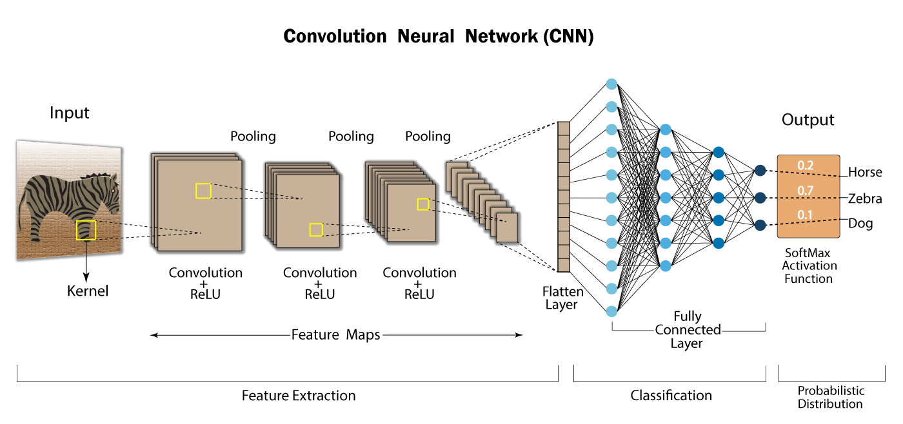

# 🧠 Convolutional Neural Networks (CNNs)

> **Prerequisites:** MLPs, PyTorch basics, training loops
> **By the end of this module you will:** Understand how CNNs work from pixels to predictions, build one from scratch in PyTorch, and know which architecture to use for real problems.

---

## 📋 What You Will Learn

| Topic | Core Idea |
|-------|-----------|
| Why Not MLPs | 3 fundamental reasons images break MLPs |
| Convolution | How filters detect patterns anywhere in an image |
| Pooling, Padding, Stride | Controlling the size and scale of feature maps |
| CNN Architecture | How to stack layers into a working model |
| PyTorch Code | Build and train a real CNN end to end |
| Famous Models | LeNet → AlexNet → VGG → ResNet and why each mattered |

---

---

# CHAPTER 1 — Why MLPs Fail on Images

---

## 1.1 The Parameter Explosion Problem

Before CNNs, people tried flattening images and feeding them into regular MLPs (fully connected networks). It fails badly. Here is why.

**A single 224×224 RGB image has:**
```
224 × 224 × 3 = 150,528 input features
```

If your first hidden layer has 512 neurons:
```
150,528 × 512 = ~77 million parameters
```
That is **77 million numbers to learn** — just in the first layer, before any learning has happened. A network with several such layers would have hundreds of millions of parameters, making training slow, memory usage enormous, and overfitting almost guaranteed.

---

## 1.2 Three Fundamental Problems

### Problem 1 — Parameter Explosion
MLPs treat every pixel as an independent input. For large images this creates an unmanageable number of weights. More parameters means more data needed, slower training, and higher risk of overfitting.

### Problem 2 — No Spatial Awareness
When an MLP flattens the image, pixel at position (0,0) and pixel at position (0,1) — which are neighbors on screen — become disconnected inputs. The MLP has no idea they are next to each other.

> **Test this:** If you randomly shuffle ALL the pixels of an image before feeding it to an MLP, the MLP sees exactly the same input as before (same numbers, different order). It cannot tell the difference. That is fundamentally broken for image understanding.

Images have **local structure** — edges, textures, and shapes only make sense because nearby pixels relate to each other.

### Problem 3 — No Translation Invariance
A cat in the top-left corner of an image looks completely different to an MLP than the same cat in the bottom-right corner — because the pixel positions in the flattened vector are completely different.

A good image model should recognize a cat **wherever** it appears.

---

## 1.3 How CNNs Solve All Three Problems

| Problem | CNN Solution |
|---------|--------------|
| Parameter explosion | **Weight sharing** — one filter covers the whole image using only 9 weights |
| No spatial awareness | **Local receptive fields** — each neuron connects to a small patch |
| No translation invariance | **Sliding filter** — same detector scans every position |

---

## 1.4 What is a CNN?

**Definition:** A **Convolutional Neural Network (CNN)** is a deep learning architecture designed for grid-like data (images, audio spectrograms, video frames) that learns to detect spatial patterns through small learnable filters called **kernels** or **filters**.

**Core Idea — Look Locally, Understand Globally:**
- Instead of connecting every pixel to every neuron, a CNN connects each neuron to only a small local region of the image
- The same filter slides across the entire image — it learns to detect a feature (like a vertical edge) anywhere
- Deeper layers combine simple features into complex ones

**The Hierarchy of Features:**
```
Layer 1  →  edges, color gradients, corners
Layer 2  →  textures, curves, simple shapes
Layer 3  →  object parts (eyes, wheels, doors)
Layer 4+ →  full objects (faces, cars, animals)
```

**Real-World Analogy:** Think of how you read a newspaper. Your eyes do not process the entire page at once — they scan a small window at a time (a few words or a corner of a photo). As the window moves, you build a complete understanding of the page. That scanning window is exactly what a convolution filter does.


---

---

# CHAPTER 2 — The Convolution Operation

---

## 2.1 What is a Filter (Kernel)?

**Definition:** A **filter** (also called a **kernel**) is a small matrix of learnable weights — typically 3×3 or 5×5 — that slides across the input image to detect a specific visual pattern such as an edge, curve, or texture.

**Three key properties:**
- **Small** — usually 3×3, 5×5, or 7×7 regardless of image size
- **Learnable** — the network discovers what to detect via backpropagation
- **Shared** — the same filter is applied at every position in the image

**Example: Vertical Edge Detector (Sobel Filter)**
```
-1   0   1
-2   0   2
-1   0   1
```
When this slides across an image, it produces a high value wherever there is a vertical edge and near-zero everywhere else.

---

## 2.2 The Convolution Operation — Step by Step

**How it works:**

1. Place the filter over a region of the image (called the **receptive field**)
2. Multiply each filter weight with the corresponding pixel value (element-wise)
3. Sum all the products → one single number (the **activation** for that position)
4. Slide the filter to the next position by **stride** pixels
5. Repeat until the filter has scanned the entire image
6. The result is a 2D grid of values called the **Feature Map** or **Activation Map**

**Worked Example:**
```
Input patch (3×3):          Filter (3×3):
  1   2   3                   1   0  -1
  4   5   6                   1   0  -1
  7   8   9                   1   0  -1

Element-wise multiply, then sum:
(1×1) + (2×0) + (3×-1)   →   1 + 0 - 3  = -2
(4×1) + (5×0) + (6×-1)   →   4 + 0 - 6  = -2
(7×1) + (8×0) + (9×-1)   →   7 + 0 - 9  = -2

Total = -2 + (-2) + (-2) = -6
This -6 becomes one value in the feature map.
```

**Mathematical formula:**
```
Feature_Map(i, j) = Σ_m Σ_n  Input(i+m, j+n) × Filter(m, n)
```

**What the feature map tells you:**
- **High positive value** at position (i,j) → the filter's pattern was found there
- **Near zero or negative value** → the pattern was NOT present there

---

## 2.3 Multiple Filters → Multiple Feature Maps

One filter detects one type of feature. In practice we use **many filters** simultaneously — each one scanning for a different pattern.

```
Input Image (H × W × C)
       ↓   32 filters applied in parallel
32 Feature Maps (H' × W' × 32)
```

After applying 32 filters to a 28×28 image with a 3×3 filter and no padding:
```
Output shape: (26, 26, 32)
```
This is a 3D tensor — a **stack of feature maps**, one per filter.

Each filter specializes: one might detect horizontal edges, another detects diagonal ones, another responds to red blobs, and so on.

---

## 2.4 Weight Sharing — Why it is Brilliant

**Definition:** **Weight sharing** means the same filter weights are used at every spatial position as the filter slides. The weights do NOT change as the filter moves.

**Why this matters:**
- A 3×3 filter has only 9 weights — regardless of whether your image is 28×28 or 1000×1000
- The same edge-detector works whether the edge is at position (5,5) or (100,200) — translation invariance for free
- Fewer parameters means less overfitting and faster training

**Parameter count comparison:**
```
MLP on 28×28 image with 32 neurons in first layer:
28 × 28 × 32 = 25,088 parameters

Conv layer with 32 filters of size 3×3 (grayscale):
3 × 3 × 1 × 32 + 32 bias = 320 parameters

CNNs use 87× fewer parameters for the same representational power.
```

---

## 2.5 Activation After Convolution

After every convolution, we apply **ReLU** — exactly like in MLPs:

```python
output = ReLU(conv(input))   # ReLU(x) = max(0, x)
```

Without activation functions, stacking multiple conv layers would just be one big linear operation. ReLU introduces the non-linearity that allows the network to learn complex patterns.

---

---

# CHAPTER 3 — Padding, Stride, and Pooling

---

## 3.1 The Shrinking Problem

Every convolution reduces the spatial size of the output. With a 3×3 filter on a 5×5 input, the output is only 3×3. In a deep network with many layers, this rapid shrinkage destroys spatial information.

**Output size formula:**
```
Output Size = (Input Size − Filter Size) / Stride + 1
Example: (5 − 3) / 1 + 1 = 3
```

---

## 3.2 Padding

**Definition:** **Padding** adds extra rows and columns of zeros around the border of the input before convolution, so the output can be the same size as the input.

| Padding Type | PyTorch Argument | Effect |
|-------------|-----------------|--------|
| No padding | `padding=0` | Output shrinks |
| Same padding | `padding=1` (with 3×3 filter) | Output same size as input |

```python
# 3×3 filter with padding=1 keeps 28×28 input as 28×28 output
nn.Conv2d(in_channels=1, out_channels=32, kernel_size=3, padding=1)
```

**Why padding matters:**
1. Preserves spatial dimensions across many layers
2. Preserves border information — without padding, edge pixels are convolved fewer times than center pixels

---

## 3.3 Stride

**Definition:** **Stride** is the number of pixels the filter moves at each step. Stride=1 means move one pixel at a time. Stride=2 means skip one pixel each step.

**Effect of stride on output size:**
```
Output = floor((Input − Filter + 2×Padding) / Stride) + 1

Example: Input=28, Filter=3, Padding=0, Stride=2
Output = (28 − 3 + 0) / 2 + 1 = 13
```

Stride > 1 downsamples the feature map — similar to pooling. Modern networks like ResNet use stride=2 convolutions instead of separate pooling layers.

---

## 3.4 Pooling

**Definition:** **Pooling** is a downsampling operation that reduces the spatial size of feature maps while retaining the most important information. It introduces local **spatial invariance** — small shifts in the input produce the same pooled output.

### Max Pooling (most common)

```
Input region (2×2):          Max Pooling result:
  1   6                    →     6
  3   2

  8   4                    →     8
  5   7
```

Takes the **maximum** value from each pooling window. This answers the question: "Did this feature appear **anywhere** in this region?"

```python
nn.MaxPool2d(kernel_size=2, stride=2)
# Halves both height and width
```

### Effect on tensor shape:
```
Input:  (32, 26, 26)   → 32 feature maps, each 26×26
After MaxPool 2×2:
Output: (32, 13, 13)   → same depth, halved spatial dimensions
```

**Why pooling helps:**
- Reduces computation in subsequent layers
- Makes the model robust to small translations (shift the image slightly → same pool result)
- Acts as a mild form of regularization

---

## 3.5 Receptive Field

**Definition:** The **receptive field** of a neuron is the region of the original input image that influences that neuron's value.

```
After Conv Layer 1 (3×3 filter): each neuron sees 3×3 pixels of input
After Conv Layer 2 (3×3 filter): each neuron sees 5×5 pixels of original
After Conv Layer 3 (3×3 filter): each neuron sees 7×7 pixels of original
```

This means deeper neurons integrate information from larger regions. Early neurons detect local features (individual edges), while deep neurons detect global structures (entire faces or objects). This is how CNNs build from local to global understanding.

---

---

# CHAPTER 4 — Full CNN Architecture

---

## 4.1 The Standard Blueprint

```
INPUT IMAGE
    ↓
[Conv → BatchNorm → ReLU → Conv → BatchNorm → ReLU → MaxPool]  ← Block 1
    ↓
[Conv → BatchNorm → ReLU → Conv → BatchNorm → ReLU → MaxPool]  ← Block 2
    ↓
[Conv → BatchNorm → ReLU → Conv → BatchNorm → ReLU → MaxPool]  ← Block 3
    ↓
Flatten   (3D tensor → 1D vector)
    ↓
[Linear → BatchNorm → ReLU → Dropout]   ← Classifier
    ↓
[Linear → (Softmax)]   ← Output: class probabilities
```

**Two distinct roles:**

| Part | Layers | Job |
|------|--------|-----|
| **Feature Extractor** | Conv + Pool blocks | Learn WHAT is in the image |
| **Classifier Head** | Fully connected layers | Decide HOW to classify |

---

## 4.2 Shape Tracking — MNIST Example

Learning to track tensor shapes through a network is an essential skill. Work through this example:

```
Input:                  (1, 28, 28)   ← (channels, height, width)

Conv2d(1→32, 3×3, pad=1):  (32, 28, 28)
ReLU:                       (32, 28, 28)   unchanged
MaxPool2d(2×2):             (32, 14, 14)   halved

Conv2d(32→64, 3×3, pad=1): (64, 14, 14)
ReLU:                       (64, 14, 14)   unchanged
MaxPool2d(2×2):             (64, 7, 7)     halved

Flatten:                    (3136,)        64 × 7 × 7 = 3136

Linear(3136 → 128):         (128,)
ReLU + Dropout:             (128,)

Linear(128 → 10):           (10,)          10 digit classes
```

Practice computing these shapes manually before writing any code. A shape mismatch at the Flatten→Linear boundary is one of the most common bugs in CNN code.

---

## 4.3 The Flatten Layer

The bridge between feature extraction and classification. It converts the 3D feature volume into a 1D vector for the fully connected layers.

```python
# Option 1: use nn.Flatten()
nn.Flatten()

# Option 2: manual reshape in forward()
x = x.view(x.size(0), -1)   # x.size(0) = batch size; -1 = flatten everything else
```

---

---

# CHAPTER 5 — Building a CNN in PyTorch

---

## 5.1 Full CNN Code — MNIST

```python
import torch
import torch.nn as nn
import torch.optim as optim
from torchvision import datasets, transforms
from torch.utils.data import DataLoader

# ─── Step 1: Data ───────────────────────────────────────────────
transform = transforms.Compose([
    transforms.ToTensor(),
    transforms.Normalize((0.1307,), (0.3081,))   # MNIST mean and std
])

train_dataset = datasets.MNIST(root='./data', train=True,
                                download=True, transform=transform)
test_dataset  = datasets.MNIST(root='./data', train=False,
                                download=True, transform=transform)

train_loader = DataLoader(train_dataset, batch_size=64, shuffle=True)
test_loader  = DataLoader(test_dataset,  batch_size=64, shuffle=False)

# ─── Step 2: Model ─────────────────────────────────────────────
class CNN(nn.Module):
    def __init__(self):
        super(CNN, self).__init__()

        # Feature extractor
        self.features = nn.Sequential(
            nn.Conv2d(1, 32, kernel_size=3, padding=1),   # (32, 28, 28)
            nn.ReLU(),
            nn.MaxPool2d(2, 2),                            # (32, 14, 14)

            nn.Conv2d(32, 64, kernel_size=3, padding=1),  # (64, 14, 14)
            nn.ReLU(),
            nn.MaxPool2d(2, 2),                            # (64, 7, 7)
        )

        # Classifier head
        self.classifier = nn.Sequential(
            nn.Flatten(),
            nn.Linear(64 * 7 * 7, 128),   # 3136 → 128
            nn.ReLU(),
            nn.Dropout(0.5),
            nn.Linear(128, 10),            # 128 → 10 classes
            # Note: no Softmax here — CrossEntropyLoss includes it
        )

    def forward(self, x):
        x = self.features(x)
        x = self.classifier(x)
        return x

# ─── Step 3: Setup ─────────────────────────────────────────────
device    = torch.device('cuda' if torch.cuda.is_available() else 'cpu')
model     = CNN().to(device)
criterion = nn.CrossEntropyLoss()
optimizer = optim.Adam(model.parameters(), lr=0.001)

# ─── Step 4: Train ─────────────────────────────────────────────
def train(model, loader, criterion, optimizer, device):
    model.train()    # activates Dropout, BatchNorm in train mode
    total_loss, correct = 0, 0

    for images, labels in loader:
        images, labels = images.to(device), labels.to(device)

        optimizer.zero_grad()           # clear old gradients
        outputs = model(images)         # forward pass
        loss    = criterion(outputs, labels)
        loss.backward()                 # backpropagation
        optimizer.step()               # update weights

        total_loss += loss.item()
        correct    += (outputs.argmax(1) == labels).sum().item()

    avg_loss = total_loss / len(loader)
    accuracy = 100. * correct / len(loader.dataset)
    return avg_loss, accuracy

# ─── Step 5: Evaluate ──────────────────────────────────────────
def evaluate(model, loader, criterion, device):
    model.eval()     # disables Dropout, BatchNorm uses running stats
    total_loss, correct = 0, 0

    with torch.no_grad():   # no gradient computation needed
        for images, labels in loader:
            images, labels = images.to(device), labels.to(device)
            outputs = model(images)
            loss    = criterion(outputs, labels)
            total_loss += loss.item()
            correct    += (outputs.argmax(1) == labels).sum().item()

    avg_loss = total_loss / len(loader)
    accuracy = 100. * correct / len(loader.dataset)
    return avg_loss, accuracy

# ─── Step 6: Run ───────────────────────────────────────────────
for epoch in range(1, 6):
    train_loss, train_acc = train(model, train_loader, criterion, optimizer, device)
    test_loss,  test_acc  = evaluate(model, test_loader, criterion, device)
    print(f"Epoch {epoch} | Train {train_acc:.1f}% | Test {test_acc:.1f}%")
```

---

## 5.2 Critical Rules to Remember

**1. model.train() vs model.eval()**
```python
model.train()   # Use during training loop — Dropout ON, BN uses batch stats
model.eval()    # Use during evaluation — Dropout OFF, BN uses running stats
# Forgetting model.eval() → wrong validation accuracy → misleading metrics
```

**2. torch.no_grad() during evaluation**
```python
with torch.no_grad():
    outputs = model(images)
# Skips gradient graph construction → 2× faster + less memory
# Always use this in eval and inference
```

**3. optimizer.zero_grad() every batch**
```python
optimizer.zero_grad()
# PyTorch accumulates gradients by default
# Without this: gradients from previous batch add to current → wrong updates
```

**4. CrossEntropyLoss does NOT need Softmax**
```python
# WRONG — double applies, breaks numerically
outputs = torch.softmax(logits, dim=1)
loss = criterion(outputs, labels)

# CORRECT — CrossEntropyLoss internally applies log_softmax
loss = criterion(logits, labels)
```

---

## 5.3 Manual Parameter Count

Always verify your understanding by computing parameter counts by hand:

```
Layer                    Formula                              Params
Conv2d(1, 32, 3×3)      (3×3×1×32) + 32 bias            =      320
Conv2d(32, 64, 3×3)     (3×3×32×64) + 64 bias           =   18,496
Linear(3136, 128)        (3136×128) + 128 bias            =  401,536
Linear(128, 10)          (128×10) + 10 bias               =    1,290
                                                 TOTAL    =  421,642
```

```python
# Verify with code:
total = sum(p.numel() for p in model.parameters())
trainable = sum(p.numel() for p in model.parameters() if p.requires_grad)
print(f"Total:     {total:,}")
print(f"Trainable: {trainable:,}")
```

---

---

# CHAPTER 6 — Famous Architectures

---

## 6.1 The CNN Family Tree

### LeNet-5 (1998) — The Pioneer
- **Creator:** Yann LeCun, for handwritten digit recognition
- **Architecture:** Conv → Pool → Conv → Pool → FC → FC
- **Achievement:** Made CNNs work on MNIST (handwritten digits)
- **Why it matters:** Proved the concept. Every modern CNN is a descendant of LeNet.

### AlexNet (2012) — The Deep Learning Revolution
- **Creators:** Alex Krizhevsky, Ilya Sutskever, Geoffrey Hinton
- **Achievement:** Won ImageNet 2012 with 16.4% error vs 26.2% for the runner-up
- **Key innovations:** ReLU activations, GPU training, Dropout regularization
- **Why it matters:** This single result triggered the modern deep learning era. It proved that large CNNs on GPUs could dramatically outperform all other approaches.

### VGGNet (2014) — Depth Through Simplicity
- **Creator:** Oxford Visual Geometry Group
- **Key idea:** Use ONLY 3×3 convolutions, stack many of them (16 or 19 layers)
- **Why it matters:** Showed that depth matters more than large filters. Two stacked 3×3 convs have the same receptive field as one 5×5 conv but with fewer parameters and more non-linearity.

### ResNet (2015) — Skip Connections Change Everything
- **Creator:** Kaiming He et al. at Microsoft Research
- **Key innovation:** Residual connections (skip connections):
```
output = F(x) + x
```
Instead of just learning F(x), the layer learns the **residual** F(x) = desired − input. This lets gradients flow directly through the skip connection, solving the vanishing gradient problem in very deep networks.
- **Achievement:** Won ImageNet 2015. Models up to 152 layers trained reliably.
- **Why it matters:** ResNet-50 is still the default backbone for most vision tasks today. The skip connection idea appears everywhere — in transformers, UNets, and beyond.

### Architecture Comparison:

| Model | Year | Layers | ImageNet Top-5 Error | Key Innovation |
|-------|------|--------|---------------------|----------------|
| LeNet-5 | 1998 | 5 | N/A | CNN concept |
| AlexNet | 2012 | 8 | 16.4% | ReLU + GPU + Dropout |
| VGG-16 | 2014 | 16 | 7.3% | Only 3×3 filters |
| ResNet-50 | 2015 | 50 | 5.3% | Skip connections |
| Human | — | — | ~5.1% | — |

---

## 6.2 Real-World Applications

### Healthcare
- **Diabetic retinopathy:** CNNs analyze retinal photographs to detect early signs of diabetes-related vision damage — matching specialist accuracy
- **Chest X-ray diagnosis:** CheXNet (Stanford) detects 14 thoracic diseases from X-rays
- **Skin cancer:** Nature (2017) — CNN matched board-certified dermatologists in classifying skin lesions

### Autonomous Vehicles
- Tesla Autopilot: 8 cameras feed one neural network that handles lane detection, pedestrian recognition, and traffic sign reading simultaneously
- Must run at 30+ frames per second with very low latency — requires highly optimized CNN architectures

### Security & Biometrics
- Face ID and Samsung Face Recognition use CNNs to produce 128-dimensional face embeddings. Authentication compares embedding vectors.
- Deepfake detection uses CNNs to identify subtle artifacts left by generative models
- Malware classification: convert binary files to grayscale images, classify malware families with CNN

### Everyday Apps
- Google Lens: real-time object recognition from phone camera
- Instagram/Snapchat filters: real-time facial landmark detection
- Google Photos: face clustering, scene categorization, search by content

---

---

# CHAPTER 7 — Q&A and Practice Problems

---

## 7.1 Conceptual Questions

**Q1: Why can you not use an MLP on a 224×224 RGB image without serious problems?**

> A 224×224×3 image has 150,528 features. An MLP with a first layer of 512 neurons needs 150,528 × 512 = ~77 million parameters just in that one layer. This causes parameter explosion, overfitting on small datasets, and extreme memory use. Additionally, MLPs ignore spatial structure — neighboring pixels have no special relationship in a flattened vector.

**Q2: What is weight sharing and why does it give translation invariance?**

> Weight sharing means the same filter weights are used at every spatial position as the filter slides across the image. Because the same detector (e.g., a vertical edge filter) runs at position (0,0), (0,1), (0,2)... it will fire wherever it finds a vertical edge, regardless of location. This means a cat detector works whether the cat is top-left or bottom-right — translation invariance emerges naturally.

**Q3: A feature map has a value of +12 at position (5,7). What does this mean?**

> The filter that produced this feature map found its target pattern (e.g., a vertical edge, a specific texture) very strongly at position (5,7) of the input image. A high positive value = strong match. Near-zero = no match. Negative = the opposite of the pattern.

**Q4: Why do we apply ReLU after convolution?**

> Without non-linear activation functions, stacking multiple conv layers is mathematically equivalent to a single linear transformation. ReLU introduces non-linearity, allowing the network to learn complex, non-linear patterns. ReLU also has practical advantages: fast computation, and less vanishing gradient than sigmoid/tanh.

**Q5: Your network produces logits `[2.1, -0.5, 3.3]`. Why should you NOT pass these through Softmax before CrossEntropyLoss?**

> CrossEntropyLoss internally applies log-softmax + NLLLoss. If you first apply Softmax and then pass the result to CrossEntropyLoss, the loss function applies log-softmax again to your already-softmaxed values — double application. This causes numerical instability and incorrect loss values. Always pass raw logits to CrossEntropyLoss.

**Q6: What is the receptive field of a neuron in layer 3 of a network that uses 3×3 filters with no padding and stride 1?**

> Each 3×3 filter in layer 1 sees a 3×3 patch of the input. A neuron in layer 2 sees a 3×3 patch of layer 1's feature maps, which corresponds to a 5×5 patch of the original input. A neuron in layer 3 sees a 3×3 patch of layer 2, corresponding to a 7×7 patch of the original. The receptive field grows by 2 pixels in each direction per layer.

**Q7: What is the difference between stride and pooling for downsampling?**

> Both reduce spatial size. Stride > 1 in a conv layer skips positions during the sliding operation — the filter still learns features but covers the image more coarsely. Pooling applies a fixed aggregation (max or average) over a local region after the conv. Strided convolutions are learnable; pooling is a fixed operation. Modern architectures (ResNet) prefer stride=2 convolutions over separate pooling layers.

---

## 7.2 Numerical Exercises

**Exercise 1:** Calculate the output size of this sequence:
```
Input: 32×32×3
Conv2d(3, 16, kernel_size=5, padding=0, stride=1)
MaxPool2d(2, 2)
Conv2d(16, 32, kernel_size=3, padding=1, stride=1)
MaxPool2d(2, 2)
```

> **Solution:**
> After Conv1: (32-5)/1 + 1 = 28 → shape (16, 28, 28)
> After Pool1: 28/2 = 14 → shape (16, 14, 14)
> After Conv2: (14-3+2)/1 + 1 = 14 → shape (32, 14, 14) [padding=1 keeps size]
> After Pool2: 14/2 = 7 → shape (32, 7, 7)
> Flattened: 32 × 7 × 7 = **1,568**

**Exercise 2:** How many trainable parameters does this layer have?
```python
nn.Conv2d(in_channels=64, out_channels=128, kernel_size=3, padding=1)
```

> **Solution:** (3×3×64×128) + 128 bias = 73,728 + 128 = **73,856 parameters**

**Exercise 3:** You build a CNN. The feature extractor output is shape (batch, 128, 6, 6). The next layer is `nn.Linear(4096, 256)`. Will this work?

> **No.** Flatten gives: 128 × 6 × 6 = 4,608 features. But the Linear layer expects 4,096. There is a shape mismatch. Fix: `nn.Linear(4608, 256)`.

---

## 7.3 Common Mistakes and How to Avoid Them

| Mistake | What Goes Wrong | Fix |
|---------|----------------|-----|
| Forget `model.eval()` | Dropout active during val → wrong accuracy | Call `model.eval()` before eval loop |
| Forget `optimizer.zero_grad()` | Gradients accumulate → exploding updates | Call at start of every batch |
| Apply Softmax before CrossEntropyLoss | Double application → wrong loss | Remove Softmax from model forward |
| Wrong channel order | Tensor shape errors | PyTorch: `(batch, channels, H, W)` |
| Shape mismatch at Flatten→Linear | Runtime error | Calculate flattened size manually first |

---

## 7.4 Homework Assignment

**Build a CIFAR-10 Classifier**

CIFAR-10 has 60,000 images across 10 classes: airplane, automobile, bird, cat, deer, dog, frog, horse, ship, truck. Each image is 32×32 RGB.

**Requirements:**
1. Load CIFAR-10 with proper normalization
2. Build a CNN with at least 3 convolutional blocks (Conv → BN → ReLU → Pool)
3. Add Dropout in the classifier head
4. Train for at least 20 epochs with Adam optimizer
5. Plot training and validation loss/accuracy curves
6. Report final test accuracy (target: above 75%)

**Bonus challenges:**
- Visualize the first conv layer's learned filters after training
- Show 10 misclassified images and analyze what the model confuses
- Try adding BatchNorm to every conv block and observe the difference in training speed

**Starter code:**
```python
from torchvision import datasets, transforms
from torch.utils.data import DataLoader

transform = transforms.Compose([
    transforms.ToTensor(),
    transforms.Normalize((0.5, 0.5, 0.5), (0.5, 0.5, 0.5))
])

train_data = datasets.CIFAR10('./data', train=True,  download=True, transform=transform)
test_data  = datasets.CIFAR10('./data', train=False, download=True, transform=transform)
```

---

## 7.5 Key Formulas to Memorize

```
Output size (no padding):
  O = (I − F) / S + 1

Output size (with padding):
  O = (I − F + 2P) / S + 1

Parameter count (Conv layer):
  params = (F × F × C_in × C_out) + C_out

Receptive field after N layers (3×3 filters, stride 1):
  RF = 2N + 1
```

---

## 7.6 Summary Table

| Concept | Definition | Why It Matters |
|---------|-----------|----------------|
| Filter / Kernel | Small learnable weight matrix | Detects one visual pattern |
| Feature Map | Output of one filter over entire image | Shows WHERE the pattern was found |
| Weight Sharing | Same filter at every position | Translation invariance + fewer params |
| Padding | Zero border around input | Preserves spatial size |
| Stride | Step size of filter slide | Controls downsampling |
| Max Pooling | Take max in local region | Spatial robustness + size reduction |
| Receptive Field | Input region a neuron depends on | Grows with depth — local to global |
| Flatten | 3D tensor → 1D vector | Bridge to fully connected classifier |

---