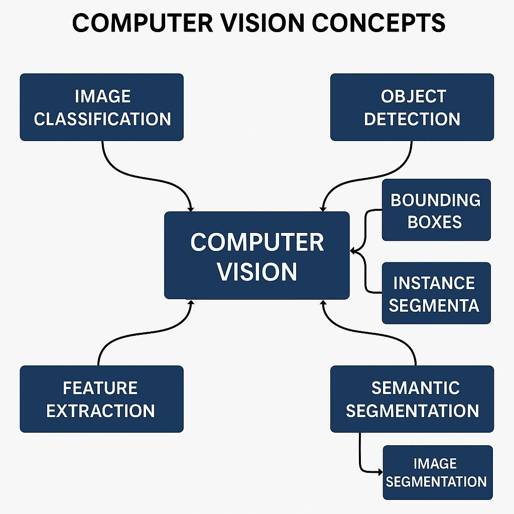
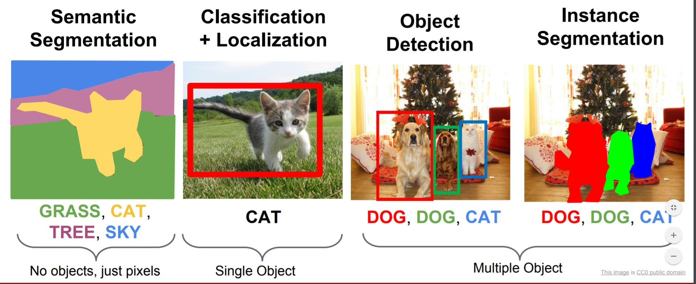
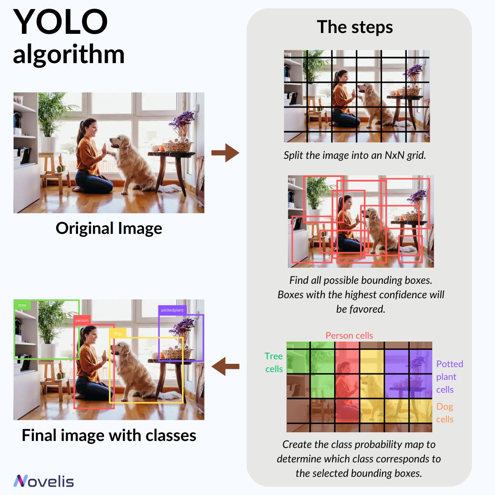
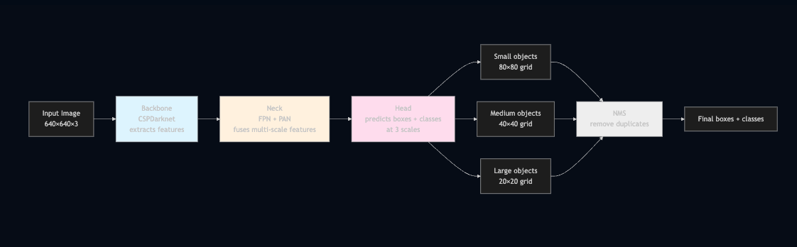
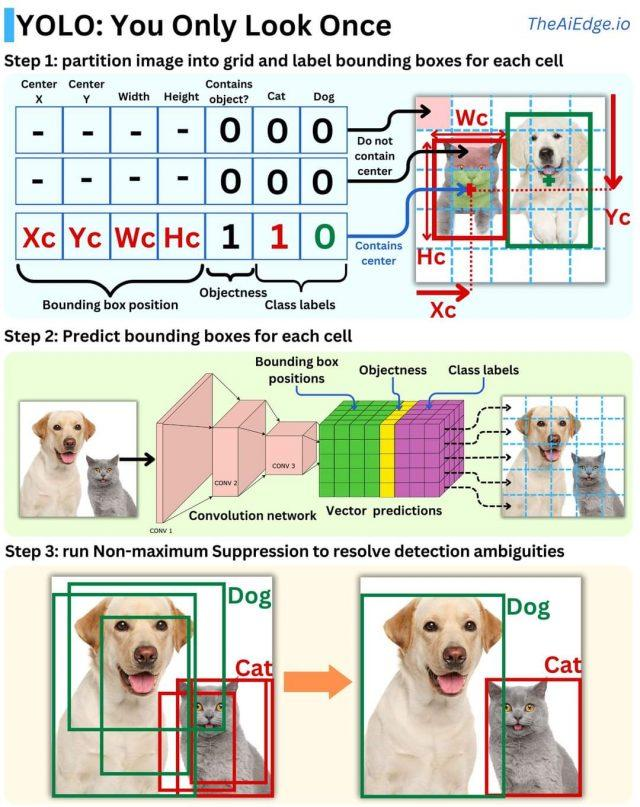
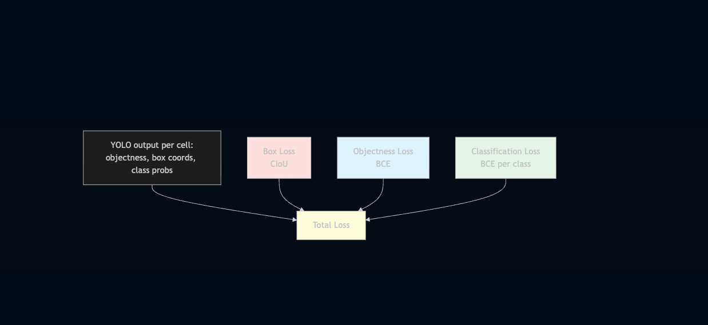
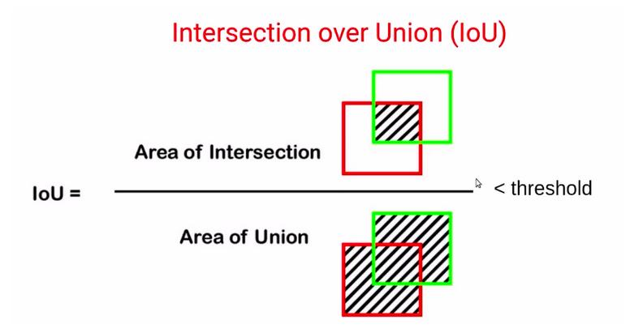

# YOLO: Notes — Object Detection from Scratch


---

## 0. Where We Come From — The Bridge from Classification to Detection

### 0.1 What You Already Know: Classification

You've built a CNN classifier before. It looks like this:

```
Input image (224×224×3)
        │
        ▼
  ┌───────────┐
  │    CNN    │   ← convolutions, pooling, feature extraction
  └─────┬─────┘
        │
        ▼
  ┌───────────┐
  │  Flatten  │
  │    MLP    │   ← fully-connected layers
  └─────┬─────┘
        │
        ▼
   [0.02, 0.91, 0.05, 0.02]   ← softmax over N classes
   "it's class 1 (cat), 91% sure"
```

The output is **one label for the whole image**. One image → one answer.

### 0.2 The Problem: Multiple Objects

Classification breaks down the moment an image has multiple things. A photo with a dog, a cat, and a person can't be summarized as one label. Worse, the user often wants to know *where* each object is, not just *that* it exists.

What we need is a list of predictions, each with:
- A **class label** ("dog")
- A **location** (a rectangle drawn around it)
- A **confidence score** (how sure the model is)

This is called **object detection**.

### 0.3 The Naive First Try: Sliding Window

The first instinct researchers had was:

> "Slide a classifier over the image. At each position, ask: is there an object here? If yes, what class?"

```
┌──────────────────────┐          ┌──────────────────────┐
│ ┌──┐                 │          │                 ┌──┐ │
│ │??│  "cat here?"    │   →      │    "cat here?"  │??│ │  → ...
│ └──┘                 │          │                 └──┘ │
└──────────────────────┘          └──────────────────────┘
     window at (0,0)                    window at (200, 0)
```

This is called the **sliding window** approach. It worked, but it was very slow — for a 1000×1000 image, you might run the classifier 50,000+ times, and you still don't know what *size* of window to use.

Faster R-CNN (2015) improved this by first proposing ~2000 candidate regions, then classifying each. Better, but still slow (~5 images per second).

### 0.4 The YOLO Insight

In 2015, Joseph Redmon asked a different question:

> "What if the CNN itself directly predicts boxes and labels, in **one forward pass**, the same way a classifier predicts labels?"

Instead of running a classifier thousands of times, we train **a single CNN whose output is a grid of predictions** — and each cell in the grid outputs "what's here and where exactly is it."

```
Classification CNN output:        YOLO CNN output:

     [one vector]                 [a GRID of vectors]
     [class probs]                 ┌──┬──┬──┬──┬──┐
                                   ├──┼──┼──┼──┼──┤
                                   ├──┼──┼──┼──┼──┤
                                   ├──┼──┼──┼──┼──┤
                                   └──┴──┴──┴──┴──┘
 one answer for the image    each cell: "is there an object
                              centered in me? if so, what/where?"
```

**That's the core YOLO insight.** Everything else is engineering details.

### 0.5 Mental Translation Table

| What you know | YOLO's version |
|---|---|
| CNN classifier output: `[batch, num_classes]` | YOLO output: `[batch, grid_h, grid_w, 4 + 1 + num_classes]` |
| Softmax → one class label | Per-cell: box coords + objectness + class probs |
| Cross-entropy loss on class labels | Combined loss: box regression + objectness + classification |
| "Image X is class Y" | "In image X, there's a Y at box [x,y,w,h]; also a Z at [x2,y2,w2,h2]; ..." |

The per-cell output breaks down as:
- **4 numbers** → Bounding box: `x_center, y_center, width, height`
- **1 number** → Objectness score: "Is there an object here?" (0 = no, 1 = yes)
- **num_classes numbers** → Class probabilities: "If there is an object, what is it?"

---

## 1. Why Object Detection Matters

Real applications need more than classification:

- **Self-driving cars** need to know *where* the pedestrian is, not just *that* one exists.
- **Retail analytics** needs to count and track people in a store.
- **Medical imaging** needs to localize tumors, not just flag their presence.
- **Factory QC** needs to find defects and report their coordinates.
- **On-device security** (e.g., Knox-style) needs to detect phishing UI elements, fake buttons, or tampered screens — with location.

Object detection answers **three questions simultaneously**:
1. **What** is it? (classification)
2. **Where** is it? (localization via bounding box)
3. **How confident** are we? (probability)

---

## 2. What YOLO Actually Is

**YOLO = "You Only Look Once"**

It's a family of CNN-based detectors that treats detection as **a single regression problem** — from pixels directly to bounding boxes and class probabilities, in one forward pass.

Everything else (anchors, FPN, NMS, loss functions) is engineering to make that idea work well.

### Example

Imagine you're in a classroom and your teacher holds up a class photograph. Two scenarios:

**Old way (classifier):** "Is this a school photo?" → Yes or no. One question, one answer.

**YOLO way:** The teacher prints the photo, draws a **7×7 grid** on it, and gives a copy to every student. She says:

> "Look at your own cell. If the center of a person's face is inside your cell, tell me: (1) where their face starts and ends, (2) how big it is, and (3) who it is. If there's no face centered in your cell, just say 'empty'."

All 49 students write their answers **at the same time**. Collect the 49 answers, throw away the "empty" ones — and you have all face locations for the whole photo in the time it took to answer one question.

That's YOLO. The CNN is all 49 students acting in parallel.

---

## 3. How YOLO Thinks: The Grid Model

Imagine laying a grid over the image — say 20×20 cells:

```
       ┌──┬──┬──┬──┬──┬──┬──┬──┐
       │  │  │  │  │  │  │  │  │
       ├──┼──┼──┼──┼──┼──┼──┼──┤
       │  │ 🐕│  │  │  │  │  │  │   ← this cell contains the center of the dog
       ├──┼──┼──┼──┼──┼──┼──┼──┤     → it predicts a box for "dog"
       │  │  │  │  │  │ 🚗 │  │  │
       ├──┼──┼──┼──┼──┼──┼──┼──┤   this cell has the center of the car
       │  │  │  │  │  │  │  │  │   → it predicts "car"
       ├──┼──┼──┼──┼──┼──┼──┼──┤
       │  │  │  │  │  │  │  │  │
       └──┴──┴──┴──┴──┴──┴──┴──┘

      Each cell outputs: [objectness, x, y, w, h, class_probs...]
```

For each cell, YOLO asks three questions:
1. "Is there an object whose center falls inside me?"
2. "If yes, what are the box dimensions (x, y, width, height)?"
3. "What class is it?"

### What One Cell Actually Outputs

Say we're detecting 3 classes: `person`, `car`, `dog`. Each cell outputs:

```
   [ obj,   x,     y,     w,     h,    p_person,  p_car,  p_dog  ]

Cell containing the dog:
   [ 0.97,  0.42,  0.58,  0.31,  0.47,   0.01,    0.02,   0.97   ]
      │      │      │      │      │        └────────┴──────┴──→ class probs
      │      │      │      │      └──→ box height (normalized 0–1)
      │      │      │      └──→ box width (normalized 0–1)
      │      │      └──→ box y-center (normalized 0–1)
      │      └──→ box x-center (normalized 0–1)
      └──→ "I'm 97% sure an object is centered here"

Empty cell (background):
   [ 0.02,  --- ignored because objectness is low ---  ]
```

Read the first row as: "I (this cell) am 97% sure there's an object. Its center is at (0.42, 0.58) of the image, it's 31% as wide and 47% as tall as the image, and it's a dog (97% probability)."

**All cells produce this output simultaneously** in one forward pass.



### How This Compares to a Classifier

| Classifier | YOLO |
|---|---|
| CNN backbone extracts features | **Same.** |
| Global pooling + FC layer | Replaced by a conv layer that outputs a **grid** |
| Output shape: `[batch, 1000]` | Output shape: `[batch, 20, 20, 85]` (20×20 grid, 85 = 4+1+80 classes) |
| Loss: cross-entropy | Loss: box regression + objectness + classification |
| One label per image | Multiple boxes per image |

The "magic" of YOLO is simply: **replace the final FC layer with a convolution that produces a grid output, and design a loss function that supervises box coordinates + objectness + class all at once.**


---

## 4. The YOLO Family — Which Version Should You Use?

| Version | Year | Key innovation | Use today? |
|---------|------|----------------|------------|
| YOLOv1–v3 | 2015–18 | Invented the idea. Anchors, multi-scale. | Historical only |
| YOLOv4 | 2020 | Bag of tricks, CSPNet. Great accuracy. | Only if stuck on Darknet |
| YOLOv5 | 2020 | PyTorch, clean API. Dominant in industry. | Yes — battle-tested |
| YOLOv6, v7 | 2022 | Specialized improvements | Niche |
| **YOLOv8** | **2023** | **Anchor-free, unified CLI for detect/segment/pose** | **Yes — most popular** |
| YOLO11 | 2024 | Efficiency improvements over v8 | Yes — great balance |
| YOLO12 | 2025 | Attention mechanisms | Experimental |
| YOLO26 | 2026 | End-to-end, edge-optimized | Yes — latest stable |

**Practical recommendation:** Use **YOLOv8** via the `ultralytics` package. It's what 90% of industry currently deploys, with the most tutorials, Stack Overflow answers, and community support. Both YOLOv8 and YOLO26 use the **same API** — only the weights filename changes.

---

## 5. The Three Ideas That Made YOLO Work

Every modern YOLO has three parts:

```
Raw Image
    │
    ▼
┌──────────┐
│ Backbone │  ← The eyes. A CNN that turns pixels into feature maps.
└──────────┘
    │
    ▼
┌──────────┐
│   Neck   │  ← The integrator. Combines features from different depths.
└──────────┘
    │
    ▼
┌──────────┐
│   Head   │  ← The decision-maker. Outputs boxes, objectness, class probs.
└──────────┘
    │
    ▼
   NMS      ← The cleanup crew. Removes duplicate predictions.
```



### 5.1 Anchors (and Why Modern YOLO Doesn't Need Them)ß̌

**The problem:** Boxes have wildly different aspect ratios. A pedestrian is tall-and-thin. A car is short-and-wide. Predicting raw `(w, h)` from scratch is hard — the model has no prior on what shapes are reasonable.

**Analogy:** Asking someone to estimate the height of a building they've never seen is hard. Asking "is it taller or shorter than the house next to it?" is easy. Anchors gave the model reference shapes to adjust *from*, not predict from scratch.

```
Predefined anchor shapes:
┌──┐       ┌──────────┐       ┌───────┐
│  │       │          │       │       │
│  │       └──────────┘       │       │
│  │        car-shaped        │       │
└──┘                          └───────┘
tall-thin                      square
(person)

Model learns: "for the car anchor, nudge it a bit wider and 10px to the right"


```

- **Old YOLO (v2–v7):** Pre-compute anchor boxes from the dataset using k-means on training box shapes. Model predicts offsets from anchors.
- **Modern YOLO (v8+):** **Anchor-free.** Predict box dimensions directly using clever loss functions (DFL) and assignment rules (Task-Aligned Assigner). Simpler, fewer hyperparameters, fewer things to break.

**What you need to know:** Modern YOLO is anchor-free. You don't configure anchors anymore.

---

### 5.2 Feature Pyramids — Detecting Both Ants and Elephants

**The problem:** CNNs progressively shrink spatial dimensions (640×640 → 20×20). Early layers keep fine detail but don't "understand" much. Late layers are deeply semantic ("this is a person") but have lost spatial precision.

If you only look at the last layer, small objects disappear. If you only look at early layers, large objects get chopped up.

**Analogy:** Reading a map. To find your house, you zoom *in* (fine detail, small area). To find the highway network, you zoom *out* (coarser detail, big picture). You need both scales to navigate.

```
CNN feature maps at different depths:

Input 640×640 → early features → middle features → late features
                  160×160           40×40              20×20
                 "lots of pixels,  "medium zoom,       "few pixels,
                  few semantics"    some semantics"      deep meaning"
                       │                  │                  │
                       ▼                  ▼                  ▼
                  detect small       detect medium       detect large
                  objects here       objects here        objects here
```

**The solution: Feature Pyramid Network (FPN) + Path Aggregation Network (PAN)**

- **FPN:** Takes features from multiple backbone depths. Passes high-level semantic info **downward** (top → down).
- **PAN:** Enhances FPN by also passing low-level detail **upward** (bottom → up).
- Together: better feature sharing across all scales.

This is why YOLO outputs predictions at **3 scales** (80×80, 40×40, 20×20 for 640-pixel input). Each scale handles a different object size range.

**Result:** YOLO can detect both the tiny bird in the corner AND the huge truck in the foreground in the same image.

---

### 5.3 The Backbone: CSPDarknet

The backbone is the **feature extractor** — it converts raw pixels into meaningful representations (edges → shapes → objects).

**CSP = Cross Stage Partial Network.** The key idea:
- Split the feature map into two parts.
- One part goes through heavy computation layers.
- One part takes a shortcut.
- Both parts are merged at the end.

**Why this is good:**
- Faster inference ⚡
- Less memory usage 💾
- Reduces duplicate gradient computation
- Better gradient flow → better learning

**One-line summary:** CSPDarknet is a smart CNN backbone that splits and recombines features to make YOLO faster and more efficient without losing accuracy.

---

### 5.4 Non-Maximum Suppression (NMS)

**The problem:** YOLO often predicts multiple overlapping boxes for the same object. Neighboring cells might both claim "there's a dog here." You need one box per object, not 17.

**Analogy:** Imagine 17 witnesses to a car accident, each reporting slightly different descriptions of the same car. You don't want 17 cars in your police report — you pick the most confident witness and discard everyone whose description strongly agrees with that one.

**The algorithm:**
1. Sort all predictions by confidence score.
2. Take the highest-confidence box — keep it.
3. Remove all other boxes that overlap it by more than a threshold (typically IoU > 0.5) **of the same class**.
4. Repeat with the next-highest remaining box.
5. Continue until no boxes remain.

```
BEFORE NMS:                          AFTER NMS:

   ┌─────────┐                         ┌─────────┐
   │ ┌──────┐│                         │         │
   │ │┌─────┤│   ← 5 overlapping       │   🐕    │
   │ ││ 🐕  ││     boxes for           │         │
   │ ││     ││     the same dog        └─────────┘
   │ │└─────┘│                        keep only the best
   │ └──────┘│
   └─────────┘
```

NMS is not learned — it's a simple post-processing algorithm that runs after the network.

  
---

## 5A. How Does YOLO Learn? The Loss Function

You know how classification training works: forward pass → cross-entropy loss → backprop → update weights. YOLO works **exactly the same way**, except the loss has **three parts** because the network predicts three different kinds of things.

```
Total Loss = λ_box × Box_Loss  +  λ_obj × Objectness_Loss  +  λ_cls × Classification_Loss
```

The λ values are weighting hyperparameters. Ultralytics sets reasonable defaults — you rarely need to touch them.

### Part 1: Box Regression Loss

**Purpose:** Penalize wrong box coordinates — teach the model to place the rectangle accurately.

Old YOLOs used simple MSE on `(x, y, w, h)`. The problem: MSE treats "a box shifted 10px" and "a box 10px wider" as equally bad, which isn't how humans judge box quality.

Modern YOLOs use **CIoU (Complete Intersection over Union) Loss**, which checks three things simultaneously:

| Check | What it penalizes |
|---|---|
| Do boxes overlap? | If not, how far are the centers? |
| Are centers close? | Center distance matters even without overlap |
| Do they have similar shape? | Aspect ratio mismatch is penalized |

**Why CIoU is better than IoU:**

```
Case 1: Perfect prediction
  Overlap = high ✅  |  Centers = same ✅  |  Shape = same ✅
  → CIoU loss is very low (good)

Case 2: No overlap but close boxes
  Overlap = 0 ❌  |  Centers = close ✅  |  Shape = similar ✅
  → IoU loss = 0 (useless gradient!)
  → CIoU loss still says: "You're close — move a bit" ✅

Case 3: Wrong shape
  Overlap = okay  |  Centers = okay  |  Shape = wrong ❌
  → CIoU says: "Fix your width and height"
```

CIoU gives useful gradients even when boxes don't yet overlap, which makes early training more stable.

### Part 2: Objectness Loss

**Purpose:** Teach each cell whether it *should* be predicting an object or not.

```
L_obj = −[y·log(p) + (1−y)·log(1−p)]
```

- Target = 1 if a ground truth object's center falls in this cell.
- Target = 0 otherwise.

This is standard **Binary Cross-Entropy (BCE)** — the same as any binary classifier. Without this, the model can't distinguish foreground cells from background cells.

### Part 3: Classification Loss

**Purpose:** Given that we've decided there IS an object in this cell, what class is it?

This is also **BCE applied per class** (not softmax + cross-entropy). Modern YOLOs allow multi-label outputs — an object can be both "vehicle" and "car" simultaneously. For each class, it's simply: "is this the right class? yes/no."

### Reading the Training Output

When you run `model.train(...)`, you'll see:

```
  Epoch  GPU_mem  box_loss  cls_loss  dfl_loss  Instances  Size
    1/30   4.2G    1.423     2.017     1.298       42      640
    2/30   4.2G    1.289     1.602     1.245       45      640
    ...
```

All three losses should go **down** together. If one stops going down or goes up:

| Symptom | Meaning |
|---|---|
| `box_loss` stuck | Boxes aren't tightening. Likely labeling noise or too few examples. |
| `cls_loss` stuck | Model is confusing classes. Check class balance, check for mislabels. |
| `dfl_loss` stuck | YOLOv8's variant of box loss. Follows `box_loss` behavior. |

---

## 6. Key Vocabulary — The Terms You Must Know

| Term | What it really means |
|------|----------------------|
| **Bounding box (bbox)** | Rectangle around an object. Usually `[x_center, y_center, width, height]`, normalized to [0, 1]. |
| **IoU (Intersection over Union)** | How much two boxes overlap. 0 = no overlap, 1 = identical. The fundamental metric. |
| **Confidence** | Objectness score × class probability. How sure the model is about a specific prediction. |
| **mAP (mean Average Precision)** | The headline accuracy metric. Averages precision across recall thresholds and classes. |
| **mAP@0.5** | mAP computed with IoU threshold = 0.5 (lenient — "did you find the object?"). |
| **mAP@0.5:0.95** | Averaged over IoU thresholds 0.5, 0.55, ..., 0.95 (strict COCO-style — "did you draw a tight box too?"). |
| **NMS threshold** | IoU cutoff for removing duplicate predictions. |
| **Confidence threshold** | Minimum score to keep a prediction. Raise it → fewer false positives. |
| **Backbone** | The feature extractor (e.g., CSPDarknet). |
| **Neck** | The feature fusion part (e.g., PAN-FPN). |
| **Head** | The part that actually outputs boxes and classes. |

### IoU Visualized

IoU = Area of Overlap ÷ Area of Union of the two boxes.

```
Ground truth (green)   Prediction (blue)     Overlap (purple)

 ┌─────────┐           ┌─────────┐           ┌─────────┐
 │         │           │  ┌──────┼──┐        │  ┌──────┼──┐
 │   🐕    │           │  │  🐕  │  │        │  │██████│  │
 │         │           │  │      │  │        │  │██████│  │
 └─────────┘           └──┼──────┘  │        └──┼──────┘  │
                           └─────────┘           └─────────┘

       IoU = Area(overlap) / Area(union)

       IoU = 0.0  →  no overlap, totally wrong
       IoU = 0.5  →  decent, standard "correct" threshold
       IoU = 0.9  →  near-perfect localization
       IoU = 1.0  →  boxes are identical
```

### Understanding mAP

You already know precision and recall from classification:
- **Precision** = "of the things I flagged, how many were actually right?"
- **Recall** = "of all the things that were actually there, how many did I find?"

In detection, a prediction counts as "correct" only when it has IoU ≥ some threshold with a ground truth box of the same class.

A detector doesn't give hard yes/no — it gives **confidence scores**. Lower threshold → more detections → higher recall, lower precision. Higher threshold → fewer detections → higher precision, lower recall. This creates a **Precision-Recall curve**.

```
Precision-Recall curve (for ONE class):

Precision
  1.0 ┤●
      │ ●●●
      │    ●●●●
      │        ●●●●●       ← AP = area under this curve
      │             ●●●
      │                ●●●●●
  0.0 └────────────────────────────
      0.0                          1.0
                   Recall
```

- **AP (Average Precision)** = area under the precision-recall curve for *one class*. Range [0, 1].
- **mAP (mean Average Precision)** = average AP across *all classes*.
- **mAP@0.5** = "Did you find the object?" (lenient)
- **mAP@0.5:0.95** = "Did you also draw a tight rectangle around it?" (strict, production-grade)

---

## 7. The YOLO Label Format

Every image needs a corresponding `.txt` file with the **same filename**. Each line = one object:

```
<class_id>  <x_center>  <y_center>  <width>  <height>
```

**All coordinates are normalized to [0, 1]** — divided by image width/height. This makes labels resolution-independent.

**Example** for `photo.jpg` (640×480):
```
# photo.txt
0 0.5 0.5 0.3 0.4
1 0.2 0.7 0.1 0.15
```

This says:
- Class 0 ("person"), centered at the middle of the image, 30% wide, 40% tall.
- Class 1 ("helmet"), in the lower-left area, small.

### Converting Pixel Coordinates → YOLO Format

This is where most students get tripped up. Here's the step-by-step.

**Scenario:** Image is 800×600px. You've drawn a box around a dog:
- top-left corner = (200, 150)
- bottom-right corner = (500, 450)

**Step 1: Compute pixel dimensions**
```
width_pixels  = 500 - 200 = 300
height_pixels = 450 - 150 = 300
x_center_pix  = (200 + 500) / 2 = 350
y_center_pix  = (150 + 450) / 2 = 300
```

**Step 2: Normalize by image dimensions**
```
x_center = 350 / 800 = 0.4375
y_center = 300 / 600 = 0.5000
width    = 300 / 800 = 0.3750
height   = 300 / 600 = 0.5000
```

**Step 3: Write the label line** (if dog's class_id = 2):
```
2 0.4375 0.5000 0.3750 0.5000
```

Every pixel-format dataset (COCO, Pascal VOC) needs this conversion before YOLO can use it. Tools like Roboflow do it automatically. For manual labeling, write a small conversion script.

### Folder Structure

```
dataset/
├── images/
│   ├── train/
│   │   ├── img001.jpg
│   │   └── ...
│   └── val/
│       └── ...
├── labels/
│   ├── train/
│   │   ├── img001.txt   ← MUST match image name exactly!
│   │   └── ...
│   └── val/
│       └── ...
└── data.yaml            ← config file
```

**`data.yaml` contents:**
```yaml
path: /absolute/path/to/dataset
train: images/train
val: images/val
names:
  0: person
  1: helmet
  2: vest
```

> ⚠️ **90% of "YOLO isn't working" bugs are label format issues.**

---

## 8. The Real-World Workflow

### Step 1: Define the Problem
- What am I detecting? (classes)
- What's the deployment environment? (cloud GPU? phone? embedded?)
- What's acceptable latency? (500ms OK, or need 30ms?)
- What's acceptable accuracy? (safety-critical vs. analytics)

### Step 2: Get the Data
- **Public dataset** — fastest start (check Roboflow Universe).
- **Custom data** — usually needed for real applications. Labeling tools: CVAT, Roboflow, Label Studio.
- **Synthetic data** — increasingly viable for rare classes.

**Rule of thumb:** 200+ labeled images per class to start. 1000+ for good performance. 10k+ for production.

### Step 3: Pick a Model Size

| Model | Params | Speed | Use case |
|-------|--------|-------|----------|
| YOLOv8n (nano) | 3.2M | Fastest | Mobile, edge, real-time |
| YOLOv8s (small) | 11.2M | Fast | **Good starting point** |
| YOLOv8m (medium) | 25.9M | Medium | Good accuracy, server deployment |
| YOLOv8l (large) | 43.7M | Slow | High accuracy needed |
| YOLOv8x (extra-large) | 68.2M | Slowest | Maximum accuracy, batch processing |

**Start with `s` or `n`. Upgrade only if accuracy is insufficient.**

### Step 4: Train
- **Always start from pretrained weights** (COCO). Never train from scratch unless you have >100k images.
- Freeze the backbone for the first few epochs if your dataset is small.
- Use data augmentation aggressively (Ultralytics does this by default).

### Step 5: Evaluate
- Look at **mAP@0.5:0.95** as the headline metric.
- Look at **per-class AP** — is one class dragging down the average?
- Look at the **confusion matrix** — where does the model confuse classes?
- **Always look at actual predictions visually.** Metrics can mislead; your eyes don't.

### Step 6: Deploy
| Target platform | Export format |
|---|---|
| Cross-platform | `model.export(format='onnx')` |
| NVIDIA GPU | TensorRT |
| Mobile (Android/iOS) | TFLite or CoreML |
| Intel CPUs | OpenVINO |
| On-device NPU (e.g., Galaxy S25) | ONNX → INT8/INT4 quantization → NPU delegate |

---

## 9. Common Pitfalls

1. **Tiny objects are hard.** If objects are <30px, use larger input resolution (`imgsz=1280` instead of 640), or tile/crop your images first.

2. **Class imbalance.** If you have 10,000 "person" boxes and 100 "helmet" boxes, helmet detection will suffer badly. Collect more minority-class data or use focal loss.

3. **Train/val leakage.** Don't split images randomly if you have sequences or video. Adjacent frames are near-identical — you'll overfit and think you have a great model when you don't.

4. **Overfitting on small datasets.** Signs: training loss keeps dropping, validation mAP plateaus or drops. Fix: more augmentation, smaller model, early stopping.

5. **Wrong class IDs.** If `data.yaml` says `0: person, 1: helmet` but your labels have `0: helmet, 1: person`, training "works" but predictions are silently wrong. Always visualize a few training samples with labels drawn.

6. **Confidence threshold confusion.** Training evaluates at `conf=0.001` (very lenient). When you deploy with `conf=0.25`, results look different. Both are correct — know which you're looking at.

7. **Letterboxing.** YOLO resizes images to square with gray padding. If you preprocess yourself, match this exactly or predictions will be spatially shifted.

8. **Ignoring deployment environment.** A model that runs at 60 FPS on an A100 might run at 2 FPS on a phone. Test on target hardware early.

---

## 10. When NOT to Use YOLO

YOLO is not always the right tool:

| Need | Better alternative |
|---|---|
| Pixel-perfect segmentation masks | YOLOv8-seg, Mask R-CNN, or SAM |
| Open-vocabulary / zero-shot detection (objects never seen in training) | GroundingDINO, OWL-ViT, YOLO-World |
| Single-region precise classification | Just use a classifier |
| Objects described in natural language | CLIP-based detectors |
| 3D bounding boxes (autonomous driving) | CenterPoint and similar |

---

## 11. Quick-Start Code (30-Minute Hello YOLO)

```python
# 1. Install
pip install ultralytics

# 2. Detect on an image using pretrained COCO weights
from ultralytics import YOLO
model = YOLO('yolov8n.pt')              # downloads ~6MB automatically
results = model('path/to/image.jpg')    # can also be a URL or a folder
results[0].show()                       # visualize in a window

# 3. Train on your own data
model = YOLO('yolov8n.pt')
model.train(data='data.yaml', epochs=50, imgsz=640)

# 4. Run inference with your trained model
best = YOLO('runs/detect/train/weights/best.pt')
best.predict('test_image.jpg', save=True, conf=0.25)

# 5. Export for deployment
best.export(format='onnx')
```

That's the entire API. Everything else is tuning.

---

## 12. TL;DR — The 8 Things to Remember

1. YOLO = single-pass CNN that outputs boxes + classes simultaneously.
2. Use the `ultralytics` package with YOLOv8 (stable, most documented) or YOLO26 (latest).
3. Get your data into YOLO format: normalized labels, `images/labels` folders, `data.yaml`.
4. **Always start from pretrained weights. Always.**
5. Train with `model.train(data='data.yaml', epochs=50)`.
6. Evaluate with mAP@0.5:0.95 + visual inspection.
7. Export to ONNX / TensorRT / TFLite for deployment.
8. **The bug is almost always the labels.**

---

## 13. Resources to Bookmark

| Resource | What it's for |
|---|---|
| [Ultralytics Docs](https://docs.ultralytics.com/) | Official, always up-to-date API reference |
| [Roboflow Universe](https://universe.roboflow.com/) | Thousands of labeled datasets in YOLO format |
| [Papers With Code: Object Detection](https://paperswithcode.com/task/object-detection) | Benchmark leaderboards |
| [CVAT](https://www.cvat.ai/) | Free, self-hostable labeling tool |
| [Netron](https://netron.app/) | Drag-and-drop ONNX model visualizer (great for debugging exports) |

### Deeper Architecture Diagrams (for the curious)

Once you have the mental model down, explore:
- YOLOv8 full layer diagram: [ultralytics/ultralytics #189](https://github.com/ultralytics/ultralytics/issues/189)
- Side-by-side comparison of v5/v6/v8/RTMDet: [MMYOLO algorithm descriptions](https://mmyolo.readthedocs.io/en/latest/recommended_topics/algorithm_descriptions/yolov8_description.html)

> **Note:** Look at these diagrams *after* you have the mental model — not before. They are overwhelming without the conceptual scaffolding first.

---

*Open the companion notebook and train a real safety-compliance detector end-to-end.*
