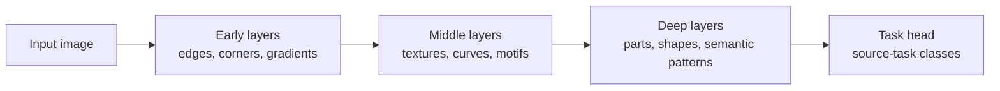
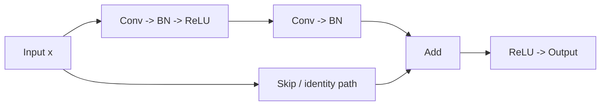
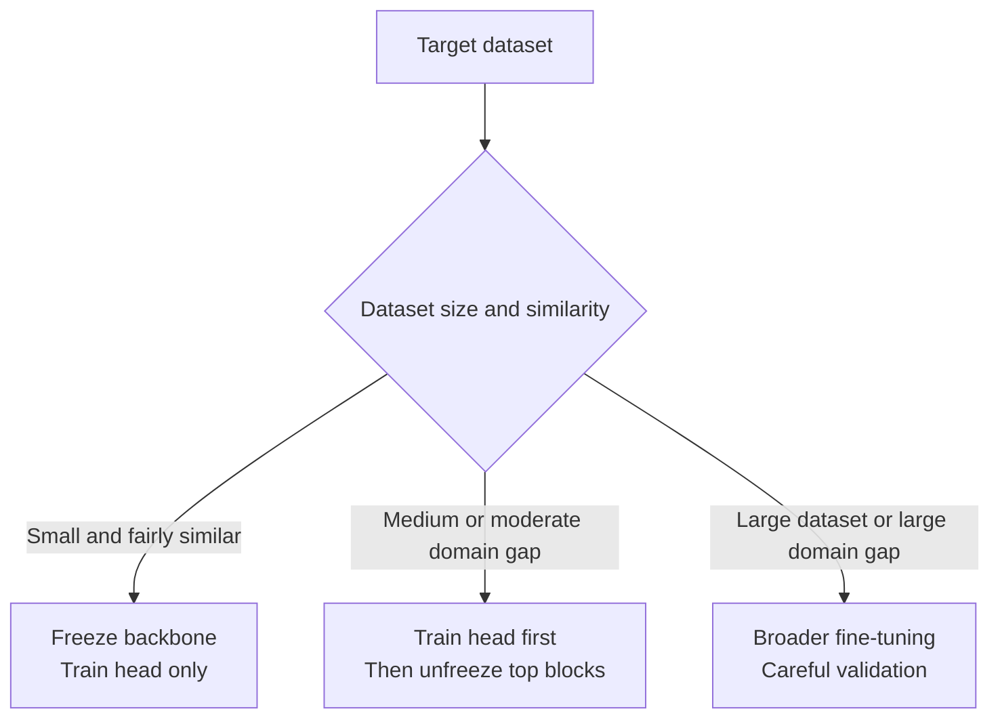

# Transfer Learning: ResNet | VGG | Fine-Tuning
## Teacher Speaking Notes for Classroom Delivery

> This file is written in a teacher voice so you can read it, explain it, and teach directly from it in class. I have kept the content detailed, but the tone is more like you speaking to students.

---

## How to Use This File

This note is designed for teaching, not just reading.

Each major section has:

- **What I say in class** -> lines you can more or less speak directly
- **Board note** -> short points to write on the board
- **Ask students** -> questions to keep the class active
- **Teacher explanation** -> deeper background for you
- **Industry note** -> how this is used in real jobs and projects

If you want to teach this in one session, you can comfortably use this for a 90 to 120 minute class.

---

## Class Objective

### What I say in class

Students, today we are going to learn one of the most practical topics in computer vision and deep learning: **transfer learning**.

And I want you to remember this from the beginning:

**In real industry projects, people usually do not train big image models from scratch. They start from a pretrained model like ResNet or VGG and adapt it to their own problem.**

So today our goal is not just to know definitions. Our goal is to understand:

- what transfer learning is,
- why it works,
- why ResNet became so important,
- why VGG is still useful for learning,
- what fine-tuning really means,
- and how to use all this in a real project.

### Board note

```text
Today's Goal:
1. Understand transfer learning
2. Understand VGG and ResNet
3. Learn feature extraction vs fine-tuning
4. Learn real-world workflow
```

### Ask students

- If I give you only 1,000 labeled images, can you train a very deep CNN from scratch reliably?
- If a model has already learned millions of visual patterns, should we throw that away and restart from zero?

---

## Part 1: Why Transfer Learning Exists

### What I say in class

Students, let us begin with a very honest question.

Suppose your manager gives you a classification problem:

- detect plant disease,
- classify defective products,
- classify medical images,
- or classify animals from camera trap photos.

And suppose you only have a few thousand labeled images.

Now tell me, should you build a deep network from scratch?

In most cases, the answer is **no**.

Why?

Because deep CNNs have millions of parameters. If you initialize everything randomly and try to learn from a small dataset, the network may simply memorize the training data instead of learning general visual patterns.

So the idea of transfer learning is simple:

**Use knowledge that a model has already learned from a big dataset, then adapt that knowledge to your own task.**

### Board note

```text
Why not train from scratch?
- Too much data required
- Too much compute required
- Slow training
- High risk of overfitting
- Wasteful to relearn basic visual features
```

### Teacher explanation

This is the key mental shift students need.

Most students initially imagine deep learning like this:

1. define model,
2. start random,
3. train everything,
4. get result.

But in professional computer vision, the mindset is different:

1. start from a strong pretrained backbone,
2. adapt it,
3. validate it,
4. fine-tune only as much as needed.

### Industry note

This is the standard approach because it saves:

- time,
- money,
- compute,
- and data collection effort.

### Ask students

- Why is learning edges and textures again from 2,000 images not a good use of time?
- If Google or Microsoft has already trained a strong visual model on millions of images, what is smarter: reuse it or ignore it?

---

## Part 2: The Basic Definition of Transfer Learning

### What I say in class

Students, now let me define transfer learning very clearly.

**Transfer learning means taking a model trained on one task or dataset and reusing its learned knowledge for another related task.**

Let us understand the two sides:

- **source task** -> the original task the model learned first
- **target task** -> the new task we want to solve

For example:

- source task: ImageNet image classification
- target task: mango disease classification

The labels are different, but the visual knowledge can still help.

### Board note

```text
Transfer Learning =
Knowledge learned on source task
            ->
Reused on target task
```

### Teacher explanation

The important thing is not that the source and target tasks are identical.

The important thing is that the model learned useful visual patterns that can transfer:

- edges,
- shapes,
- textures,
- repeated local structures,
- object parts.

### Ask students

- If a model knows how to detect curves, edges, and textures, can that help on a new vision task?
- Does the final output layer usually stay the same when the new classes change?

---

## Part 3: Why Pretrained CNNs Work So Well

### What I say in class

Students, here is the secret behind transfer learning.

When a CNN learns from a large image dataset, the early layers do not memorize "dog" or "car" in a human-language sense.

Instead, they learn visual building blocks:

- edges,
- corners,
- gradients,
- texture transitions,
- repetitive local patterns.

As we move deeper into the network, the model starts combining these into more meaningful structures:

- circles,
- fur texture,
- leaf veins,
- wheels,
- eyes,
- object parts.

And the deepest layers become more specific to the original training task.

That is why transfer learning works.

The early and middle features are general enough to be reused.

### Feature hierarchy diagram



### Board note

```text
Early layers   -> general features
Middle layers  -> combined patterns
Deep layers    -> task-specific features
Final layer    -> source-task classifier
```

### Teacher explanation

This is the most important sentence in the whole lesson:

**The earlier the layer, the more general its features. The later the layer, the more task-specific its features.**

Because of this:

- we often freeze early layers first,
- we replace the final head,
- and we fine-tune later layers only if needed.

### Ask students

- Which layers do you think are safest to reuse, early layers or final layers?
- If the new dataset is small, should we aggressively retrain all layers or be more careful?

---

## Part 4: The Two Big Ways We Use Transfer Learning

### What I say in class

Students, in practice, there are two main ways to use transfer learning.

The first way is **feature extraction**.

The second way is **fine-tuning**.

Let me explain the difference carefully.

### 4.1 Feature Extraction

### What I say in class

In feature extraction, we keep most of the pretrained model fixed.

That means:

- freeze the backbone,
- replace the final classification head,
- train only the new head.

So we are using the pretrained model like a very smart feature extractor.

### Board note

```text
Feature Extraction:
Freeze backbone
Replace classifier
Train only new head
```

### Teacher explanation

This is usually the safest starting point when:

- the dataset is small,
- the task is not extremely different from natural images,
- or you want a fast baseline.

### 4.2 Fine-Tuning

### What I say in class

In fine-tuning, we do not keep the entire backbone frozen forever.

Instead, after training the new head, we may unfreeze some deeper layers and allow them to adjust to the target dataset.

That is called fine-tuning.

And remember this:

**Fine-tuning means adjustment, not starting over.**

### Board note

```text
Fine-Tuning:
Start from pretrained model
Train new head
Unfreeze some deeper layers
Train with small LR
```

### Teacher explanation

Students often think fine-tuning means:

"Train the whole model again."

That is not the right mindset.

The better way to say it is:

"We are gently adapting already useful weights to a new problem."

### Ask students

- Which one is safer on a very small dataset: feature extraction or full fine-tuning?
- Why should the learning rate usually be smaller during fine-tuning?

---

## Part 5: VGG - The Easy Architecture to Teach

### What I say in class

Students, let us first talk about **VGG**.

VGG is one of the best models for teaching because the architecture is easy to understand.

Its basic idea is:

- use many small `3 x 3` convolution filters,
- stack them block by block,
- apply max pooling after each block,
- then use fully connected layers for final classification.

So if I had to describe VGG in one sentence, I would say:

**VGG is a deep but very clean, very readable CNN architecture built by stacking simple convolution blocks.**

### VGG16 block structure

```text
Input
  |
  v
[Conv 64] -> [Conv 64] -> [MaxPool]
  |
  v
[Conv 128] -> [Conv 128] -> [MaxPool]
  |
  v
[Conv 256] -> [Conv 256] -> [Conv 256] -> [MaxPool]
  |
  v
[Conv 512] -> [Conv 512] -> [Conv 512] -> [MaxPool]
  |
  v
[Conv 512] -> [Conv 512] -> [Conv 512] -> [MaxPool]
  |
  v
Flatten -> FC -> FC -> FC -> Output
```

### Board note

```text
VGG idea:
- Small 3x3 filters
- More depth by stacking conv layers
- MaxPool between blocks
- Large FC classifier at the end
```

### Teacher explanation

Why did VGG matter?

Because it showed that:

- small convolution filters are powerful,
- depth helps,
- and a clean repeated design can achieve strong performance.

The model is very structured. That is why students usually understand it quickly.

### What I say in class

Students, notice how repetitive VGG is. That is actually a good thing for learning.

Block after block, the model keeps extracting richer and richer features.

Early layers may detect edges.
Later layers may respond to textures or parts.
Deeper layers combine those into higher-level visual meaning.

### Strengths of VGG

### Board note

```text
Why VGG is good for learning:
- Simple
- Clean
- Easy to trace layer by layer
- Good for understanding CNN depth
```

### Weaknesses of VGG

### What I say in class

Now students, let me be honest. VGG is great for teaching, but it is not the most efficient model for modern production systems.

Why?

- it has many parameters,
- the fully connected part is heavy,
- memory use is high,
- and later architectures became more efficient.

### Board note

```text
VGG limitations:
- Heavy model
- Large parameter count
- More memory usage
- Less efficient than ResNet
```

### Industry note

Today, VGG is still useful:

- as a teaching model,
- as a classical baseline,
- and sometimes as a feature extractor in older systems.

But if I am starting a serious practical project today, I am usually more likely to begin with ResNet than VGG.

### Ask students

- Why do you think VGG is easier to teach than more complex architectures?
- If a model is easy to understand, does that automatically make it the best production choice?

---

## Part 6: ResNet - The Model That Made Deep Networks Easier to Train

### What I say in class

Students, now let us move to the more practically important model: **ResNet**, which stands for **Residual Network**.

Before ResNet, researchers kept trying to build deeper networks because deeper models should, in theory, learn richer representations.

But a problem appeared.

When plain networks became very deep, optimization became difficult.

Even though the deeper model had more capacity, training it well was not straightforward.

This is where ResNet changed the game.

### The core idea

ResNet says:

Instead of forcing every block to learn a completely new transformation from scratch, let the block learn only what needs to be changed.

In other words:

**If the input is already useful, let it pass forward through a shortcut path.**

That shortcut is the famous **skip connection**.

### Residual block diagram



### Board note

```text
ResNet idea:
Output = F(x) + x

Learn correction, not full mapping
Skip connection helps information and gradients flow
```

### Teacher explanation

Let me translate the math into classroom language.

Suppose the ideal behavior of a block is:

"Do almost nothing. Just keep the useful information moving."

In a plain network, the block still has to learn a full transformation.

In a residual block, the identity path is already available.

So the block only needs to learn the extra correction.

That makes training much easier.

### What I say in class

Students, think of it like this.

Suppose I give you a correct paragraph and ask you to improve it.

I do not ask you to rewrite the whole paragraph from zero.

I ask you to make the necessary corrections.

That is exactly the intuition of residual learning.

### Why skip connections help

### Board note

```text
Why skip connections help:
- Easier optimization
- Better gradient flow
- Supports deeper networks
- Lets blocks learn corrections
```

### Teacher explanation

This is why ResNet became such an important backbone.

It gave the deep learning community a practical way to train deeper CNNs more reliably.

### Common ResNet variants

| Model | Approx Params | Good Use Case |
|---|---:|---|
| ResNet18 | 11.7M | classroom demos, smaller compute |
| ResNet34 | 21.8M | deeper basic model |
| ResNet50 | 25.6M | strong real-world baseline |
| ResNet101 | 44.5M | deeper and heavier |
| ResNet152 | 60.2M | very deep, more expensive |

### What I say in class

Students, if you are doing a small classroom project, ResNet18 is usually a great starting point.

If you want a stronger industry-style baseline and have more compute, ResNet50 is a very common choice.

### Ask students

- Why might learning a correction be easier than learning the whole function?
- If a block is not useful, what should the network be able to do with the input?

---

## Part 7: VGG vs ResNet - How I Explain the Difference to Students

### What I say in class

Students, both VGG and ResNet are important, but they are important for different reasons.

If I want to teach you CNN structure clearly, VGG is wonderful.

If I want to start a practical transfer learning project, ResNet is usually the better first choice.

### Board note

| Aspect | VGG | ResNet |
|---|---|---|
| Structure | simple stacked conv blocks | residual blocks with skip connections |
| Teaching clarity | very high | medium |
| Efficiency | lower | better |
| Modern practical use | lower | high |
| Transfer learning baseline | good | excellent |

### Teacher explanation

VGG helps students understand:

- what it means to stack conv layers,
- how feature depth increases,
- and how a CNN becomes deeper step by step.

ResNet helps students understand:

- why architecture design matters,
- why deeper is not automatically easier,
- and how skip connections solve a real optimization problem.

### One-line teaching summary

**VGG teaches CNN structure clearly. ResNet teaches deep learning maturity.**

### Ask students

- If you had to explain CNN depth to a beginner, which architecture would you choose first?
- If you had to build a practical classification baseline for industry, which one would you choose?

---

## Part 8: What Exactly Do We Replace in Transfer Learning?

### What I say in class

Students, one very practical question is this:

When we say we are using a pretrained model, what do we keep and what do we change?

The answer is:

- we usually keep the pretrained backbone,
- and we replace the final classifier layer or classifier head.

Why?

Because the original model was trained for the source dataset classes, not for our new classes.

If the original model was trained on 1,000 ImageNet classes, but your problem has 5 classes, then the last layer must change.

### Board note

```text
Keep:
- Backbone / feature extractor

Replace:
- Final classifier head
```

### Teacher explanation

This is one of the easiest practical points for students to understand.

The earlier parts of the model are learning visual features.
The final layer is mapping those features to specific source labels.

If your labels change, the output layer must change.

### Ask students

- If my new dataset has 3 classes, can I keep a final layer that was built for 1,000 classes?
- What part of the model is most tightly connected to the original source labels?

---

## Part 9: Feature Extraction vs Fine-Tuning - The Full Teaching Version

### 9.1 Feature Extraction

### What I say in class

Students, imagine you have hired an expert who already understands vision very well.

You do not want to retrain the expert from zero.

You simply want the expert to give you good features, and then you put a small new decision layer on top.

That is feature extraction.

### Board note

```text
Feature Extraction:
pretrained backbone fixed
new classifier trained
```

### Best time to use it

### Teacher explanation

Feature extraction is a very good starting choice when:

- the dataset is small,
- the classes are reasonably similar to natural-image categories,
- you want a fast and stable baseline,
- or you want to reduce overfitting risk.

### 9.2 Fine-Tuning

### What I say in class

Students, now suppose the frozen backbone gives decent results, but not quite enough.

Then we allow some deeper layers to adapt.

This adaptation is called fine-tuning.

We usually do this in a careful order:

1. train the new head first,
2. unfreeze deeper layers,
3. use a smaller learning rate,
4. continue training carefully.

### Board note

```text
Typical order:
1. Train head
2. Unfreeze top layers
3. Fine-tune with small LR
```

### Why not unfreeze everything immediately?

### Teacher explanation

If students unfreeze everything on a tiny dataset from the first epoch:

- the model can overfit,
- useful pretrained knowledge can get damaged,
- validation may become unstable,
- and they may do worse than the frozen baseline.

So we teach gradual adaptation, not reckless retraining.

### Decision table

| Situation | Good starting strategy |
|---|---|
| small dataset, similar domain | feature extraction |
| medium dataset, moderate domain gap | unfreeze last block(s) |
| larger dataset or bigger domain gap | deeper fine-tuning |
| very different domain | test carefully, probably fine-tune more |

### Ask students

- Why is feature extraction often the first baseline?
- Why do we usually fine-tune later layers before early layers?

---

## Part 10: What to Freeze and What to Unfreeze

### What I say in class

Students, now let us answer a question you will definitely face in projects:

Which layers should I freeze, and which layers should I unfreeze?

The rule of thumb is:

- early layers are more general,
- deeper layers are more task-specific.

So if I want to fine-tune gradually, I usually start by unfreezing the deeper blocks first.

### Board note

```text
Freeze first:
- early layers

Unfreeze first:
- later layers
```

### Teacher explanation

Think of it like this:

The early layers know very universal things about images.
Edges are edges in many domains.
Corners are corners in many domains.

But deep layers may become more specialized to the source task.
Those are the layers that may need adaptation first.

### Practical table

| Dataset situation | Suggested action |
|---|---|
| 500 to 2,000 images | freeze backbone, train head |
| 2,000 to 20,000 images | unfreeze top block(s) |
| more data, stronger domain difference | unfreeze more layers |
| very tiny dataset | be very conservative |

### Important line to say

**Fine-tuning is not about bravery. It is about control.**

### Ask students

- If the dataset is tiny, why can full fine-tuning be dangerous?
- If my new task is very different from ImageNet, should I expect head-only training to always be enough?

---

## Part 11: Why Learning Rate Must Be Smaller During Fine-Tuning

### What I say in class

Students, this point is extremely important.

When we fine-tune a pretrained model, the weights are not random. They are already useful.

So we should not move them too aggressively.

That is why we usually use a **smaller learning rate** during fine-tuning.

If the learning rate is too high, the model can forget valuable pretrained knowledge.

This is sometimes called **catastrophic forgetting**.

### Board note

```text
Fine-tuning LR should be small
Reason:
do not destroy pretrained features
```

### Teacher explanation

A nice practical approach is:

- higher LR for the new classifier head,
- lower LR for pretrained layers.

This is often called **discriminative learning rates**.

### Example

```python
optimizer = torch.optim.Adam([
    {"params": model.layer4.parameters(), "lr": 1e-5},
    {"params": model.fc.parameters(), "lr": 1e-4},
], weight_decay=1e-4)
```

### Ask students

- Which part should learn faster: a random new classifier or a pretrained backbone block?
- What happens if we use a very large learning rate on already useful pretrained weights?

---

## Part 12: Industry Standard Transfer Learning Workflow

### What I say in class

Students, now I want to show you the real workflow that many teams follow in practice.

This is how transfer learning is actually used in projects.

### Workflow diagram

```mermaid
flowchart LR
    A["Collect and clean data"] --> B["Train / validation / test split"]
    B --> C["Train augmentations only on training set"]
    C --> D["Load pretrained backbone"]
    D --> E["Replace classifier head"]
    E --> F["Train head first"]
    F --> G["Evaluate baseline"]
    G --> H["Unfreeze selected deeper layers"]
    H --> I["Fine-tune with small LR"]
    I --> J["Evaluate metrics and errors"]
    J --> K["Save best model"]
```



### Step-by-step teacher explanation

#### Step 1: Understand the dataset

### What I say in class

Before touching the model, students, understand the data.

Ask:

- How many classes?
- How many images?
- Is the data balanced?
- Is the domain close to normal photographs or very specialized?
- Are there noisy labels?

#### Step 2: Make clean splits

### What I say in class

Always create:

- training set,
- validation set,
- test set.

And remember:

**Do not tune your model on the test set.**

#### Step 3: Preprocess correctly

### What I say in class

If you use an ImageNet-pretrained model, then the input should usually be normalized using ImageNet statistics.

```python
mean = [0.485, 0.456, 0.406]
std  = [0.229, 0.224, 0.225]
```

Students, this is not random decoration.

The model expects inputs in a distribution similar to what it saw during pretraining.

#### Step 4: Use augmentation only for training

### What I say in class

For training data, we often use:

- random crop,
- horizontal flip,
- color jitter,
- mild rotation.

But for validation and test:

- no random augmentation,
- only deterministic transforms.

#### Step 5: Replace the head

### What I say in class

Replace the last layer so the output size matches your number of classes.

#### Step 6: Train the head first

### What I say in class

This gives a fast and stable baseline.

#### Step 7: Fine-tune deeper layers only if needed

### What I say in class

If performance saturates, unfreeze the final blocks and continue gently.

#### Step 8: Evaluate more than accuracy

### What I say in class

Students, in real-world tasks, accuracy alone is not enough.

We should also inspect:

- confusion matrix,
- precision,
- recall,
- F1 score,
- per-class performance,
- and wrong predictions.

### Board note

```text
Real workflow:
Data -> Split -> Preprocess -> Load pretrained model
-> Replace head -> Train head -> Fine-tune -> Evaluate properly
```

### Ask students

- Why should validation data not have random transformations?
- Why is it useful to train the head first before unfreezing deeper layers?

---

## Part 13: Teaching ResNet Transfer Learning in PyTorch

### What I say in class

Students, now let me show you the most common practical pattern.

We will:

1. load a pretrained ResNet,
2. freeze all layers,
3. replace the final classifier,
4. train the new classifier,
5. then optionally fine-tune the last residual block.

### Code: head-only training with ResNet18

```python
import torch
import torch.nn as nn
from torchvision import models

num_classes = 5

# Load pretrained ResNet18
model = models.resnet18(weights=models.ResNet18_Weights.DEFAULT)

# Freeze pretrained parameters
for param in model.parameters():
    param.requires_grad = False

# Replace final layer
in_features = model.fc.in_features
model.fc = nn.Linear(in_features, num_classes)

# Only train the new head
optimizer = torch.optim.Adam(model.fc.parameters(), lr=1e-3)
criterion = nn.CrossEntropyLoss()
```

### What I say in class

Students, please notice the key idea.

We did not destroy the backbone.
We kept the learned feature extractor.
We only changed the last layer because our target classes are different.

### Code: partial fine-tuning of the last block

```python
# Unfreeze the last residual stage
for param in model.layer4.parameters():
    param.requires_grad = True

optimizer = torch.optim.Adam([
    {"params": model.layer4.parameters(), "lr": 1e-5},
    {"params": model.fc.parameters(), "lr": 1e-4},
], weight_decay=1e-4)
```

### What I say in class

Students, now we are allowing the deeper visual features to adjust a little.

But see the learning rates:

- smaller for `layer4`,
- slightly larger for `fc`.

That is a very important practical detail.

### Ask students

- Why are we not unfreezing `layer1`, `layer2`, and `layer3` immediately?
- Why should the random new head usually learn faster than the pretrained block?

---

## Part 14: Teaching VGG Transfer Learning in PyTorch

### What I say in class

Students, VGG follows the same transfer learning idea, but the layer names and classifier structure look different.

In VGG:

- `features` contains the convolution backbone,
- `classifier` contains the dense layers at the end.

### Code: head replacement in VGG16

```python
import torch
import torch.nn as nn
from torchvision import models

num_classes = 5

model = models.vgg16(weights=models.VGG16_Weights.DEFAULT)

# Freeze convolution backbone
for param in model.features.parameters():
    param.requires_grad = False

# Replace final classifier layer
in_features = model.classifier[6].in_features
model.classifier[6] = nn.Linear(in_features, num_classes)

# Train classifier layers
optimizer = torch.optim.Adam(model.classifier.parameters(), lr=1e-3)
criterion = nn.CrossEntropyLoss()
```

### What I say in class

Students, here the logic is exactly the same:

- keep the visual feature extractor,
- replace the task-specific head,
- train the new classifier.

### Code: optional later-block unfreezing

```python
for param in model.features[24:].parameters():
    param.requires_grad = True

optimizer = torch.optim.Adam([
    {"params": model.features[24:].parameters(), "lr": 1e-5},
    {"params": model.classifier.parameters(), "lr": 1e-4},
], weight_decay=1e-4)
```

### Teacher explanation

In VGG, the exact index where you unfreeze can vary.

The teaching point is not the exact number.
The teaching point is:

**unfreeze later convolution layers first, not the earliest ones.**

---

## Part 15: Data Pipeline - What I Explain to Students

### What I say in class

Students, a pretrained model is not enough by itself. The input pipeline matters a lot.

If preprocessing is wrong, performance suffers even if the model is strong.

### Code example

```python
from torchvision import transforms

train_transforms = transforms.Compose([
    transforms.Resize((256, 256)),
    transforms.RandomResizedCrop(224),
    transforms.RandomHorizontalFlip(),
    transforms.ColorJitter(brightness=0.2, contrast=0.2, saturation=0.2),
    transforms.ToTensor(),
    transforms.Normalize(
        mean=[0.485, 0.456, 0.406],
        std=[0.229, 0.224, 0.225]
    ),
])

val_transforms = transforms.Compose([
    transforms.Resize((224, 224)),
    transforms.ToTensor(),
    transforms.Normalize(
        mean=[0.485, 0.456, 0.406],
        std=[0.229, 0.224, 0.225]
    ),
])
```

### What I say in class

Students, please notice:

- training data gets randomness,
- validation data does not,
- both are normalized properly.

### Board note

```text
Train transforms:
- random augmentation
- normalization

Validation transforms:
- deterministic only
- same normalization
```

### Ask students

- Why do we avoid random transforms on validation data?
- Why should the normalization match the pretrained model family?

---

## Part 16: Live Demo Teaching Flow

### What I say in class

If I am teaching this live, this is the exact order I prefer:

1. show dataset folders,
2. explain train/val split,
3. load pretrained ResNet18,
4. freeze all layers,
5. replace final layer,
6. train the head,
7. show train and validation curves,
8. unfreeze `layer4`,
9. fine-tune with smaller LR,
10. compare the result.

### Suggested live narration

Students, watch carefully what changes between phase 1 and phase 2.

In phase 1:

- the backbone is fixed,
- only the head learns,
- training is fast and stable.

In phase 2:

- the last deeper block is unfrozen,
- the model gets some flexibility,
- and if the dataset needs it, performance can improve.

### Board note

```text
Live demo phases:
Phase 1 -> frozen backbone
Phase 2 -> unfreeze last block
Compare validation performance
```

### Ask students

- Which phase is safer?
- Which phase is more flexible?
- When might phase 2 give a bigger benefit?

---

## Part 17: How I Explain "Domain Gap" to Students

### What I say in class

Students, transfer learning works best when the source and target domains are not extremely far apart.

This difference between source data and target data is called the **domain gap**.

For example:

- ImageNet -> dogs vs cats: small gap
- ImageNet -> plant disease: moderate gap
- ImageNet -> X-ray images: larger gap
- ImageNet -> satellite thermal imagery: even larger gap

### Board note

```text
Domain gap = difference between source data and target data

Small gap  -> easier transfer
Large gap  -> may need deeper fine-tuning
```

### Teacher explanation

Transfer learning can still help even with a larger domain gap, but the following may become more important:

- stronger fine-tuning,
- careful validation,
- more domain-specific augmentation,
- and sometimes a different pretrained source.

### Ask students

- Will ImageNet features transfer equally well to natural photos and X-ray scans?
- If the domain gap is large, what should we expect to change in our training strategy?

---

## Part 18: Real-World Applications I Explain in Class

### What I say in class

Students, let me connect this topic to real applications so you understand why companies care about transfer learning so much.

### 18.1 Medical imaging

Tasks:

- pneumonia classification from chest X-rays,
- diabetic retinopathy grading,
- skin lesion classification.

Why transfer learning helps:

- labels are expensive,
- datasets are often not huge,
- pretrained features still give a strong starting point.

### 18.2 Manufacturing

Tasks:

- defect classification,
- scratch detection,
- product quality grading,
- missing-part inspection.

Why it helps:

- building a large custom dataset is expensive,
- practical teams need fast iteration.

### 18.3 Agriculture

Tasks:

- plant disease classification,
- crop health analysis,
- fruit quality detection.

Why it helps:

- texture and color patterns matter,
- moderate datasets are common,
- quick deployment matters.

### 18.4 Retail and e-commerce

Tasks:

- product image classification,
- catalog categorization,
- shelf item recognition.

Why it helps:

- many classes,
- limited images per class,
- need quick baseline performance.

### 18.5 Security and surveillance

Tasks:

- PPE compliance image classification,
- anomaly frame classification,
- restricted zone monitoring.

Why it helps:

- camera quality varies,
- labels are limited,
- rapid deployment is valuable.

### Board note

```text
Industries using transfer learning:
- Medical
- Manufacturing
- Agriculture
- Retail
- Security
```

---

## Part 19: Common Mistakes Students Make

### What I say in class

Students, now let me warn you about the most common mistakes.

These mistakes are extremely common in assignments and mini-projects.

### Mistake 1: Unfreezing everything on day one

Why it is a problem:

- unstable training,
- overfitting on small data,
- pretrained knowledge can get damaged.

### What I say in class

Please do not confuse "more training" with "better training".

### Mistake 2: Using a large LR during fine-tuning

Why it is a problem:

- overwrites useful weights too quickly.

### Mistake 3: Forgetting pretrained normalization

Why it is a problem:

- input distribution no longer matches what the model expects.

### Mistake 4: Random validation augmentation

Why it is a problem:

- evaluation becomes noisy and misleading.

### Mistake 5: Looking only at accuracy

Why it is a problem:

- accuracy can hide class imbalance problems.

### Mistake 6: No error analysis

Why it is a problem:

- students see a low score but do not know why.

### Mistake 7: Replacing the wrong layer incorrectly

Why it is a problem:

- model output size becomes wrong,
- training setup breaks.

### Board note

```text
Common mistakes:
- Unfreeze too much too early
- LR too high
- Wrong normalization
- Random val transforms
- Only accuracy
- No error analysis
```

### Ask students

- Which of these mistakes do you think is easiest to make without noticing?
- Why is a strong baseline better than immediately trying every advanced trick?

---

## Part 20: BatchNorm During Fine-Tuning

### What I say in class

Students, this is a slightly advanced point, but it is useful.

Models like ResNet use BatchNorm.

If your batch size becomes very small, BatchNorm behavior can become unstable during fine-tuning.

In some practical cases, people:

- freeze BatchNorm,
- or keep BatchNorm layers in eval mode,
- especially when batch size is tiny.

### Teacher explanation

This is not a universal rule.
It is a practical engineering decision.

Students should know it exists, but they should validate it experimentally.

### Example helper

```python
def set_bn_eval(module):
    if isinstance(module, nn.BatchNorm2d):
        module.eval()

model.apply(set_bn_eval)
```

### What I say in class

Students, do not memorize this as magic.
Treat it as a practical debugging tool when small-batch fine-tuning behaves badly.

---

## Part 21: Metrics and Evaluation - What I Stress in Class

### What I say in class

Students, a good model is not just a model with high training accuracy.

A good model is one that generalizes well and is evaluated properly.

So after training, I want you to check:

- validation accuracy,
- test accuracy,
- confusion matrix,
- precision,
- recall,
- F1 score,
- and wrong examples.

### Why confusion matrix matters

### What I say in class

Suppose you have 5 classes and the overall accuracy looks fine.

But maybe class 4 is almost always being confused with class 2.

If you do not inspect the confusion matrix, you may miss that entirely.

### Board note

```text
Evaluation should include:
- Accuracy
- Precision
- Recall
- F1
- Confusion matrix
- Error analysis
```

### Ask students

- Can a model have decent overall accuracy but still fail badly on one class?
- Why is per-class analysis important in real deployments?

---

## Part 22: A Teacher-Friendly Comparison of the Three Training Modes

### What I say in class

Students, let me summarize the three common modes very clearly.

### Mode 1: Train from scratch

- all weights random,
- needs lots of data,
- expensive,
- risky on small datasets.

### Mode 2: Feature extraction

- pretrained backbone frozen,
- new head trained,
- fast and safe baseline.

### Mode 3: Fine-tuning

- pretrained backbone partly or fully unfrozen,
- deeper adaptation possible,
- needs care and smaller LR.

### Board note

| Mode | Data need | Speed | Risk | Typical use |
|---|---|---|---|---|
| From scratch | high | slow | high | large custom dataset |
| Feature extraction | low to medium | fast | low | strong first baseline |
| Fine-tuning | medium to high | medium | medium | better adaptation |

---

## Part 23: Visual Summary Diagram for the Board

```text
              TRANSFER LEARNING FLOW

Large source dataset
        |
        v
Pretrained model learns visual features
        |
        v
Keep backbone + replace final head
        |
        v
Train new classifier on target dataset
        |
        v
If needed: unfreeze later layers
        |
        v
Fine-tune with small learning rate
        |
        v
Evaluate and deploy
```

---

## Part 24: Another Diagram I Would Explain Slowly in Class



### What I say in class

Students, do not try to memorize this as a rigid law.

Think of it as a decision guide.

We start simple, then increase flexibility only if the data supports it.

---

## Part 25: What I Would Actually Say When Introducing ResNet and VGG Together

### Speaking script

Students, VGG and ResNet are both milestone CNN families, but they teach us different lessons.

VGG teaches us how a deep CNN can be built in a clean, repeated, understandable way.

ResNet teaches us that architecture design can solve optimization problems and make very deep networks practical.

So if I want to teach structure, I show you VGG.
If I want to show you the backbone I would seriously consider in a real project, I show you ResNet.

That is why both matter.

---

## Part 26: Classroom Questions I Expect From Students

### Q1. Why not always use the biggest model?

### What I say in class

Because bigger is not automatically better.

Bigger models need:

- more memory,
- more compute,
- more training time,
- and usually more careful tuning.

If your dataset is small, a bigger model can overfit more easily.

### Q2. Why does ImageNet pretraining help on a different task?

### What I say in class

Because the model is not only learning ImageNet labels.
It is learning reusable visual representations.

### Q3. If ResNet is better, why are we still teaching VGG?

### What I say in class

Because VGG is one of the cleanest ways to understand deep CNN block structure.
It is a teaching model and a historical baseline.

### Q4. When should I unfreeze more layers?

### What I say in class

When:

- head-only training saturates,
- validation suggests the model is underfitting,
- or the domain gap is larger.

### Q5. Does transfer learning always work?

### What I say in class

Not always.

It often helps a lot, but success depends on:

- data quality,
- label quality,
- domain similarity,
- preprocessing,
- and proper training choices.

### Q6. Can I fine-tune the whole network?

### What I say in class

Yes, but not blindly.

It is safer to earn that complexity:

1. start with feature extraction,
2. get a baseline,
3. then unfreeze more only if needed.

---

## Part 27: Exam and Interview Questions

These are good for revision or viva preparation.

1. What is transfer learning?
2. Why is transfer learning useful in computer vision?
3. What is the difference between feature extraction and fine-tuning?
4. Why are early CNN layers considered more general?
5. Why is the final classifier usually replaced in transfer learning?
6. Why is VGG easier to explain than ResNet?
7. What problem do skip connections solve in ResNet?
8. Why should fine-tuning use a smaller learning rate?
9. What is domain gap?
10. Why is validation augmentation usually deterministic?
11. Why is accuracy alone not enough?
12. What is catastrophic forgetting?

---

## Part 28: Suggested Board Work During the Lecture

If you want a smooth board flow, write in this order.

### Board section 1

```text
Transfer Learning
= reuse pretrained visual knowledge
```

### Board section 2

```text
Why use it?
- less data
- faster training
- better starting point
- lower compute cost
```

### Board section 3

```text
CNN feature hierarchy:
edges -> textures -> parts -> semantic patterns
```

### Board section 4

```text
VGG:
simple deep conv stacks
```

### Board section 5

```text
ResNet:
residual learning
output = F(x) + x
```

### Board section 6

```text
Two strategies:
1. Feature extraction
2. Fine-tuning
```

### Board section 7

```text
Workflow:
load pretrained -> replace head -> train head -> fine-tune
```

---

## Part 29: Suggested Slide and Visual Ideas

If you are teaching with slides, these visuals work very well:

1. A feature hierarchy diagram showing edges -> textures -> parts -> objects
2. A VGG block diagram with repeated conv stacks
3. A residual block diagram showing the skip connection
4. A transfer learning workflow chart
5. A confusion matrix example
6. A frozen-backbone vs fine-tuned comparison chart

### Teacher note

You do not always need fancy graphics.

In many cases, a clean block diagram teaches better than a cluttered slide.

---

## Part 30: Short Summary I Can Read at the End of Class

### End-of-class speaking script

Students, let us summarize everything we learned today.

Transfer learning means we do not start from zero when a good pretrained model already exists.

A pretrained CNN has already learned valuable visual features.
We reuse those features and adapt them to a new task.

VGG helps us understand deep CNN structure clearly because it is simple and sequential.

ResNet goes further and solves the problem of training deeper networks using skip connections and residual learning.

In practice, we usually begin by replacing the final classifier and training only the new head.

If needed, we then unfreeze some deeper layers and fine-tune them with a smaller learning rate.

That is the professional workflow.

So if you remember only one thing from today, remember this:

**Transfer learning is the bridge between deep learning theory and real-world computer vision practice.**

---

## Part 31: 5-Minute Revision Sheet

### Must remember

- transfer learning reuses pretrained knowledge
- early layers are more general
- later layers are more task-specific
- VGG is simple and great for teaching
- ResNet uses skip connections
- feature extraction means train only the new head
- fine-tuning means unfreeze some or all deeper layers
- fine-tuning uses smaller learning rates
- validation transforms should be deterministic
- real evaluation needs more than accuracy

---

## Part 32: Homework Ideas

### Homework 1

Train a frozen ResNet18 on a small dataset and report:

- train accuracy,
- validation accuracy,
- confusion matrix.

### Homework 2

Unfreeze the last residual block and compare:

- accuracy,
- training time,
- overfitting behavior.

### Homework 3

Repeat with VGG16 and compare:

- memory use,
- speed,
- final performance.

### Homework 4

Write a short note answering:

"When was feature extraction enough, and when did fine-tuning help?"

---

## Part 33: Final One-Minute Teacher Close

### What I say in class

Students, if tomorrow you get an image classification project in industry, do not panic and do not start by building a giant CNN from scratch.

Start smart.

Use a pretrained backbone.
Replace the head.
Train the head first.
Then fine-tune carefully only if needed.

Use VGG to understand.
Use ResNet to build strong practical baselines.

That is how modern transfer learning is actually used.

