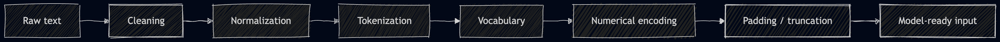

# NLP Data Preprocessing


---

## 1. What Is NLP Data Preprocessing?

### Definition

NLP data preprocessing is the process of converting messy human text into clean, structured numerical input that a machine learning model can use.

```text
Raw text -> Clean text -> Tokens -> Numbers -> Model input
```

### Why It Is Needed

Machine learning models do not understand text directly.

Example raw sentence:

```text
"OMG!!! This movie wasn't bad at all :) 10/10"
```

A model needs this in numerical form:

```text
[7, 2, 5, 6, 4, 8, 9, 9, 0, 0]
```

### Main Goal

The goal is not just to clean text.

The goal is:

```text
Remove noise, preserve meaning, and convert text into numbers.
```

###  Roadmap



### Big Picture Diagram

```text
Human text
   |
   v
"WOW!!! I didn't like it :)"
   |
   v
clean and normalize
   |
   v
"wow i did not like it smile"
   |
   v
tokenize
   |
   v
["wow", "i", "did", "not", "like", "it", "smile"]
   |
   v
convert to numbers
   |
   v
[12, 4, 9, 6, 15, 3, 20]
   |
   v
model-ready input
```

---

## 2. Why Raw Text Is Difficult

Real-world text is messy.

Example:

```text
"WOW!!! I didn't expect this movie to be soooo good :)"
```

This contains:

| Problem | Example | Why it matters |
|---|---|---|
| Mixed case | `WOW`, `wow` | Same word may become different tokens |
| Punctuation | `!!!` | May be noise or emotion |
| Contraction | `didn't` | Contains important negation |
| Repeated letters | `soooo` | Informal emphasis |
| Emoticon | `:)` | Sentiment signal |
| Informal spelling | `OMG` | Common in reviews/social media |

### : Same Meaning, Different Surface Form

```text
Human view:

Movie
movie
MOVIE

All are basically the same word.

Model vocabulary view without preprocessing:

Movie -> token 15
movie -> token 82
MOVIE -> token 146

Problem:
Vocabulary becomes bigger and learning becomes harder.
```

### Good Preprocessing Should

```text
make text consistent
reduce unnecessary vocabulary size
preserve important meaning
prepare text for the selected model
avoid data leakage
```

---

## 3. Full NLP Preprocessing Pipeline

### Standard Pipeline

```text
Raw Text
   |
   v
Text Cleaning
   |
   v
Normalization
   |
   v
Tokenization
   |
   v
Stopword handling / stemming / lemmatization
   |
   v
Vocabulary or Vectorizer
   |
   v
Numerical Encoding
   |
   v
Padding / Truncation / Feature Matrix
   |
   v
Model Input
```

### Example Pipeline

Raw:

```text
"OMG!!! This movie wasn't bad at all :) 10/10"
```

Clean and normalize:

```text
"omg this movie was not bad at all smile 10 10"
```

Tokenize:

```text
["omg", "this", "movie", "was", "not", "bad", "at", "all", "smile", "10", "10"]
```

Remove selected stopwords but keep negation:

```text
["omg", "movie", "was", "not", "bad", "smile", "10", "10"]
```

Convert to IDs:

```text
[7, 2, 5, 6, 4, 8, 9, 9]
```

Pad to length 10:

```text
[7, 2, 5, 6, 4, 8, 9, 9, 0, 0]
```

### Important Rule

There is no single best preprocessing pipeline for every NLP task.

Always ask:

```text
What information is important for this task?
What model will use this data?
```

---

## 4. Text Cleaning

### What

Text cleaning removes or fixes unwanted parts of raw text.

### Why

Raw text may contain HTML, URLs, usernames, repeated spaces, strange symbols, or formatting noise.

### Common Cleaning Operations

| Operation | Before | After |
|---|---|---|
| Remove HTML | `<br>Great movie` | `Great movie` |
| Remove URL | `visit https://abc.com` | `visit` |
| Remove username | `thanks @raj` | `thanks` |
| Normalize spaces | `very    good` | `very good` |
| Remove symbols | `movie *** great` | `movie great` |
| Convert emoticon | `:)` | `smile` |

### : Cleaning Function

```text
raw_text
   |
   v
+--------------------+
| cleaning_function  |
| - remove HTML      |
| - remove URLs      |
| - normalize spaces |
| - handle symbols   |
+--------------------+
   |
   v
clean_text
```

### Example

Raw:

```text
"<br>This movie was AMAZING!!! Visit https://review.com now"
```

Cleaned:

```text
"This movie was AMAZING Visit now"
```

### Warning

Do not blindly delete everything.

For sentiment analysis:

```text
"!!!" may mean strong emotion
":)" may mean positive sentiment
capital words may show intensity
```

For topic classification:

```text
punctuation may be less important
URLs may be removable
```

---

## 5. Lowercasing

### What

Lowercasing converts all letters to lowercase.

```text
"This Movie Was GREAT" -> "this movie was great"
```

### Why

It reduces vocabulary size.

Without lowercasing:

```text
Movie, movie, MOVIE
```

may become three different tokens.

With lowercasing:

```text
movie, movie, movie
```

all become one token.

### Formula

```text
lowercase(text) = text converted to lowercase
```

Examples:

```text
lowercase("Movie") = "movie"
lowercase("MOVIE") = "movie"
```

### : Vocabulary Before and After Lowercasing

```text
Before:

Movie -> 1
movie -> 2
MOVIE -> 3
Good  -> 4
good  -> 5

Vocabulary size = 5

After lowercasing:

movie -> 1
good  -> 2

Vocabulary size = 2
```

### When To Be Careful

Lowercasing is not always safe.

Example:

```text
US = United States
us = pronoun
```

For named entity recognition, casing can be useful.

---

## 6. Contraction Expansion

### What

Contraction expansion replaces shortened forms with full forms.

```text
wasn't -> was not
don't  -> do not
can't  -> can not
I'm    -> I am
```

### Why

Negation words like `not`, `no`, and `never` can completely change meaning.

Example:

```text
"The movie wasn't bad"
```

After expansion:

```text
"The movie was not bad"
```

Now the model can clearly see `not`.

### Formula

Contraction expansion is usually dictionary-based.

```text
expanded_text = replace(short_form, full_form)
```

Example dictionary:

```text
{
  "wasn't": "was not",
  "don't": "do not",
  "can't": "can not"
}
```

### : Why Negation Matters

```text
bad          -> negative
not bad      -> mildly positive or acceptable
not very bad -> less negative
never good   -> negative
```

Removing or hiding negation can reverse sentiment.

---

## 7. Punctuation Handling

### What

Punctuation handling decides whether punctuation should be removed, kept, or converted into tokens.

### Why

Punctuation can be noise, but it can also carry meaning.

```text
"Great."
"Great!"
"Great!!!"
```

These may express different emotional intensity.

### Options

| Strategy | Example | Use case |
|---|---|---|
| Remove punctuation | `Great!!! -> great` | Topic classification |
| Keep punctuation | `Great!!! -> ["great", "!"]` | Emotion/sentiment |
| Convert punctuation | `!!! -> strong_emphasis` | Social media sentiment |

### : Punctuation Decision

```text
Is punctuation meaningful for the task?

Yes -> keep or convert important punctuation
No  -> remove punctuation
```

### Example

```text
"Worst service ever!!!"
```

Possible outputs:

```text
["worst", "service", "ever"]
["worst", "service", "ever", "!"]
["worst", "service", "ever", "strong_emphasis"]
```

---

## 8. Number Handling

### What

Number handling decides whether numbers are kept, removed, or replaced with a generic token.

### Why

Numbers may be important or irrelevant depending on the task.

Examples:

```text
"10/10 movie"       -> number is useful for sentiment
"I watched in 2021" -> year may not matter for sentiment
"BP is 140/90"      -> number is very important in medical NLP
```

### Strategies

| Strategy | Example | When useful |
|---|---|---|
| Keep numbers | `10/10` | ratings, finance, medical NLP |
| Replace with token | `NUM` | general NLP |
| Remove numbers | remove `2021` | when numbers are irrelevant |

### 

```text
Raw: "Rated 10/10 in 2021"

Option A: keep all
["rated", "10", "10", "in", "2021"]

Option B: replace numbers
["rated", "NUM", "NUM", "in", "NUM"]

Option C: remove numbers
["rated", "in"]
```

---

## 9. Emoji and Emoticon Handling

### What

Emoji and emoticon handling converts symbols like `:)`, `:(`, or hearts into meaningful text tokens.

### Why

In reviews, chat, and social media, emojis can carry strong sentiment.

Examples:

```text
":)" -> "smile"
":(" -> "sad"
"heart emoji" -> "love"
```

### Example

```text
"The food was cold :)"
```

The words are negative, but the smile may indicate sarcasm, politeness, or mixed sentiment.

### 

```text
Raw social text
    |
    +--> words: "food was cold"
    |
    +--> emoticon: ":)"
              |
              v
         sentiment clue
```

### Practical Rule

For social media, reviews, and chat data:

```text
Do not remove emojis blindly.
Convert useful emojis into words.
```

---

## 10. Tokenization

### What

Tokenization splits text into smaller units called tokens.

Tokens can be:

```text
words
characters
subwords
```

### Why

Models need a sequence of units. Tokenization decides what the model sees.

### Word Tokenization

Sentence:

```text
"I love machine learning"
```

Tokens:

```text
["I", "love", "machine", "learning"]
```

### Formula

```text
tokenize(text) = [w1, w2, w3, ..., wT]
```

Where:

| Symbol | Meaning |
|---|---|
| `w1, w2, ...` | tokens |
| `T` | number of tokens |

### : Tokenization

```text
"I love NLP"
      |
      v
+----------------+
| tokenizer      |
+----------------+
      |
      v
["I", "love", "NLP"]
```

### Character Tokenization

Word:

```text
"cat"
```

Tokens:

```text
["c", "a", "t"]
```

Useful for:

```text
spelling correction
character-level generation
morphologically rich languages
```

### Subword Tokenization

Subword tokenization splits rare words into meaningful pieces.

Examples:

```text
"playing"     -> ["play", "ing"]
"unhappiness" -> ["un", "happiness"]
```

Modern Transformer models use subword tokenizers.

### : Tokenization Levels

```text
Text: "unhappiness"

Word-level:
["unhappiness"]

Character-level:
["u", "n", "h", "a", "p", "p", "i", "n", "e", "s", "s"]

Subword-level:
["un", "happiness"]
```

### Important Point

Bad tokenization can damage the whole pipeline.

Example:

```text
"don't" -> ["don", "t"]
```

This may lose the negation meaning unless handled carefully.

---

## 11. Stopword Removal

### What

Stopwords are very common words.

Examples:

```text
the, is, am, are, was, in, on, at, of
```

Stopword removal removes these common words.

### Why

In some classical ML tasks, stopwords add little information and increase feature size.

Example:

```text
"the movie is good" -> ["movie", "good"]
```

### Formula

Let `S` be the stopword set:

```text
S = {"the", "is", "am", "are", "in", "on", ...}
```

For tokens:

```text
tokens = [w1, w2, w3, ..., wT]
```

Filtered tokens:

```text
filtered_tokens = [w for w in tokens if w not in S]
```

### Protected Words

For sentiment analysis, protect negation words:

```text
protected_words = {"not", "no", "never"}
```

Rule:

```text
keep word if word not in stopwords OR word in protected_words
```

### : Stopword Danger

```text
Original:
"not good"

Bad stopword removal:
["good"]

Meaning changed:
negative/mixed -> positive
```

### When To Remove Stopwords

Useful:

```text
classical ML
search
topic classification
TF-IDF pipelines
```

Usually avoid manual stopword removal:

```text
LSTM/GRU if meaning may depend on function words
Transformer fine-tuning
sentiment tasks with negation
```

---

## 12. Stemming

### What

Stemming cuts words down to a rough root form.

Examples:

```text
playing -> play
played  -> play
studies -> studi
```

### Why

It groups related word forms together.

```text
play, plays, played, playing -> play
```

### Formula Idea

Stemming is rule-based.

```text
stem(word) = rough root form
```

### 

```text
playing
played
plays
   |
   v
stemmer
   |
   v
play
```

### Limitation

Stemming can produce unnatural roots.

```text
studies -> studi
```

### Best Use

Stemming is mostly used in:

```text
search
Bag of Words
TF-IDF
classical NLP
```

---

## 13. Lemmatization

### What

Lemmatization converts words to dictionary base forms using vocabulary and grammar.

Examples:

```text
running  -> run
children -> child
better   -> good
studies  -> study
```

### Why

It is more linguistically correct than stemming.

### Formula Idea

```text
lemma(word, part_of_speech) = dictionary base form
```

Examples:

```text
lemma("running", verb) = "run"
lemma("better", adjective) = "good"
lemma("children", noun) = "child"
```

### Stemming vs Lemmatization

| Word | Stemming | Lemmatization |
|---|---|---|
| studies | studi | study |
| running | run | run |
| better | better | good |
| children | children | child |

### 

```text
Word forms:
running, ran, runs
      |
      v
lemmatizer + grammar
      |
      v
run
```

### Practical Rule

Use lemmatization when quality matters more than speed.

Use stemming when you need a fast, simple classical baseline.

---

## 14. Vocabulary Building

### What

A vocabulary is a mapping from known tokens to integer IDs.

Example:

```text
<pad>      -> 0
<unk>      -> 1
movie      -> 2
good       -> 3
bad        -> 4
excellent -> 5
boring    -> 6
```

### Why

Deep learning models cannot use strings directly. They need token IDs.

### Formula

Build vocabulary from training tokens:

```text
V = {unique tokens from training data}
```

Mapping:

```text
token_to_id: token -> integer
```

Examples:

```text
token_to_id("movie") = 2
token_to_id("good")  = 3
```

Unknown token:

```text
token_to_id(unknown_word) = token_to_id("<unk>")
```

### Frequency Threshold

If `count(w)` is the number of times word `w` appears:

```text
V = {w : count(w) >= min_freq}
```

If `min_freq = 2`, words appearing once become `<unk>`.

### : Vocabulary Creation

```text
Training tokens:
["movie", "good", "movie", "bad", "excellent"]
        |
        v
count frequency
        |
        v
movie: 2
good: 1
bad: 1
excellent: 1
        |
        v
assign IDs
        |
        v
<pad>: 0, <unk>: 1, movie: 2, good: 3, bad: 4, excellent: 5
```

### Special Tokens

| Token | Meaning |
|---|---|
| `<pad>` | used to pad short sequences |
| `<unk>` | used for unknown or rare tokens |
| `<bos>` | beginning of sequence, sometimes used |
| `<eos>` | end of sequence, sometimes used |

### Important Rule

Build the vocabulary only on training data.

Do not build vocabulary using test data.

---

## 15. Converting Text Into Numbers

### What

Text representation converts tokens or documents into numerical form.

### Common Representations

| Method | Output | Used with |
|---|---|---|
| Bag of Words | count vector | Naive Bayes, Logistic Regression |
| TF-IDF | weighted sparse vector | Logistic Regression, SVM |
| Token IDs | sequence of integers | LSTM, GRU, Transformer tokenizer |
| Embeddings | dense vectors | Neural networks |

### General Formula

```text
numerical_features = representation_function(text)
```

Examples:

```text
Bag of Words: text -> count vector
TF-IDF:       text -> weighted vector
Token IDs:    text -> integer sequence
Embeddings:   token ID -> dense vector
```

### 

```text
Text
 |
 +--> Classical ML path: BoW / TF-IDF -> classifier
 |
 +--> Deep learning path: token IDs -> embeddings -> LSTM/GRU
 |
 +--> Transformer path: pretrained tokenizer -> Transformer
```

---

## 16. Bag of Words

### What

Bag of Words counts how many times each vocabulary word appears in a document.

It ignores word order.

### Example

Sentence:

```text
"movie was good good"
```

Vocabulary:

```text
["movie", "was", "good", "bad"]
```

Bag-of-Words vector:

```text
[1, 1, 2, 0]
```

Meaning:

| Word | Count |
|---|---:|
| movie | 1 |
| was | 1 |
| good | 2 |
| bad | 0 |

### Formula

Suppose:

```text
V = [w1, w2, w3, ..., wn]
```

For document `d`:

```text
BoW(d) = [count(w1, d), count(w2, d), ..., count(wn, d)]
```

### : Bag of Words

```text
Document: "movie was good good"

Vocabulary columns:
movie | was | good | bad
  1   |  1  |  2   |  0

Vector:
[1, 1, 2, 0]
```

### Binary Bag of Words

Binary BoW only stores presence or absence.

```text
BinaryBoW(w, d) = 1 if word appears
BinaryBoW(w, d) = 0 if word does not appear
```

Example:

```text
"good" appears 2 times -> 1
"bad" appears 0 times  -> 0
```

### Limitation

Bag of Words loses order.

```text
"dog bites man"
"man bites dog"
```

Both contain:

```text
dog, bites, man
```

But meanings are different.

### : Order Lost

```text
Sentence A: dog -> bites -> man
Sentence B: man -> bites -> dog

Bag-of-Words features:
dog: 1, bites: 1, man: 1

Both look identical to BoW.
```

---

## 17. TF-IDF

### What

TF-IDF gives higher weight to words that are frequent in one document but rare across all documents.

TF-IDF means:

```text
Term Frequency - Inverse Document Frequency
```

### Why

Common words like `the`, `is`, and `movie` may appear everywhere.

Specific words like `brilliant`, `refund`, `boring`, or `masterpiece` may be more useful.

### Formula

```text
TF-IDF(w, d) = TF(w, d) * IDF(w)
```

### Term Frequency

Simple:

```text
TF(w, d) = count(w, d)
```

Normalized:

```text
TF(w, d) = count(w, d) / total words in d
```

### Inverse Document Frequency

```text
IDF(w) = log(N / df(w))
```

Where:

| Symbol | Meaning |
|---|---|
| `N` | total number of documents |
| `df(w)` | number of documents containing word `w` |
| `log` | logarithm |

Smoothed version:

```text
IDF(w) = log((N + 1) / (df(w) + 1)) + 1
```

### : TF-IDF Intuition

```text
Word appears often in this document?
        |
        v
High TF

Word appears in few documents overall?
        |
        v
High IDF

High TF * High IDF = important feature
```

### Numeric Example

Documents:

```text
D1: good movie good
D2: good acting
D3: bad movie
D4: boring movie
```

For word `good` in `D1`:

```text
count("good", D1) = 2
total words in D1 = 3
TF("good", D1) = 2/3 = 0.67
```

`good` appears in 2 documents:

```text
N = 4
df("good") = 2
IDF("good") = log(4/2) = log(2) = 0.69
```

So:

```text
TF-IDF("good", D1) = 0.67 * 0.69 = 0.46
```

### Use Cases

TF-IDF works well for:

```text
spam detection
sentiment analysis
document classification
search systems
classical ML baselines
```

---

## 18. N-Grams

### What

An n-gram is a sequence of `n` continuous tokens.

### Formula

For tokens:

```text
tokens = [w1, w2, w3, ..., wm]
```

An n-gram is:

```text
(wi, wi+1, ..., wi+n-1)
```

### Examples

Sentence:

```text
"not very good movie"
```

Unigrams:

```text
["not", "very", "good", "movie"]
```

Bigrams:

```text
["not very", "very good", "good movie"]
```

Trigrams:

```text
["not very good", "very good movie"]
```

### Why N-Grams Help

Single words may miss phrase meaning.

```text
"not good" != "good"
```

With bigrams, `not good` can become one feature.

### 

```text
Tokens:
[not, very, good, movie]

Sliding window for bigrams:

[not, very]  good  movie  -> "not very"
 not [very, good] movie   -> "very good"
 not  very [good, movie]  -> "good movie"
```

### Feature Formula

```text
feature(d) = count(ngram, d)
```

or:

```text
feature(d) = TF-IDF(ngram, d)
```

---

## 19. Token IDs and Embeddings

### What

For deep learning, tokens are first converted to integer IDs.

Then an embedding layer converts IDs into dense vectors.

### Token IDs

Tokens:

```text
["movie", "was", "good"]
```

IDs:

```text
[2, 5, 3]
```

Formula:

```text
id_t = token_to_id(w_t)
```

For sequence:

```text
[w1, w2, w3, ..., wT] -> [id1, id2, id3, ..., idT]
```

### Embeddings

An embedding is a learned vector representation of a token.

Example:

```text
movie -> [0.12, -0.33, 0.88, ...]
good  -> [0.65,  0.10, 0.42, ...]
```

### Embedding Matrix

```text
E = embedding matrix
```

Shape:

```text
vocabulary_size x embedding_dimension
```

If token ID is `id_t`:

```text
embedding_vector_t = E[id_t]
```

### : Embedding Lookup

```text
Vocabulary IDs:
<pad> -> 0
movie -> 2
good  -> 3

Input IDs:
[2, 3]

Embedding table:
row 0 -> vector for <pad>
row 2 -> vector for movie
row 3 -> vector for good

Output:
[
  E[2],
  E[3]
]
```

### Shape Diagram

If:

```text
B = batch size
T = sequence length
D = embedding dimension
```

Then:

```text
Token IDs shape:       (B, T)
Embedding output:      (B, T, D)
```

:

```text
Batch token IDs:

          T tokens
       +-------------+
B rows | 2  5  3  0 |
       | 7  4  0  0 |
       +-------------+

Shape: (B, T)

After embedding:

Each number becomes a vector of length D.

Shape: (B, T, D)
```

### PyTorch

```python
import torch.nn as nn

embedding = nn.Embedding(
    num_embeddings=vocab_size,
    embedding_dim=50,
    padding_idx=0
)
```

---

## 20. Padding and Truncation

### What

Padding and truncation make sequences the same length.

### Why

Deep learning models train in batches, and tensors in a batch must have consistent shape.

Example:

```text
"good movie"                 -> 2 tokens
"the movie was very good"    -> 5 tokens
```

To batch them together, both need the same length.

### Padding

If max length is 5:

```text
[good, movie] -> [good, movie, <pad>, <pad>, <pad>]
```

With IDs:

```text
[3, 2] -> [3, 2, 0, 0, 0]
```

### Padding Formula

If sequence length is `L` and max length is `T`:

```text
number_of_pad_tokens = T - L
```

Example:

```text
L = 2
T = 5
pad tokens = 3
```

### Truncation

If sequence is too long, cut it.

```text
[this, movie, was, very, very, very, good]
```

Max length 5:

```text
[this, movie, was, very, very]
```

or keep the last tokens:

```text
[was, very, very, very, good]
```

### Truncation Formula

Right truncation:

```text
truncated_sequence = sequence[0:T]
```

Keep last `T` tokens:

```text
truncated_sequence = sequence[L-T:L]
```

### 

```text
Short sequence:
[3, 2]
   |
   v pad to length 5
[3, 2, 0, 0, 0]

Long sequence:
[8, 4, 3, 9, 1, 6, 7]
   |
   v truncate to length 5
[8, 4, 3, 9, 1]
```

### Practical Note

For sentiment analysis, the end of a review may contain the final opinion.

So sometimes keeping the last tokens works better than keeping the first tokens.

---

## 21. Preprocessing Depends on Model Type

### Model-Specific Choices

| Model | Typical preprocessing |
|---|---|
| Naive Bayes | clean, lowercase, tokenize, BoW or TF-IDF |
| Logistic Regression | clean, lowercase, TF-IDF, n-grams |
| SVM | clean, TF-IDF, n-grams |
| LSTM / GRU | clean, tokenize, vocab, token IDs, padding |
| Transformer | use pretrained tokenizer |

### : Which Path?

```text
Raw text
 |
 +--> Classical ML
 |       clean -> TF-IDF / BoW -> classifier
 |
 +--> LSTM / GRU
 |       clean -> tokens -> vocab -> IDs -> padding -> embedding
 |
 +--> Transformer
         minimal cleaning -> pretrained tokenizer -> model
```

### Transformer Warning

For BERT, GPT-style models, or other pretrained Transformers:

```text
Use the tokenizer that belongs to the pretrained model.
```

Reason:

```text
The model was trained with that tokenizer and vocabulary.
Changing the tokenizer breaks the expected input format.
```

---

## 22. Full Worked Example: Sentiment Analysis

### Dataset

| Review | Label |
|---|---:|
| `OMG!!! This movie wasn't bad at all :) 10/10` | positive |
| `Worst film ever... I want my money back!!!` | negative |
| `The acting was good, but the story was boring.` | negative |
| `Absolutely loved it. Great music and great ending!` | positive |
| `Not good. Too slow and too long.` | negative |
| `A brilliant, emotional, and beautiful movie.` | positive |

### Goal

Convert:

```text
"OMG!!! This movie wasn't bad at all :) 10/10"
```

into model input:

```text
[7, 2, 5, 6, 4, 8, 9, 9, 0, 0]
```

### Step-by-Step Flow

```text
Raw:
"OMG!!! This movie wasn't bad at all :) 10/10"

1. Lowercase:
"omg!!! this movie wasn't bad at all :) 10/10"

2. Expand contraction:
"omg!!! this movie was not bad at all :) 10/10"

3. Convert emoticon:
"omg!!! this movie was not bad at all smile 10/10"

4. Remove punctuation:
"omg this movie was not bad at all smile 10 10"

5. Tokenize:
["omg", "this", "movie", "was", "not", "bad", "at", "all", "smile", "10", "10"]

6. Remove selected stopwords:
["omg", "movie", "was", "not", "bad", "smile", "10", "10"]

7. Convert to IDs:
[7, 2, 5, 6, 4, 8, 9, 9]

8. Pad to length 10:
[7, 2, 5, 6, 4, 8, 9, 9, 0, 0]
```

### : End-to-End Example

```text
raw text
   |
   v
clean text
   |
   v
tokens
   |
   v
token IDs
   |
   v
padded IDs
   |
   v
embedding layer
   |
   v
LSTM / GRU / classifier
```

### Vocabulary Used in Example

```text
<pad> -> 0
<unk> -> 1
movie -> 2
good  -> 3
bad   -> 4
was   -> 5
not   -> 6
omg   -> 7
smile -> 8
10    -> 9
```

---

## 23. Complete Python Preprocessing Example

This simple version avoids advanced libraries so every step is visible.

```python
import re
from collections import Counter


reviews = [
    ("OMG!!! This movie wasn't bad at all :) 10/10", "positive"),
    ("Worst film ever... I want my money back!!!", "negative"),
    ("The acting was good, but the story was boring.", "negative"),
    ("Absolutely loved it. Great music and great ending!", "positive"),
    ("Not good. Too slow and too long.", "negative"),
    ("A brilliant, emotional, and beautiful movie.", "positive"),
]


contractions = {
    "wasn't": "was not",
    "weren't": "were not",
    "isn't": "is not",
    "aren't": "are not",
    "don't": "do not",
    "doesn't": "does not",
    "didn't": "did not",
    "can't": "can not",
    "won't": "will not",
    "i'm": "i am",
}


stopwords = {
    "a", "an", "the", "this", "that", "it", "i", "my",
    "and", "or", "at", "all", "to", "of", "in"
}


def expand_contractions(text):
    for short_form, expanded in contractions.items():
        text = text.replace(short_form, expanded)
    return text


def clean_text(text):
    text = text.lower()
    text = expand_contractions(text)
    text = text.replace(":)", " smile ")
    text = text.replace(":(", " sad ")
    text = re.sub(r"http\S+|www\S+", " ", text)
    text = re.sub(r"[^a-z0-9\s]", " ", text)
    text = re.sub(r"\s+", " ", text).strip()
    return text


def tokenize(text):
    return text.split()


def remove_stopwords(tokens):
    keep_words = {"not", "no", "never"}
    return [
        token for token in tokens
        if token not in stopwords or token in keep_words
    ]


def preprocess_text(text):
    text = clean_text(text)
    tokens = tokenize(text)
    tokens = remove_stopwords(tokens)
    return tokens


processed_reviews = [
    (preprocess_text(review), label)
    for review, label in reviews
]

print(processed_reviews)
```

### What This Code Does

```text
clean_text:
  lowercase
  expand contractions
  convert emoticons
  remove URLs
  remove punctuation
  normalize spaces

tokenize:
  split cleaned text into tokens

remove_stopwords:
  remove common words
  keep negation words
```

---

## 24. Build Vocabulary and Encode Text

### Code

```python
def build_vocab(tokenized_texts, min_freq=1):
    counter = Counter()

    for tokens in tokenized_texts:
        counter.update(tokens)

    vocab = {
        "<pad>": 0,
        "<unk>": 1,
    }

    for token, count in counter.items():
        if count >= min_freq:
            vocab[token] = len(vocab)

    return vocab


def encode_tokens(tokens, vocab):
    return [
        vocab.get(token, vocab["<unk>"])
        for token in tokens
    ]


tokenized_texts = [
    tokens for tokens, label in processed_reviews
]

vocab = build_vocab(tokenized_texts)

encoded_reviews = [
    (encode_tokens(tokens, vocab), label)
    for tokens, label in processed_reviews
]

print(vocab)
print(encoded_reviews)
```

### : Encoding Tokens

```text
Tokens:
["omg", "movie", "was", "not", "bad"]

Vocabulary:
omg -> 7
movie -> 2
was -> 5
not -> 6
bad -> 4

Encoded:
[7, 2, 5, 6, 4]
```

---

## 25. Padding and Label Encoding

### Code

```python
def pad_sequence(sequence, max_len, pad_value=0):
    if len(sequence) > max_len:
        return sequence[:max_len]

    return sequence + [pad_value] * (max_len - len(sequence))


label_to_id = {
    "negative": 0,
    "positive": 1,
}


max_len = 10

X = [
    pad_sequence(encoded, max_len=max_len, pad_value=vocab["<pad>"])
    for encoded, label in encoded_reviews
]

y = [
    label_to_id[label]
    for encoded, label in encoded_reviews
]

print(X)
print(y)
```

### Output Meaning

```text
X = padded token ID sequences
y = numerical labels
```

Example:

```text
positive -> 1
negative -> 0
```

---

## 26. LSTM-Ready Data

### What LSTM Needs

LSTM/GRU models usually expect:

```text
token IDs -> embedding layer -> sequence model
```

### Example

```text
X = [
  [7, 2, 5, 6, 4, 8, 9, 9, 0, 0],
  [10, 11, 12, 13, 14, 15, 0, 0, 0, 0],
]

y = [1, 0]
```

### PyTorch Example

```python
import torch
import torch.nn as nn


X_tensor = torch.tensor(X, dtype=torch.long)
y_tensor = torch.tensor(y, dtype=torch.long)

embedding = nn.Embedding(
    num_embeddings=len(vocab),
    embedding_dim=50,
    padding_idx=vocab["<pad>"]
)

embedded = embedding(X_tensor)

print(embedded.shape)
```

### Shape Explanation

If:

```text
number of reviews = 6
max length = 10
embedding dimension = 50
```

Then:

```text
embedded.shape = (6, 10, 50)
```

Meaning:

```text
6 reviews
10 tokens per review
50 features per token
```

### LSTM Input Formula

With `batch_first=True`:

```text
input shape = (batch_size, sequence_length, embedding_dimension)
```

Short form:

```text
X_embedded shape = (B, T, D)
```

---

## 27. Classical ML Version: TF-IDF Pipeline

### When To Use

Use this for classical ML models:

```text
Logistic Regression
Naive Bayes
SVM
Random Forest on sparse text features
```

### Code

```python
from sklearn.feature_extraction.text import TfidfVectorizer
from sklearn.linear_model import LogisticRegression
from sklearn.pipeline import Pipeline


texts = [review for review, label in reviews]
labels = [label for review, label in reviews]


model = Pipeline([
    ("tfidf", TfidfVectorizer(
        lowercase=True,
        stop_words="english",
        ngram_range=(1, 2)
    )),
    ("classifier", LogisticRegression())
])


model.fit(texts, labels)

prediction = model.predict([
    "The movie was slow but the ending was excellent"
])

print(prediction)
```

### 

```text
Raw text
   |
   v
TfidfVectorizer
   |
   v
sparse numerical vector
   |
   v
Logistic Regression
   |
   v
class label
```

### Important Warning

In real projects:

```text
split train/test before fitting TF-IDF
```

---

## 28. Data Leakage

### What

Data leakage happens when information from validation or test data enters training.

### Bad Pipeline

```text
All text -> build vocabulary / fit TF-IDF -> split train/test -> train model
```

Why bad?

```text
The vocabulary or TF-IDF statistics have already seen the test data.
```

### Correct Pipeline

```text
Raw data
   |
   v
Train/test split
   |
   +--> Train text -> fit preprocessing -> transform train -> train model
   |
   +--> Test text  -> use same fitted preprocessing -> evaluate
```

### Formula

Correct:

```text
preprocessor = fit(X_train)
X_train_processed = transform(preprocessor, X_train)
X_test_processed  = transform(preprocessor, X_test)
```

Wrong:

```text
preprocessor = fit(X_train + X_test)
```

### : Leakage

```text
Wrong:

test data ----+
              v
all data -> vocabulary -> model training
              ^
train data ---+

The model preparation has indirectly seen test data.
```

### Rule

Fit preprocessing objects only on training data.

Use the fitted objects to transform validation and test data.

---

## 29. Which Technique To Use When

| Task | Recommended preprocessing |
|---|---|
| Sentiment with Logistic Regression | lowercase, clean URLs, TF-IDF, n-grams |
| Sentiment with LSTM | clean text, handle contractions, tokenize, vocab, pad |
| Named Entity Recognition | preserve casing, careful tokenization, align labels |
| Spam detection | clean URLs/emails, TF-IDF, n-grams |
| Search engine | normalization, stemming or lemmatization, TF-IDF |
| Transformer fine-tuning | use pretrained tokenizer, minimal manual cleaning |
| Social media sentiment | handle hashtags, mentions, emojis, repeated letters |
| Medical NLP | keep numbers, units, abbreviations, domain terms |

### Decision Diagram

```text
Are you using a pretrained Transformer?
   |
   +-- yes -> use its tokenizer
   |
   +-- no
        |
        v
Are you using classical ML?
   |
   +-- yes -> TF-IDF / BoW + n-grams
   |
   +-- no
        |
        v
Are you using LSTM/GRU?
   |
   +-- yes -> tokens -> vocab -> IDs -> padding -> embeddings
```

---

## 30. Industry Standards and Practical Notes

### Standard Practices

```text
fit vectorizers only on training data
save the fitted tokenizer/vectorizer/vocabulary
use the same preprocessing in training and inference
track unknown-token rate
handle padding consistently
keep domain-specific information
avoid over-cleaning
```

### Save Preprocessing Artifacts

For deployment, save:

```text
vocabulary
label mapping
max sequence length
tokenizer rules
TF-IDF vectorizer
normalization rules
```

### Training vs Inference

The same preprocessing must run during inference.

```text
Training:
raw text -> preprocessing -> model

Production:
raw text -> same preprocessing -> model
```

If production preprocessing differs, model performance may drop.

### : Production Pipeline

```text
User review
   |
   v
same cleaning rules
   |
   v
same tokenizer
   |
   v
same vocabulary/vectorizer
   |
   v
same padding/max length
   |
   v
trained model
   |
   v
prediction
```

---

## 31. Common Mistakes

### Mistake 1: Removing Negation

```text
"not good" -> "good"
```

This changes meaning.

### Mistake 2: Removing Useful Emojis

For sentiment tasks:

```text
":)" and ":(" may be useful labels hidden inside the text.
```

### Mistake 3: Building Vocabulary on Full Data

This causes data leakage.

Correct:

```text
build vocabulary on training data only
```

### Mistake 4: Using Same Preprocessing for Every Task

Different tasks need different preprocessing.

Example:

```text
NER may need casing.
Sentiment may need emojis and negation.
Medical NLP may need numbers and units.
```

### Mistake 5: Forgetting Padding

LSTM/GRU batches need equal-length sequences.

### Mistake 6: Wrong Tokenizer for Transformers

Use the pretrained model tokenizer.

### Mistake 7: Over-Cleaning

Removing too much can remove meaning.

```text
"10/10!!! :)"
```

This is mostly signal, not noise, for sentiment.

---

## 32. Quick Revision Cheat Sheet

### Pipeline

```text
Raw text -> Clean -> Normalize -> Tokenize -> Numbers -> Model
```

### Cleaning

```text
remove HTML, URLs, extra spaces, unwanted symbols
```

### Normalization

```text
lowercase
expand contractions
handle numbers
handle emojis
```

### Tokenization

```text
word tokens
character tokens
subword tokens
```

### Classical ML

```text
text -> BoW / TF-IDF / n-grams -> classifier
```

### Deep Learning

```text
text -> tokens -> token IDs -> padding -> embeddings -> LSTM/GRU
```

### Transformer

```text
text -> pretrained tokenizer -> Transformer
```

### Most Important Warnings

```text
do not remove meaning
do not remove negation blindly
do not fit preprocessing on test data
do not use the wrong tokenizer
```

---
