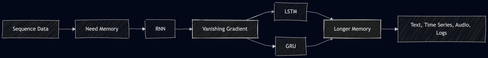

# Sequence Models

## RNN, LSTM, GRU


### Visual Roadmap



### Big Picture

```text
Raw sequence
    |
    v
tokens / frames / events / prices
    |
    v
vectors or embeddings
    |
    v
RNN / LSTM / GRU
    |
    +--> final output       many-to-one task
    |
    +--> output per step    many-to-many task
```

---

## 1. What Is Sequence Data?

### Definition

Sequence data is data where the order of items matters.

```text
x1 -> x2 -> x3 -> ... -> xt
```

Each item depends on what came before it, what comes after it, or both.

### Why It Matters

In normal tabular or image classification, each input is often treated as independent.

```text
Independent data:
sample_1, sample_2, sample_3

Sequence data:
word_1 -> word_2 -> word_3
```

For sequence problems, changing the order can change the meaning.

### Examples

| Data | Sequence Element | Why order matters |
|---|---|---|
| Text | Words or tokens | "Dog bites man" and "Man bites dog" mean different things |
| Audio | Sound frames | Sounds form words over time |
| Video | Frames | Motion depends on frame order |
| Stock prices | Daily prices | Today depends on previous days |
| DNA | Nucleotides | Gene patterns depend on order |
| Logs | Events | Attack patterns depend on event sequence |

### Core Problem

MLPs and CNNs do not naturally remember previous time steps.

```text
MLP:
current input -> prediction

Sequence model:
current input + previous memory -> prediction
```

###  Why Order Changes Meaning

```text
Same words, different order:

Sentence A:  dog -> bites -> man
Meaning:     dog attacks man

Sentence B:  man -> bites -> dog
Meaning:     man attacks dog

Bag-of-words view:
{dog, bites, man}

Problem:
Bag-of-words loses order, so both sentences look the same.
Sequence models keep order.
```

###  Sequence Memory

```text
At each step, the model carries a summary of the past.

time 1              time 2              time 3
 x1                 x2                  x3
 |                  |                   |
 v                  v                   v
[model] --h1-----> [model] --h2-----> [model] --h3

h1 = memory after x1
h2 = memory after x1, x2
h3 = memory after x1, x2, x3
```

---

## 2. Sequence Model Basics

### Common Notation

| Symbol | Meaning |
|---|---|
| `t` | current time step |
| `x_t` | input at time step `t` |
| `h_t` | hidden state at time step `t` |
| `h_{t-1}` | previous hidden state |
| `y_t` | output at time step `t` |
| `W` | learnable weight matrix |
| `b` | learnable bias |
| `sigma` | sigmoid function, output from `0` to `1` |
| `tanh` | activation function, output from `-1` to `1` |
| `odot` | element-wise multiplication |

### Shape Convention

In PyTorch, use:

```python
batch_first=True
```

Then sequence input shape is:

```text
(batch_size, sequence_length, input_size)
```

For text:

```text
raw sentence -> token ids -> embeddings -> RNN/LSTM/GRU

token ids shape:  (B, T)
embedding shape:  (B, T, E)
model output:      (B, T, H)
final hidden:      (L, B, H)
```

###  Tensor Shape for Text

```text
Batch of 3 sentences, padded to length 5:

Sentence 1: [I, love, this, movie, PAD]
Sentence 2: [bad, acting, PAD, PAD, PAD]
Sentence 3: [very, good, ending, today, PAD]

Token IDs shape:

          T=5 time steps
       +-------------------+
B=3    |  11  53  71  82  0 |
rows   |  44  91   0   0  0 |
       |  38  57  68  25  0 |
       +-------------------+

Shape: (B, T) = (3, 5)

After embedding:
Shape: (B, T, E) = (3, 5, embedding_dim)
```

###  One Token Through the Pipeline

```text
word
 |
 v
token id
 |
 v
embedding vector
 |
 v
sequence model cell
 |
 v
hidden state
```

Where:

| Symbol | Meaning |
|---|---|
| `B` | batch size |
| `T` | sequence length |
| `E` | embedding dimension |
| `H` | hidden size |
| `L` | number of recurrent layers |

---

## 3. RNN: Recurrent Neural Network

### What

An RNN is a neural network for sequences. It reads one item at a time and keeps a hidden state as memory.

### Why

RNNs are used when the model needs to remember previous inputs.

Example:

```text
"I grew up in France, so I speak fluent ____"
```

To predict `French`, the model must remember `France`.

### How

At each time step:

```text
current input + previous hidden state -> new hidden state
```

### RNN Flow Diagram

```text
Input sequence:
x1        x2        x3        x4
|         |         |         |
v         v         v         v
+-----+   +-----+   +-----+   +-----+
| RNN |-->| RNN |-->| RNN |-->| RNN |
+-----+   +-----+   +-----+   +-----+
  |         |         |         |
  v         v         v         v
 y1        y2        y3        y4

Hidden memory flows left to right:
h0 -> h1 -> h2 -> h3 -> h4
```

###  Rolled vs Unrolled RNN

The compact RNN diagram has a loop:

```text
        +-----+
x_t --->| RNN |---> y_t
        +-----+
          ^ |
          | |
          +-+
        hidden memory
```

When we unroll it over time, the loop becomes repeated cells:

```text
x1        x2        x3        x4
|         |         |         |
v         v         v         v
RNN ----> RNN ----> RNN ----> RNN
|         |         |         |
v         v         v         v
y1        y2        y3        y4
```

###  Inside One RNN Cell

```text
                  previous memory
                     h_{t-1}
                        |
                        v
current input       +--------+
    x_t ----------->| combine|----> tanh ----> h_t
                    +--------+                 |
                                               v
                                             output
```

### RNN Equation

```text
h_t = tanh(W_x x_t + W_h h_{t-1} + b)
y_t = W_y h_t + b_y
```

Meaning:

| Part | Meaning |
|---|---|
| `W_x x_t` | information from current input |
| `W_h h_{t-1}` | information from previous memory |
| `tanh(...)` | squashes hidden values between `-1` and `1` |
| `y_t` | optional output at current time step |

### Important Point: Shared Weights

The same RNN cell and same weights are reused at every time step.

```text
time 1: use W_x and W_h
time 2: use same W_x and W_h
time 3: use same W_x and W_h
```

This is called weight sharing across time.

### Data Flow Example: Sentiment Classification

Sentence:

```text
"The movie was boring"
```

Flow:

```text
"The"    -> h1 stores weak context
"movie"  -> h2 stores subject = movie
"was"    -> h3 prepares description
"boring" -> h4 stores negative sentiment

Final hidden h4 -> Linear layer -> negative class
```


```text
"The"      "movie"      "was"       "boring"
  |           |           |            |
  v           v           v            v
 h1 -------> h2 -------> h3 --------> h4
                                      |
                                      v
                              Linear classifier
                                      |
                                      v
                                negative class
```

### RNN PyTorch Example

```python
import torch
import torch.nn as nn

class SimpleRNNClassifier(nn.Module):
    def __init__(self, input_size, hidden_size, num_classes):
        super().__init__()
        self.rnn = nn.RNN(
            input_size=input_size,
            hidden_size=hidden_size,
            batch_first=True
        )
        self.fc = nn.Linear(hidden_size, num_classes)

    def forward(self, x):
        # x: (B, T, input_size)
        output, h_n = self.rnn(x)

        # output: (B, T, H), hidden state at every time step
        # h_n:    (1, B, H), final hidden state
        last_hidden = h_n[-1]

        return self.fc(last_hidden)

model = SimpleRNNClassifier(input_size=10, hidden_size=32, num_classes=2)
x = torch.randn(8, 20, 10)
logits = model(x)
print(logits.shape)  # torch.Size([8, 2])
```

---

## 4. The Vanishing Gradient Problem

### What

Vanishing gradient means the learning signal becomes extremely small when backpropagating through many time steps.

### Why It Happens

For a vanilla RNN:

```text
h_t depends on h_{t-1}
h_{t-1} depends on h_{t-2}
h_{t-2} depends on h_{t-3}
```

So the gradient must pass backward through many repeated multiplications.

```text
Loss -> h100 -> h99 -> h98 -> ... -> h1
```

By chain rule:

```text
dLoss/dh1 =
dLoss/dh100 * dh100/dh99 * dh99/dh98 * ... * dh2/dh1
```

If each local gradient is around `0.9`:

```text
0.9^50 = 0.005
0.9^100 = 0.000026
```

The gradient becomes almost zero.

###  Gradient Shrinking Ladder

```text
Backward through time:

Loss gradient
    |
    v
time 100: 1.000000
    |
    | multiply by 0.9
    v
time  99: 0.900000
    |
    | multiply by 0.9
    v
time  98: 0.810000
    |
    | multiply by 0.9 again and again
    v
time  50: 0.005154
    |
    v
time   1: almost zero
```

###  Why Early Words Stop Learning

```text
Important word                                      Loss
    |                                                |
    v                                                v
  x1 -> h1 -> h2 -> h3 -> h4 -> ... -> h100 -> prediction
        ^                                      |
        |                                      |
        +---------- tiny gradient -------------+

If the gradient reaching h1 is tiny, the model barely learns from x1.
```

### Exploding Gradient

If each local gradient is greater than `1`, gradients may explode.

```text
1.2^50 = 9100+
```

This can make training unstable and produce `NaN` loss.

### Why This Is Bad

The model cannot learn long-distance relationships.

Example:

```text
"The trophy did not fit in the suitcase because it was too large."
```

The word `it` refers to `trophy`, not `suitcase`. A vanilla RNN may forget the earlier clue.

###  Long Dependency

```text
The trophy did not fit in the suitcase because it was too large.
    |                                             |
    +--------------- long dependency ------------+

Correct reference:
it -> trophy

Hard part:
the model must preserve "trophy" while reading many later words.
```

---

## 5. LSTM: Long Short-Term Memory

### What

LSTM is an improved RNN that uses gates to control memory.

It has two states:

| State | Meaning |
|---|---|
| `h_t` | hidden state, short-term output memory |
| `C_t` | cell state, long-term memory |

### Why

LSTM was designed to reduce the vanishing-gradient problem and remember important information for longer sequences.

### How

At each time step, LSTM receives:

```text
x_t      = current input
h_{t-1}  = previous hidden state
C_{t-1}  = previous cell state
```

It produces:

```text
h_t      = new hidden state
C_t      = new cell state
```

###  LSTM Inputs and Outputs

```text
Inputs to one LSTM cell:

          h_{t-1}  previous short memory
             |
             v
x_t ----> [ LSTM CELL ] ----> h_t  new short memory/output
             ^
             |
          C_{t-1}  previous long memory

Also outputs:

C_t = new long memory
```

### LSTM Flow Diagram

```text
                       [h_{t-1}, x_t]
                    /       |       |       \
                   v        v       v        v
               forget    input  candidate  output
                gate      gate   memory     gate
                  |        |       |         |
                  v        +---*---+         |
C_{t-1} -------->*             |             |
                  \            v             |
                   +--------> C_t -> tanh -> * -> h_t
                                            ^
                                            |
                                         output gate
```

###  Full LSTM Gate Layout

```text
                         joined input
                        [h_{t-1}, x_t]
                              |
        +---------------------+----------------------+
        |                     |                      |
        v                     v                      v
   +----------+          +----------+            +----------+
   | forget   |          | input    |            | candidate|
   | gate f_t |          | gate i_t |            | memory g_t
   +----------+          +----------+            +----------+
        |                     |                      |
        |                     +----------+-----------+
        |                                |
        v                                v
old memory filter                  new memory filter
 f_t odot C_{t-1}                   i_t odot g_t
        |                                |
        +----------------+---------------+
                         |
                         v
                    new cell C_t
                         |
                         v
                      tanh(C_t)
                         |
                         v
                  +-------------+
                  | output gate |
                  |    o_t      |
                  +-------------+
                         |
                         v
                    hidden h_t
```

### LSTM Equations

```text
f_t = sigma(W_f [h_{t-1}, x_t] + b_f)
i_t = sigma(W_i [h_{t-1}, x_t] + b_i)
g_t = tanh(W_g [h_{t-1}, x_t] + b_g)

C_t = f_t odot C_{t-1} + i_t odot g_t

o_t = sigma(W_o [h_{t-1}, x_t] + b_o)
h_t = o_t odot tanh(C_t)
```

### Gate Meanings

| Gate | Equation | Question answered |
|---|---|---|
| Forget gate | `f_t` | What old memory should be kept or removed? |
| Input gate | `i_t` | How much new information should be written? |
| Candidate memory | `g_t` | What new information could be written? |
| Output gate | `o_t` | What part of memory should be shown now? |

### Sigmoid Gate Meaning

Sigmoid outputs values from `0` to `1`.

```text
0   -> closed gate, block information
0.5 -> allow half
1   -> open gate, pass information
```

### Cell State Update Explained

```text
C_t = f_t odot C_{t-1} + i_t odot g_t
      ---------------   -----------
       kept old memory   selected new memory
```

This equation says:

1. Keep useful old memory.
2. Forget unimportant old memory.
3. Add useful new memory.

###  Gate Values as Valves

```text
Gate value = 0.0
information ----X----> blocked

Gate value = 0.5
information --half---> partially passed

Gate value = 1.0
information ---------> fully passed
```

###  Cell State as Memory Highway

```text
Vanilla RNN memory path:

h1 -> tanh -> h2 -> tanh -> h3 -> tanh -> h4
      rewrite      rewrite      rewrite

LSTM cell-state path:

C1 ----------------> C2 ----------------> C3 ----------------> C4
       keep/add           keep/add            keep/add

Reason it helps:
important memory has a cleaner path through time.
```

### Example: Country and Language

Sentence:

```text
"I grew up in France, so I speak fluent French."
```

Flow:

| Time | Word | Possible LSTM behavior |
|---:|---|---|
| 1 | I | store small subject context |
| 2 | grew | update context |
| 3 | up | continue phrase |
| 4 | in | expect location |
| 5 | France | input gate writes `country = France` |
| 6 | so | keep country because result is coming |
| 7 | I | keep useful memory |
| 8 | speak | activate language context |
| 9 | fluent | prepare language prediction |
| 10 | French | output gate uses stored country information |

Diagram:

```text
"France" -> input gate writes location memory -> C_t stores it

many words pass

"French" -> output gate reveals useful memory -> correct prediction
```

Visual memory trace:

```text
time:     1      2       3       4        5        6      7      8       9        10
word:     I    grew      up      in     France     so     I    speak  fluent   French
          |      |       |       |        |        |      |      |       |        |
C_t:    small context ---------> expect location -> country=France -------------> used
```

### Example: Sentiment With Contrast

Sentence:

```text
"The movie was boring at first, but the ending was brilliant."
```

Possible gate behavior:

| Phrase | Gate behavior |
|---|---|
| `boring` | input gate writes negative sentiment |
| `at first` | memory marks negative as temporary |
| `but` | forget gate reduces earlier negative sentiment |
| `brilliant` | input gate writes strong positive sentiment |
| final prediction | output gate reveals positive sentiment |


```text
negative memory written
        |
        v
"boring" ----> C_t stores negative signal
                  |
                  v
               "but"
                  |
                  v
        forget gate weakens old negative
                  |
                  v
"brilliant" -> input gate writes positive signal
                  |
                  v
        final hidden state -> positive prediction
```

### Why LSTM Helps With Vanishing Gradient

Vanilla RNN repeatedly rewrites memory:

```text
h1 -> tanh -> h2 -> tanh -> h3 -> tanh -> ... -> h100
```

LSTM has a cell-state path:

```text
C1 -----------------> C2 -----------------> C3 -----------------> C100
```

The additive update helps:

```text
C_t = f_t odot C_{t-1} + new_information
```

If `f_t` stays close to `1`, important memory and gradients can pass through many time steps.

Important wording:

```text
LSTM does not magically remove vanishing gradients.
It reduces the problem by giving gradients a better path through the cell state.
```

###  RNN vs LSTM Backward Path

```text
RNN backward path:

Loss -> h100 -> h99 -> h98 -> ... -> h1
        *W     *W     *W             *W

Many repeated matrix multiplications can shrink or explode gradients.

LSTM backward path through cell state:

Loss -> C100 -> C99 -> C98 -> ... -> C1
        *f100  *f99   *f98          *f1

If forget gates stay near 1, gradients survive better.
```

### LSTM PyTorch Example

```python
import torch
import torch.nn as nn

class SentimentLSTM(nn.Module):
    def __init__(self, vocab_size, embed_dim, hidden_size, num_layers, num_classes):
        super().__init__()
        self.embedding = nn.Embedding(vocab_size, embed_dim, padding_idx=0)
        self.lstm = nn.LSTM(
            input_size=embed_dim,
            hidden_size=hidden_size,
            num_layers=num_layers,
            batch_first=True,
            dropout=0.3 if num_layers > 1 else 0.0
        )
        self.dropout = nn.Dropout(0.3)
        self.fc = nn.Linear(hidden_size, num_classes)

    def forward(self, x):
        # x: (B, T), token ids
        embedded = self.dropout(self.embedding(x))
        # embedded: (B, T, E)

        output, (h_n, c_n) = self.lstm(embedded)
        # output: (B, T, H)
        # h_n:    (L, B, H)
        # c_n:    (L, B, H)

        last_hidden = h_n[-1]
        return self.fc(self.dropout(last_hidden))

model = SentimentLSTM(
    vocab_size=10000,
    embed_dim=128,
    hidden_size=256,
    num_layers=2,
    num_classes=2
)

x = torch.randint(0, 10000, (32, 50))
logits = model(x)
print(logits.shape)  # torch.Size([32, 2])
```

---

## 6. GRU: Gated Recurrent Unit

### What

GRU is a simplified version of LSTM.

It has:

| Feature | LSTM | GRU |
|---|---:|---:|
| States | 2: `h_t`, `C_t` | 1: `h_t` |
| Gates | 3 | 2 |
| Parameters | More | Fewer |
| Speed | Slower | Faster |

###  LSTM vs GRU Memory Design

```text
LSTM:

previous hidden h_{t-1} ----+
                            |
current input x_t ----------+--> gates --> h_t
                            |
previous cell C_{t-1} ------+--> gates --> C_t

Two memory streams:
h_t = short-term/output memory
C_t = long-term cell memory


GRU:

previous hidden h_{t-1} ----+
                            +--> gates --> h_t
current input x_t ----------+

One memory stream:
h_t = hidden state and memory
```

### Why

GRU often performs similarly to LSTM but trains faster and uses fewer parameters.

### How

GRU uses two gates:

| Gate | Meaning |
|---|---|
| Reset gate `r_t` | How much past information to use while creating new candidate memory |
| Update gate `z_t` | How much old memory to keep vs how much new memory to use |

### GRU Diagram

```text
              h_{t-1} -------------------------+
                 |                              |
                 v                              v
x_t -------> reset gate r_t               update gate z_t
                 |                              |
                 v                              |
        candidate hidden h_tilde                |
                 |                              |
                 +------------ combine ---------+
                              |
                             v
                             h_t
```

###  GRU Reset Gate

```text
Reset gate controls how much past is used for the candidate.

r_t close to 0:
old memory h_{t-1} ----X----+
                            |
x_t ------------------------+--> candidate h_tilde

Meaning:
ignore old topic, start fresh


r_t close to 1:
old memory h_{t-1} ---------+
                            |
x_t ------------------------+--> candidate h_tilde

Meaning:
use old context strongly
```

###  GRU Update Gate

```text
Update gate mixes old memory and new candidate.

                  +------------------+
h_{t-1} ----------| keep old part    |
                  +------------------+
                           \
                            +----> h_t
                           /
                  +------------------+
h_tilde ---------| use new candidate |
                  +------------------+

z_t small  -> mostly old memory
z_t large  -> mostly new candidate
```

### GRU Equations

```text
r_t = sigma(W_r [h_{t-1}, x_t] + b_r)
z_t = sigma(W_z [h_{t-1}, x_t] + b_z)

h_tilde = tanh(W_g [r_t odot h_{t-1}, x_t] + b_g)

h_t = (1 - z_t) odot h_{t-1} + z_t odot h_tilde
```

### Update Gate Cases

```text
z_t = 0   -> h_t = h_{t-1}       keep old memory
z_t = 1   -> h_t = h_tilde       use new candidate
z_t = 0.5 -> mix old and new
```

### GRU PyTorch Example

```python
class SentimentGRU(nn.Module):
    def __init__(self, vocab_size, embed_dim, hidden_size, num_layers, num_classes):
        super().__init__()
        self.embedding = nn.Embedding(vocab_size, embed_dim, padding_idx=0)
        self.gru = nn.GRU(
            input_size=embed_dim,
            hidden_size=hidden_size,
            num_layers=num_layers,
            batch_first=True,
            dropout=0.3 if num_layers > 1 else 0.0
        )
        self.dropout = nn.Dropout(0.3)
        self.fc = nn.Linear(hidden_size, num_classes)

    def forward(self, x):
        embedded = self.dropout(self.embedding(x))
        output, h_n = self.gru(embedded)

        last_hidden = h_n[-1]
        return self.fc(self.dropout(last_hidden))
```

Key difference:

```python
# RNN / GRU
output, h_n = model(x)

# LSTM
output, (h_n, c_n) = model(x)
```

---

## 7. RNN vs LSTM vs GRU

| Feature | Vanilla RNN | LSTM | GRU |
|---|---|---|---|
| Memory | Short | Long | Long |
| Gates | None | Forget, input, output | Reset, update |
| States | `h_t` | `h_t`, `C_t` | `h_t` |
| Parameters | Fewest | Most | Medium |
| Training speed | Fast but unstable | Slower | Faster than LSTM |
| Long dependencies | Poor | Strong | Good |
| Practical use | Toy/simple tasks | Long sequences | Good default |

### Simple Decision Rule

```text
Use RNN:
  only for learning/demo or very simple short sequences

Use GRU:
  when you want a strong, fast baseline

Use LSTM:
  when long-term dependencies are important or GRU is not enough

Use Transformer:
  when the task is large-scale NLP, long context, or needs parallel training
```

---

## 8. Input and Output Types

### Many-to-One

One output for the whole sequence.

```text
x1 -> x2 -> x3 -> x4 -> final prediction
```


```text
x1       x2       x3       x4
|        |        |        |
v        v        v        v
h1 ----> h2 ----> h3 ----> h4
                           |
                           v
                    one prediction
```

Examples:

| Task | Input | Output |
|---|---|---|
| Sentiment analysis | Review words | Positive/negative |
| Spam detection | Email tokens | Spam/not spam |
| Malware detection | API call sequence | Malicious/benign |

Use final hidden state:

```python
last_hidden = h_n[-1]
logits = fc(last_hidden)
```

### Many-to-Many

One output at each time step.

```text
x1 -> y1
x2 -> y2
x3 -> y3
```


```text
x1       x2       x3       x4
|        |        |        |
v        v        v        v
h1 ----> h2 ----> h3 ----> h4
|        |        |        |
v        v        v        v
y1       y2       y3       y4
```

Examples:

| Task | Input | Output |
|---|---|---|
| POS tagging | Words | Part of speech per word |
| Named entity recognition | Words | Entity label per word |
| Time-series prediction | Sensor values | Prediction per time step |

Use `output`:

```python
output, h_n = gru(x)
# output shape: (B, T, H)
logits_each_step = fc(output)
```

### Encoder-Decoder

Input sequence and output sequence may have different lengths.

```text
English sentence -> encoder -> context -> decoder -> Hindi sentence
```


```text
Encoder reads input sequence:

x1 -> x2 -> x3 -> x4 -> context vector

Decoder produces output sequence:

context -> y1 -> y2 -> y3 -> y4 -> END
```

Examples:

| Task | Input | Output |
|---|---|---|
| Translation | Source sentence | Target sentence |
| Summarization | Document | Summary |
| Speech recognition | Audio frames | Text |

---

## 9. Bidirectional RNN/LSTM/GRU

### What

Bidirectional models read the sequence in both directions.

```text
Forward:   x1 -> x2 -> x3 -> x4
Backward:  x1 <- x2 <- x3 <- x4
```


```text
Forward pass:
x1 ----> x2 ----> x3 ----> x4
 |       |        |        |
hf1     hf2      hf3      hf4

Backward pass:
x1 <---- x2 <---- x3 <---- x4
 |       |        |        |
hb1     hb2      hb3      hb4

Final representation at each time step:

step 1: [hf1 ; hb1]
step 2: [hf2 ; hb2]
step 3: [hf3 ; hb3]
step 4: [hf4 ; hb4]
```

At each position, the model gets:

```text
[forward hidden ; backward hidden]
```

### Why

Sometimes future context helps.

Example:

```text
"I went to the bank to withdraw money."
```

The word `withdraw` helps identify `bank` as a financial bank.

### PyTorch

```python
self.lstm = nn.LSTM(
    input_size=embed_dim,
    hidden_size=hidden_size,
    batch_first=True,
    bidirectional=True
)
```

Important:

```text
output hidden size becomes 2 * hidden_size
```

So the classifier must change:

```python
self.fc = nn.Linear(2 * hidden_size, num_classes)
```

---

## 10. Stacked RNN/LSTM/GRU

### What

Stacked recurrent models use multiple recurrent layers.

```text
Input -> LSTM layer 1 -> LSTM layer 2 -> LSTM layer 3 -> Output
```


```text
Time flows left to right inside each layer.

Layer 3:        h3_1 ----> h3_2 ----> h3_3 ----> h3_4
                 ^         ^         ^          ^
                 |         |         |          |
Layer 2:        h2_1 ----> h2_2 ----> h2_3 ----> h2_4
                 ^         ^         ^          ^
                 |         |         |          |
Layer 1:        h1_1 ----> h1_2 ----> h1_3 ----> h1_4
                 ^         ^         ^          ^
                 |         |         |          |
Input:           x1        x2        x3         x4
```

### Why

Lower layers can learn simple patterns, higher layers can learn more abstract patterns.

### PyTorch

```python
nn.LSTM(
    input_size=128,
    hidden_size=256,
    num_layers=3,
    batch_first=True,
    dropout=0.3
)
```

Note:

```text
PyTorch dropout inside RNN/LSTM/GRU is applied between layers.
If num_layers = 1, dropout inside the recurrent module is ignored.
```

---

## 11. Training Standards and Best Practices

### 1. Use Embeddings for Text

Do not feed raw word IDs directly into an LSTM.

```text
token id -> embedding vector -> LSTM
```

```python
embedding = nn.Embedding(vocab_size, embed_dim, padding_idx=0)
```

### 2. Use Padding and Masking

Sentences have different lengths, but batches need equal length.

```text
"good movie"              -> [12, 45, 0, 0, 0]
"very good movie today"   -> [88, 12, 45, 64, 0]
```

Use `padding_idx=0` in embeddings.

For serious projects, use packed sequences:

```python
packed = nn.utils.rnn.pack_padded_sequence(
    embedded,
    lengths,
    batch_first=True,
    enforce_sorted=False
)
```

### 3. Clip Gradients

RNN-family models can suffer from exploding gradients.

Industry standard:

```python
torch.nn.utils.clip_grad_norm_(model.parameters(), max_norm=1.0)
```

### 4. Use Adam or AdamW

Common starting point:

```python
optimizer = torch.optim.AdamW(model.parameters(), lr=1e-3)
```

### 5. Use Dropout

Common values:

```text
0.1 to 0.5
```

For small datasets, use more dropout. For large datasets, tune it.

### 6. Track Validation Metrics

Do not trust training accuracy only.

For classification, track:

```text
accuracy
precision
recall
F1 score
confusion matrix
```

For imbalanced data, F1 is often more useful than accuracy.

### 7. Use the Right Final State

For classification:

```python
last_hidden = h_n[-1]
```

For token-level prediction:

```python
logits = fc(output)
```

### 8. Keep a Transformer Baseline

For NLP, industry often uses Transformers first.

But LSTM/GRU are still useful when:

```text
compute is limited
latency must be low
data arrives as a stream
sequence length is moderate
dataset is small or domain-specific
```

---

## 12. Complete Mini Code Pattern

```python
import torch
import torch.nn as nn

class SequenceClassifier(nn.Module):
    def __init__(
        self,
        vocab_size,
        embed_dim,
        hidden_size,
        num_classes,
        model_type="gru",
        num_layers=2,
        bidirectional=False
    ):
        super().__init__()

        self.model_type = model_type
        self.bidirectional = bidirectional
        self.embedding = nn.Embedding(vocab_size, embed_dim, padding_idx=0)
        self.dropout = nn.Dropout(0.3)

        rnn_cls = {
            "rnn": nn.RNN,
            "gru": nn.GRU,
            "lstm": nn.LSTM,
        }[model_type]

        self.seq_model = rnn_cls(
            input_size=embed_dim,
            hidden_size=hidden_size,
            num_layers=num_layers,
            batch_first=True,
            dropout=0.3 if num_layers > 1 else 0.0,
            bidirectional=bidirectional
        )

        direction_factor = 2 if bidirectional else 1
        self.fc = nn.Linear(direction_factor * hidden_size, num_classes)

    def forward(self, x):
        embedded = self.dropout(self.embedding(x))

        if self.model_type == "lstm":
            output, (h_n, c_n) = self.seq_model(embedded)
        else:
            output, h_n = self.seq_model(embedded)

        if self.bidirectional:
            # Last layer forward and backward states.
            last_forward = h_n[-2]
            last_backward = h_n[-1]
            last_hidden = torch.cat([last_forward, last_backward], dim=1)
        else:
            last_hidden = h_n[-1]

        return self.fc(self.dropout(last_hidden))


model = SequenceClassifier(
    vocab_size=10000,
    embed_dim=128,
    hidden_size=256,
    num_classes=2,
    model_type="gru",
    num_layers=2,
    bidirectional=True
)

x = torch.randint(0, 10000, (32, 50))
logits = model(x)
print(logits.shape)  # torch.Size([32, 2])
```

Training step:

```python
criterion = nn.CrossEntropyLoss()
optimizer = torch.optim.AdamW(model.parameters(), lr=1e-3)

optimizer.zero_grad()
logits = model(x)
loss = criterion(logits, y)
loss.backward()

torch.nn.utils.clip_grad_norm_(model.parameters(), max_norm=1.0)

optimizer.step()
```

---

## 13. Industry Use Cases

| Domain | Sequence | Common model |
|---|---|---|
| NLP | Tokens in text | Transformer, LSTM, GRU |
| Finance | Price/time signals | LSTM, GRU, temporal CNN, Transformer |
| IoT | Sensor readings | GRU, LSTM |
| Cybersecurity | Logs, API calls, packets | GRU, LSTM, Transformer |
| Speech | Audio frames | LSTM, GRU, Transformer |
| Healthcare | Patient history | LSTM, GRU, Transformer |
| Recommendation | User event history | GRU, Transformer |

### Current Industry Note

Transformers dominate large-scale NLP because they parallelize training and use attention.

RNN/LSTM/GRU are still important for:

```text
streaming data
low-latency inference
small devices
time-series forecasting
small or medium datasets
sequence baselines
```

---

## 14. Quick Revision Cheat Sheet

### RNN

```text
h_t = tanh(W_x x_t + W_h h_{t-1} + b)
```

Pros:

```text
simple
fast
good for learning basics
```

Cons:

```text
vanishing gradient
poor long-term memory
```

### LSTM

```text
f_t = sigma(W_f [h_{t-1}, x_t] + b_f)
i_t = sigma(W_i [h_{t-1}, x_t] + b_i)
g_t = tanh(W_g [h_{t-1}, x_t] + b_g)
C_t = f_t odot C_{t-1} + i_t odot g_t
o_t = sigma(W_o [h_{t-1}, x_t] + b_o)
h_t = o_t odot tanh(C_t)
```

Pros:

```text
strong long-term memory
handles long dependencies better
stable compared with vanilla RNN
```

Cons:

```text
more parameters
slower training
```

### GRU

```text
r_t = sigma(W_r [h_{t-1}, x_t] + b_r)
z_t = sigma(W_z [h_{t-1}, x_t] + b_z)
h_tilde = tanh(W_g [r_t odot h_{t-1}, x_t] + b_g)
h_t = (1 - z_t) odot h_{t-1} + z_t odot h_tilde
```

Pros:

```text
faster than LSTM
fewer parameters
usually strong baseline
```

Cons:

```text
slightly less expressive than LSTM for some long-memory tasks
```

---

## 15. Common  Questions

### Q1. Why do we need RNNs?

Because many real-world inputs are sequences, and the model needs memory of previous time steps.

### Q2. Why does vanilla RNN struggle with long sequences?

Because gradients are repeatedly multiplied during backpropagation through time, causing vanishing or exploding gradients.

### Q3. What is the main difference between LSTM and GRU?

LSTM has three gates and two states (`h_t`, `C_t`). GRU has two gates and one state (`h_t`).

### Q4. When should we use `output` and when should we use `h_n`?

Use `h_n` for one prediction per sequence, such as sentiment classification.

Use `output` for one prediction per time step, such as named entity recognition.

### Q5. Why is gradient clipping used?

To prevent exploding gradients from making training unstable.

### Q6. Are LSTMs still used after Transformers?

Yes. Transformers dominate large-scale NLP, but LSTM/GRU are still useful for streaming, time-series, edge devices, small data, and strong baselines.

---
