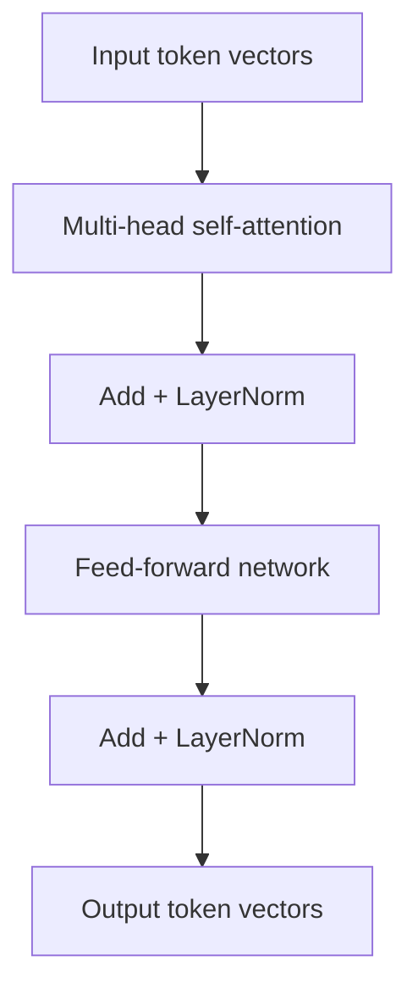
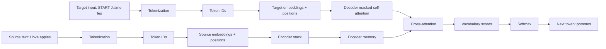
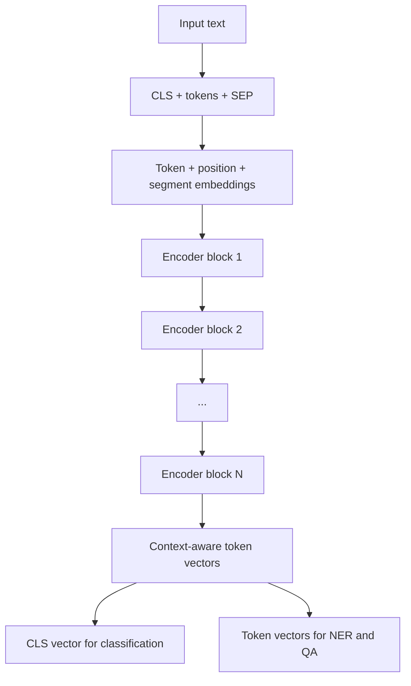
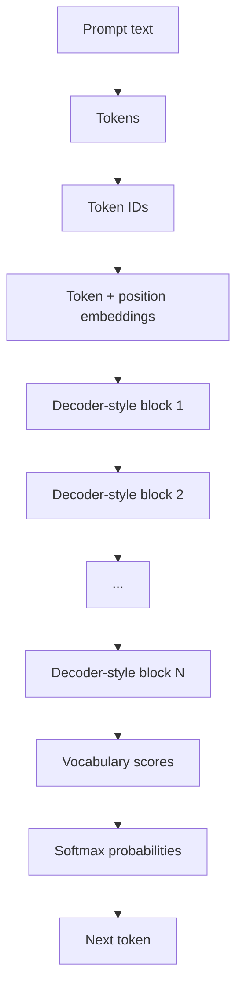

# Transformer Architectures: BERT vs GPT

## Complete Learning Notes

---

## 1. What Is A Transformer?

A Transformer is a neural network architecture built around attention.

Before Transformers, many sequence models processed tokens one by one.
Transformers process all tokens in parallel and use attention to decide which tokens should influence each other.

Core idea:

```text
Transformer = embeddings + positional information + attention blocks
```

The main job of a Transformer is:

```text
Convert plain token vectors into context-aware token vectors.
```

Example:

```text
Sentence: The movie was not good.
```

The word `"good"` alone sounds positive.

But after attention, the vector for `"good"` can include information from `"not"`.

```text
old vector: good
new vector: good + context from not
```

So the model can understand:

```text
not good = negative meaning
```

---

## 2. Transformer Family Overview

Transformer models are not all the same.

There are three major architecture styles:

| Architecture | Main Idea | Common Tasks | Example Models |
|---|---|---|---|
| Encoder-decoder | read input, then generate output | translation, summarization | original Transformer, T5, BART |
| Encoder-only | read full input deeply | classification, NER, search, extractive QA | BERT, RoBERTa, DistilBERT |
| Decoder-only | generate next token | chat, writing, coding, completion | GPT-style models |

Simple memory line:

```text
Encoder-decoder = read then write
BERT = read and understand
GPT = continue and generate
```

---

## 3. Complete Transformer Data Flow

The full data flow starts from raw text and ends with a task output.

General flow:

```text
Raw text
   |
   v
Tokenization
   |
   v
Token IDs
   |
   v
Token embeddings
   |
   v
Position embeddings
   |
   v
Transformer blocks
   |
   v
Context-aware vectors
   |
   v
Task-specific output
```

### Example

Raw text:

```text
The food was not tasty.
```

Tokens:

```text
["The", "food", "was", "not", "tasty", "."]
```

Token IDs:

```text
[101, 2034, 2001, 2025, 11937, 102]
```

Embeddings:

```text
101   -> vector for token 101
2034  -> vector for token 2034
2001  -> vector for token 2001
...
```

After Transformer blocks:

```text
The      -> context-aware vector
food     -> context-aware vector
was      -> context-aware vector
not      -> context-aware vector
tasty    -> context-aware vector containing context from "not"
.        -> context-aware vector
```

Task output:

```text
Sentiment = negative
```

---

## 4. Why Position Embeddings Are Needed

Self-attention can compare all words with all words.

But attention alone does not know order.

These two sentences use the same words:

```text
dog bites man
man bites dog
```

The meaning changes because the word order changes.

So the Transformer adds position information:

```text
input vector = token embedding + position embedding
```

Meaning:

| Part | Meaning |
|---|---|
| Token embedding | what token this is |
| Position embedding | where the token appears |

Example:

```text
Token:     The     food    was     tasty
Position:  1       2       3       4
```

Board line:

```text
Token embedding says what.
Position embedding says where.
```

---

## 5. Standard Transformer Block

A Transformer block is the repeated unit inside BERT, GPT, and encoder-decoder models.

Standard block:

```text
Input token vectors
        |
        v
Multi-head self-attention
        |
        v
Add + LayerNorm
        |
        v
Feed-forward network
        |
        v
Add + LayerNorm
        |
        v
Output token vectors
```

Mermaid diagram:



Meaning of each part:

| Component | Meaning |
|---|---|
| Self-attention | tokens exchange information |
| Multi-head attention | several attention patterns in parallel |
| Residual connection / Add | keep previous information flowing |
| LayerNorm | stabilize values during training |
| Feed-forward network | transform each token vector independently |

Example:

```text
The product is good but delivery is slow.
```

One head may focus on sentiment words:

```text
good, slow
```

Another head may focus on aspects:

```text
product, delivery
```

Another head may focus on contrast:

```text
but
```

This is why multi-head attention is powerful.

---

## 6. Attention Formula Refresher

The attention formula is:

```text
Attention(Q, K, V) = softmax((QK^T) / sqrt(d_k)) V
```

Read it as:

```text
compare -> scale -> softmax -> combine
```

Meaning:

| Formula Part | Meaning |
|---|---|
| `Q` | Query: what the current token is looking for |
| `K` | Key: what each token offers for matching |
| `QK^T` | matching scores between queries and keys |
| `d_k` | size of query/key vectors |
| `/ sqrt(d_k)` | scaling to keep scores stable |
| `softmax` | converts scores into weights |
| `V` | Value vectors that carry information |

Example:

```text
Query word: tasty
Sentence: The food was not tasty.
```

Useful context:

```text
food, not, tasty
```

`Q` and `K` decide where to look.

`V` gives the information to mix.

---

## 7. Original Encoder-Decoder Transformer

The original Transformer was designed for sequence-to-sequence tasks such as translation.

Example:

```text
English: I love apples
French:  J'aime les pommes
```

High-level flow:

```text
English input
     |
     v
Encoder
     |
     v
Encoder memory
     |
     v
Decoder
     |
     v
French output
```

Full standard diagram:

```text
SOURCE SIDE                                      TARGET SIDE

I love apples                                    [START] J'aime les
     |                                                  |
     v                                                  v
Tokenization                                      Tokenization
     |                                                  |
     v                                                  v
Token IDs                                         Token IDs
     |                                                  |
     v                                                  v
Token + position embeddings                    Token + position embeddings
     |                                                  |
     v                                                  v
+---------------------+                     +-----------------------------+
| Encoder Block 1     |                     | Decoder Block 1             |
| full self-attention |                     | masked self-attention       |
+---------------------+                     | cross-attention to encoder  |
          |                                 +-----------------------------+
          v                                               |
+---------------------+                                  v
| Encoder Block 2     |                     +-----------------------------+
| full self-attention |                     | Decoder Block 2             |
+---------------------+                     | masked self-attention       |
          |                                 | cross-attention to encoder  |
          v                                 +-----------------------------+
Encoder memory / context vectors                         |
          |                                              v
          +-----------------------------> Vocabulary scores
                                                 |
                                                 v
                                              Softmax
                                                 |
                                                 v
                                         next token: pommes
```

Mermaid diagram:



---

## 8. Encoder Data Flow

The encoder reads the input sequence.

Example:

```text
Input: The food was not tasty.
```

Encoder flow:

```text
Input tokens
   |
   v
Token IDs
   |
   v
Token embeddings + position embeddings
   |
   v
Encoder block 1
   |
   v
Encoder block 2
   |
   v
...
   |
   v
Context-aware vectors
```

Encoder self-attention is usually full attention:

```text
Every token can look at every token.
```

Example attention idea:

```text
Query word: tasty
Useful context: food, not, tasty
```

Output:

```text
The      -> context-aware vector
food     -> context-aware vector
was      -> context-aware vector
not      -> context-aware vector
tasty    -> context-aware vector
```

These vectors can be used for:

```text
classification, token labeling, search, extractive QA
```

---

## 9. Decoder Data Flow

The decoder generates output one token at a time.

Example:

```text
Prompt: The movie was not
Next token: good
```

Decoder flow:

```text
Previous tokens
   |
   v
Token IDs
   |
   v
Token embeddings + position embeddings
   |
   v
Decoder block with causal self-attention
   |
   v
Vocabulary scores
   |
   v
Softmax probabilities
   |
   v
Next token
```

The decoder uses a causal mask:

```text
          Can look at
          The  movie  was  not  good
The       yes  no     no   no   no
movie     yes  yes    no   no   no
was       yes  yes    yes  no   no
not       yes  yes    yes  yes  no
good      yes  yes    yes  yes  yes
```

Why?

```text
The model should not see future tokens while predicting the next token.
```

---

## 10. Cross-Attention In Encoder-Decoder Models

Cross-attention connects the decoder to the encoder output.

In translation:

```text
English: I love apples
French:  J'aime les pommes
```

When generating:

```text
pommes
```

the decoder should look strongly at:

```text
apples
```

Cross-attention flow:

```text
Decoder query
    |
    v
Compare with encoder keys
    |
    v
Attention weights over source tokens
    |
    v
Mix encoder values
    |
    v
Better decoder vector
    |
    v
Predict next token
```

Short line:

```text
Self-attention = look within the same sequence.
Cross-attention = look from one sequence to another sequence.
```

---

## 11. BERT Architecture

BERT stands for:

```text
Bidirectional Encoder Representations from Transformers
```

Meaning:

```text
BERT uses only the encoder side of the Transformer.
```

BERT architecture:

```text
Input text
   |
   v
[CLS] tokens [SEP]
   |
   v
Token embeddings + position embeddings + segment embeddings
   |
   v
Encoder block 1
   |
   v
Encoder block 2
   |
   v
...
   |
   v
Encoder block N
   |
   v
Context-aware token vectors
   |
   +--> [CLS] vector for sentence-level tasks
   |
   +--> token vectors for token-level tasks
```

Mermaid diagram:



BERT input example:

```text
[CLS] The food was not tasty . [SEP]
```

Embedding components:

```text
final BERT input vector =
token embedding + position embedding + segment embedding
```

| Component | Meaning |
|---|---|
| Token embedding | what token this is |
| Position embedding | where the token appears |
| Segment embedding | sentence A or sentence B |

Segment example:

```text
[CLS] Question tokens [SEP] Passage tokens [SEP]
  A       A A A        A        B B B       B
```

---

## 12. BERT Data Flow For Sentiment Classification

Task:

```text
Classify product review sentiment.
```

Example data:

| Review | Label |
|---|---|
| The delivery was late but the product quality was excellent. | positive |
| The phone battery drains quickly and the screen freezes. | negative |
| The packaging was okay and the product works as expected. | neutral |

BERT data flow:

```text
Review text
   |
   v
Tokenizer
   |
   v
[CLS] review tokens [SEP]
   |
   v
input_ids + attention_mask
   |
   v
BERT encoder stack
   |
   v
Final [CLS] vector
   |
   v
Classification layer
   |
   v
positive / neutral / negative
```

What BERT learns:

```text
"late" is negative for delivery
"excellent" is positive for product quality
"but" introduces contrast
```

The final classification depends on the whole review.

---

## 13. BERT Data Flow For Token-Level Tasks

Token-level tasks need one prediction per token.

Example:

```text
Sundar Pichai works at Google.
```

Labels:

```text
Sundar   PERSON
Pichai   PERSON
works    O
at       O
Google   ORG
.        O
```

BERT flow:

```text
Text
   |
   v
Tokenizer
   |
   v
BERT encoder
   |
   v
One vector per token
   |
   v
One label per token
```

Important difference:

```text
Classification uses [CLS].
NER uses token vectors.
```

---

## 14. BERT Training Objective

BERT is trained mainly with masked language modeling.

Example:

```text
Original: The movie was not good.
Input:    The movie was [MASK] good.
Target:   not
```

BERT can use:

```text
left context:  The movie was
right context: good
```

That is why BERT is called bidirectional.

Original BERT also used next sentence prediction:

```text
Sentence A: The student opened the notebook.
Sentence B: She started writing notes.
Label: IsNext
```

Important:

```text
The key idea for BERT is understanding full context.
```

---

## 15. GPT Architecture

GPT stands for:

```text
Generative Pre-trained Transformer
```

Meaning:

```text
GPT uses decoder-style causal self-attention.
```

GPT architecture:

```text
Prompt text
   |
   v
Tokens
   |
   v
Token IDs
   |
   v
Token embeddings + position embeddings
   |
   v
Decoder-style block 1
   |
   v
Decoder-style block 2
   |
   v
...
   |
   v
Decoder-style block N
   |
   v
Vocabulary scores
   |
   v
Softmax probabilities
   |
   v
Generated next token
```

Mermaid diagram:



Important:

```text
GPT is decoder-only,
but it usually does not use encoder-decoder cross-attention.
```

---

## 16. GPT Data Flow For Text Generation

Example:

```text
Prompt: The delivery was late but the product was
```

Data flow:

```text
Prompt
   |
   v
Tokenizer
   |
   v
Token IDs
   |
   v
GPT decoder stack
   |
   v
Next-token probabilities
   |
   v
good
```

Then:

```text
The delivery was late but the product was good
```

Now GPT predicts the next token:

```text
.
```

Generation loop:

```text
previous tokens -> predict next token -> append token -> repeat
```

---

## 17. GPT Training Objective

GPT is trained with next-token prediction.

Example:

```text
Input context              Target next token
The                        movie
The movie                  was
The movie was              not
The movie was not          good
The movie was not good     .
```

GPT learns:

```text
Given previous tokens, predict the next token.
```

This matches generation directly.

---

## 18. BERT vs GPT

| Feature | BERT | GPT |
|---|---|---|
| Architecture | Encoder-only | Decoder-only |
| Attention type | Full self-attention | Causal self-attention |
| Direction | Left + right context | Left-to-right |
| Training | Masked language modeling | Next-token prediction |
| Main strength | Understanding | Generation |
| Input style | `[CLS] text [SEP]` | prompt text |
| Output style | class, span, token label, embedding | generated text |
| Common tasks | classification, NER, QA, search | chat, writing, code, completion |

Short line:

```text
BERT creates representations.
GPT creates continuations.
```

---

## 19. BERT Variants

BERT-style models use the encoder idea, but modify training, size, speed, or attention.

| Variant | Main Idea |
|---|---|
| BERT | original encoder-only model with masked language modeling |
| RoBERTa | improves BERT training setup and removes next sentence prediction |
| DistilBERT | smaller and faster distilled version of BERT |
| ALBERT | reduces parameters using sharing and factorized embeddings |
| ELECTRA | trains by detecting replaced tokens instead of only predicting masks |
| DeBERTa | improves attention using disentangled position and content information |
| Sentence-BERT | creates sentence embeddings useful for search and similarity |

Use case examples:

```text
Fast classification -> DistilBERT
Semantic search -> Sentence-BERT
General understanding -> BERT / RoBERTa / DeBERTa
```

---

## 20. GPT Variants And Related Decoder Models

GPT-style models use decoder-only causal attention.

| Variant / Type | Main Idea |
|---|---|
| GPT-style base LM | predicts the next token |
| Instruction-tuned GPT-style model | better at following prompts and instructions |
| Chat-tuned GPT-style model | optimized for conversation |
| Code-focused decoder model | trained strongly on code data |
| Small decoder LM | lightweight generation model for limited resources |

The important architectural pattern is:

```text
decoder-only + causal mask + next-token prediction
```

Prompting example:

```text
Classify sentiment.
Text: The service was slow.
Sentiment:
```

GPT-style output:

```text
negative
```

It classifies by generating the label.

---

## 21. Encoder-Decoder Variants

Encoder-decoder models keep both sides of the original Transformer.

| Model Type | Main Idea |
|---|---|
| Original Transformer | designed for translation |
| T5-style models | convert every task into text-to-text format |
| BART-style models | encoder-decoder with denoising pretraining |

Good tasks:

```text
translation
summarization
question answering as generated text
text rewriting
```

Example:

```text
Input: summarize: The laptop is fast but battery is weak.
Output: Fast laptop with weak battery.
```

---

## 22. Which Architecture To Choose?

| Task | Better First Choice | Reason |
|---|---|---|
| Product review sentiment | BERT | needs full-text understanding |
| Named entity recognition | BERT | needs token-level labels |
| Extract answer from passage | BERT | needs start and end token positions |
| Semantic search | BERT-style encoder | needs embeddings |
| Chatbot response | GPT | needs generated response |
| Story continuation | GPT | needs next-token generation |
| Translation | Encoder-decoder | read source, generate target |
| Summarization | Encoder-decoder or GPT | depends on system design |

Modern systems often combine models:

```text
encoder retrieves useful documents
decoder generates final answer
```

---

## 23. Common Doubts

### Why not use BERT for chat?

BERT is designed to understand complete input text.

It is not naturally trained to generate long text one token at a time.

### Can GPT do classification?

Yes.

GPT can generate the class label.

```text
Prompt: Classify sentiment: The food was terrible.
Output: negative
```

### Why does GPT need a causal mask?

Because GPT predicts the next token.

If it sees future tokens, it is cheating.

### What is `[CLS]`?

`[CLS]` is a special token used in BERT.

Its final vector is often used for whole-input classification.

### What is the difference between `input_ids` and `attention_mask`?

```text
input_ids = token numbers
attention_mask = real token or padding marker
```

### Are attention weights the full explanation?

No.

They are useful to inspect, but they are only one part of the computation.

---

## 24. Final Revision

Key definitions:

| Term | Meaning |
|---|---|
| Transformer | attention-based neural architecture |
| Encoder | reads input and creates representations |
| Decoder | generates output tokens |
| Self-attention | tokens attend to tokens in same sequence |
| Cross-attention | decoder attends to encoder output |
| Causal mask | prevents looking at future tokens |
| BERT | encoder-only understanding model |
| GPT | decoder-only generation model |

Final memory lines:

```text
Original Transformer = encoder + decoder.
BERT = encoder-only, full attention, understanding.
GPT = decoder-only, causal attention, generation.
```

