# Notes: Fine-Tuning LLMs with PEFT, LoRA, and QLoRA

> Diagrams use Mermaid. If your markdown viewer does not render Mermaid, read
> the labels inside each diagram as a flowchart.

## 1. The Big Picture

Large language models are pretrained on huge general-purpose corpora. A base
model knows language, facts, reasoning patterns, and coding patterns, but it may
not know your exact task format, company style, domain vocabulary, or expected
answer structure.

Fine-tuning adapts that base model to a narrower behavior.

```text
Pretraining:
  huge data + huge compute -> general base model

Fine-tuning:
  smaller task data + fewer steps -> specialized model behavior

PEFT:
  freeze most base weights -> train only a small adapter
```

In full fine-tuning, every parameter can receive gradients. For a 7B model, that
means billions of weights, billions of gradients, and optimizer states for all
of them. With Adam, the optimizer typically stores two extra tensors per
trainable parameter, so training memory becomes much larger than inference
memory.

PEFT stands for Parameter-Efficient Fine-Tuning. It keeps most pretrained
weights frozen and trains a small number of extra parameters. LoRA is the most
common PEFT method for LLMs. QLoRA combines LoRA with 4-bit quantization so a
large model can fit on a smaller GPU.

### Diagram: From Pretraining to PEFT

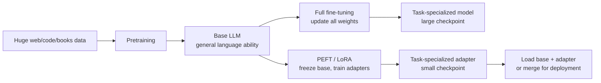

### Diagram: What Changes During Each Stage


## 2. Full Fine-Tuning vs PEFT

### Full Fine-Tuning

Full fine-tuning updates all model weights.

Advantages:

- Maximum flexibility.
- Strong when you have large high-quality data and enough compute.
- No adapter management at inference.

Disadvantages:

- Very high GPU memory requirement.
- Large checkpoints.
- Higher risk of catastrophic forgetting on small datasets.
- Expensive to repeat for many tasks.

### PEFT

PEFT updates only a small set of parameters.

Advantages:

- Much lower trainable parameter count.
- Smaller optimizer state.
- Small adapters can be shared independently of the base model.
- One base model can support many task-specific adapters.
- Usually good enough for instruction tuning and domain adaptation.

Disadvantages:

- Slightly less flexible than full fine-tuning.
- You must choose where adapters are inserted.
- Some deployment flows need adapter loading or merging.

### Diagram: Memory Components During Training

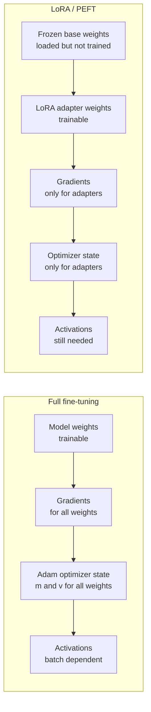

### Diagram: Full Fine-Tuning vs LoRA Update Scope

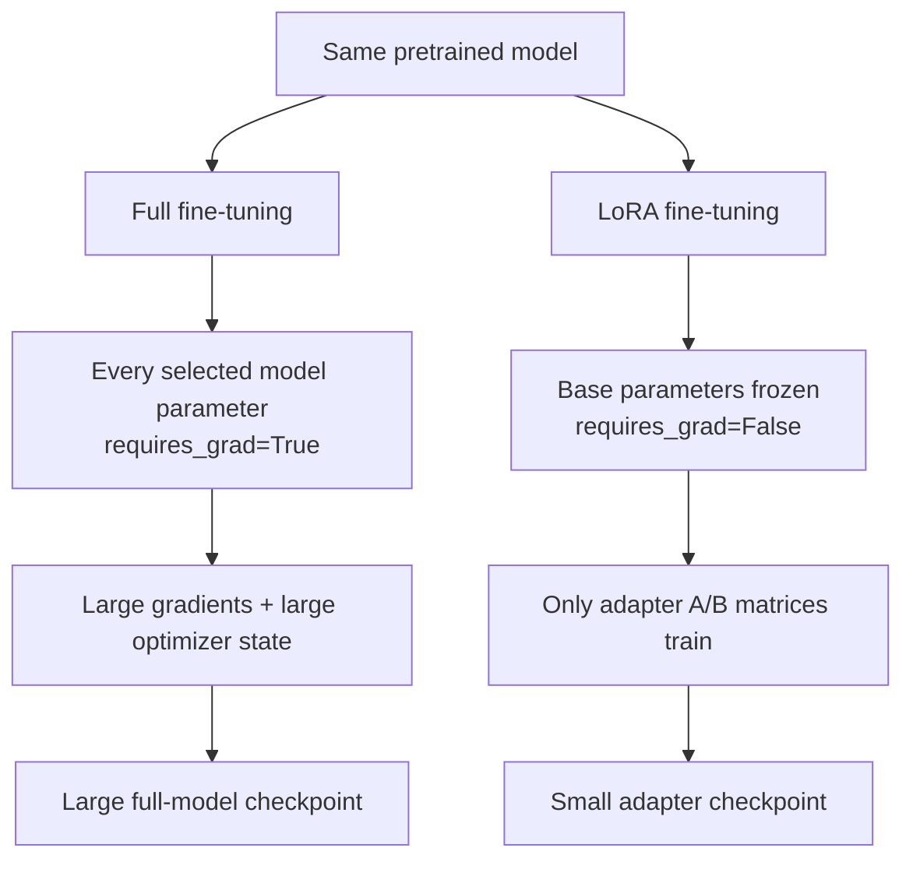

## 3. LoRA Intuition

Every linear layer has a weight matrix `W`. During full fine-tuning, training
learns a changed matrix:

```text
W_new = W + Delta_W
```

The key LoRA idea is that the update `Delta_W` does not need to be a full dense
matrix. It can often be approximated by two much smaller low-rank matrices:

```text
Delta_W ~= B @ A

A shape: r x d_in
B shape: d_out x r
r      : rank, where r is much smaller than d_in and d_out
```

The layer output becomes:

```text
output = W @ x + (lora_alpha / r) * B @ A @ x
```

The original `W` is frozen. Only `A` and `B` are trained.

### Diagram: LoRA Forward Pass

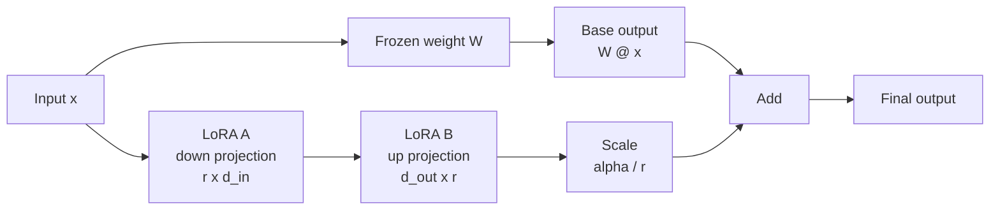

### Diagram: Full Delta vs Low-Rank Delta

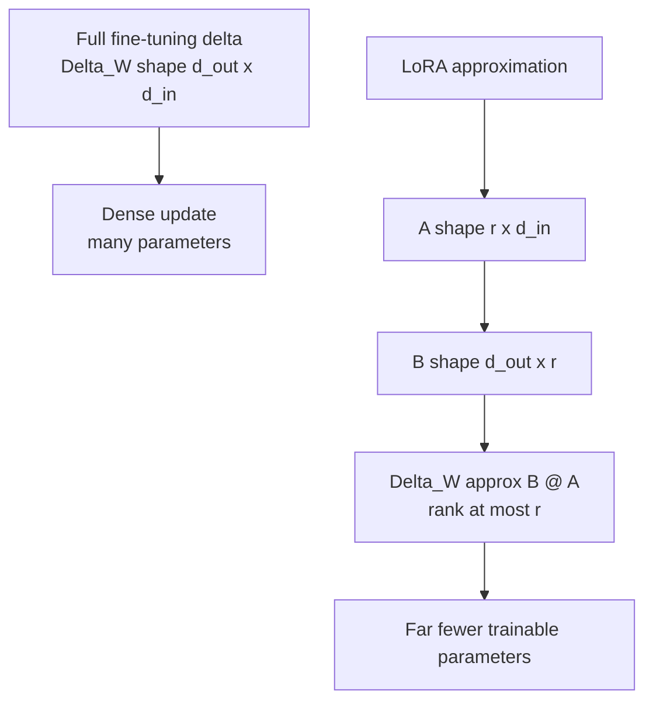

## 4. Why This Saves Parameters

Suppose a layer has:

```text
d_in = 4096
d_out = 4096
```

A full update has:

```text
4096 x 4096 = 16,777,216 parameters
```

With LoRA rank `r=16`:

```text
A = 16 x 4096  = 65,536
B = 4096 x 16  = 65,536
Total          = 131,072
```

That is about 128x fewer trainable parameters for that matrix.

Important: LoRA does not remove the base model from memory. The frozen base
weights still need to be loaded. The major training-memory savings come from
not storing gradients and optimizer states for frozen weights.

### Diagram: Parameter Count Formula

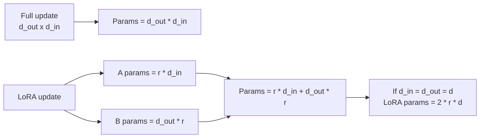

### Diagram: Example with d=4096 and r=16

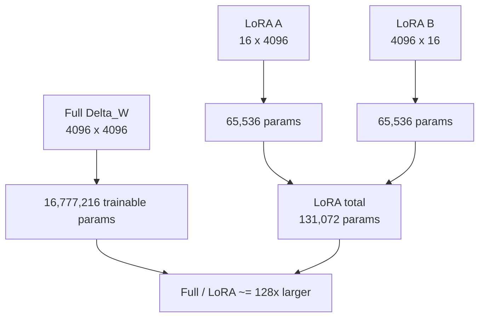

## 5. Why LoRA Starts as a No-Op

PEFT's default LoRA initialization is designed so the adapter does not change
the base model before training.

Typical default:

```text
A = small random values
B = zeros
```

Because `B` is zero:

```text
B @ A = 0
```

So at step 0:

```text
output = W @ x
```

The model starts exactly like the base model, then gradually learns the adapter
update. This is safer than randomly changing model behavior before training.

### Diagram: Default LoRA Initialization

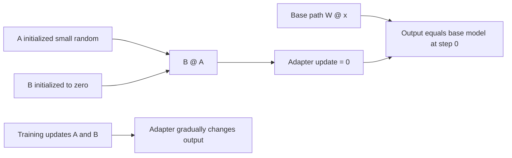

## 6. Where LoRA Is Inserted

LoRA can be inserted into linear layers. For transformer language models, common
targets are attention projections and sometimes MLP/feed-forward projections.

Typical Llama/Mistral/Qwen-style module names:

```python
target_modules=[
    "q_proj", "k_proj", "v_proj", "o_proj",
    "gate_proj", "up_proj", "down_proj",
]
```

Typical GPT-2-style names:

```python
target_modules=["c_attn", "c_proj"]
```

Practical guide:

| Target choice | Meaning | When to use |
|---|---|---|
| Query/value only | Smallest adapter, classic LoRA style | Quick experiments |
| All attention projections | More expressive | Most LLM instruction tuning |
| Attention + MLP | Highest adapter capacity | Harder domain/style adaptation |
| `all-linear` | PEFT chooses all linear/Conv1D layers except output head | Broad adaptation, more memory |

Always inspect model module names before choosing `target_modules`.

### Diagram: Transformer Block Target Modules

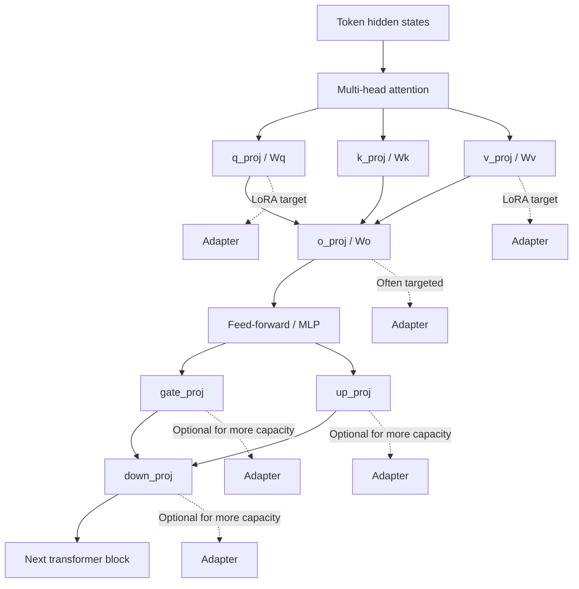

### Diagram: Architecture Names Are Different

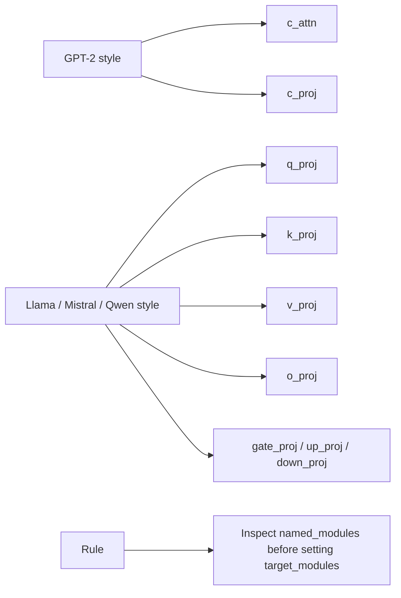

## 7. LoraConfig: Important Parameters

`LoraConfig` controls how LoRA is applied. Students should know the practical
meaning of each group.

### Core Parameters

| Parameter | What it means | Practical advice |
|---|---|---|
| `task_type` | Tells PEFT what kind of task the model is used for | Use `TaskType.CAUSAL_LM` for GPT-style LLMs |
| `r` | LoRA rank, the bottleneck dimension | Start with 8 or 16 |
| `lora_alpha` | Scaling strength for the LoRA update | Common choice: `2 * r` |
| `lora_dropout` | Dropout applied to LoRA path | Use 0.05-0.1 for small datasets, 0 for large datasets |
| `target_modules` | Which modules receive LoRA adapters | Must match model module names |
| `bias` | Whether bias terms are trainable | Usually `"none"` |

Example:

```python
from peft import LoraConfig, TaskType

lora_config = LoraConfig(
    task_type=TaskType.CAUSAL_LM,
    r=8,
    lora_alpha=16,
    target_modules=["c_attn", "c_proj"],
    lora_dropout=0.1,
    bias="none",
)
```

### Diagram: `LoraConfig` Parameter Groups

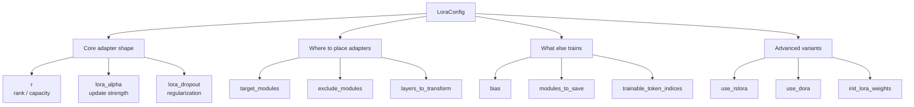

### `r`: Rank

`r` controls adapter capacity.

Low rank:

- Fewer parameters.
- Lower memory.
- Less overfitting risk.
- May underfit complex tasks.

High rank:

- More expressive.
- More trainable parameters.
- Higher adapter size.
- Better for complex style/domain changes.

Rules of thumb:

| Situation | Suggested rank |
|---|---|
| Tiny demo / CPU notebook | 4 or 8 |
| Normal instruction tuning | 8 or 16 |
| Hard domain adaptation | 32 or 64 |
| Large high-quality dataset | 64+ |

#### Diagram: Rank Trade-Off

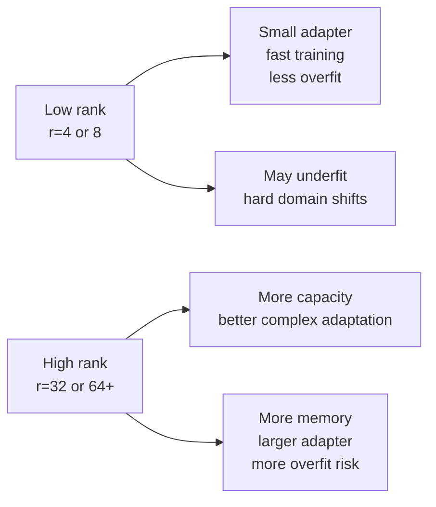

### `lora_alpha`: Scaling

The LoRA update is scaled by:

```text
lora_alpha / r
```

If `r=8` and `lora_alpha=16`, scale is `2.0`.

Higher alpha makes the adapter update stronger. Too high can make training
unstable or overwrite base behavior. Too low can make the adapter learn too
slowly.

Common choices:

```python
r=8,  lora_alpha=16
r=16, lora_alpha=32
r=64, lora_alpha=128
```

#### Diagram: Alpha as Adapter Volume

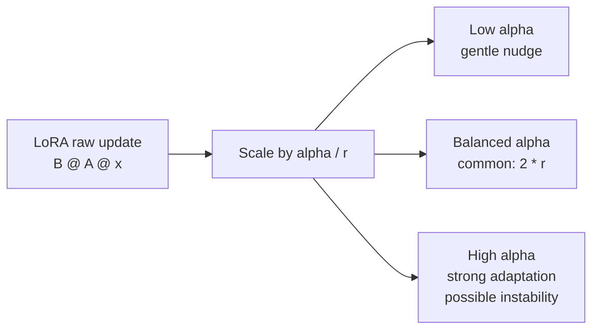

### `lora_dropout`

Dropout regularizes the adapter path.

Use:

- `0.05` or `0.1` for small datasets.
- `0.0` for large datasets or when you need maximum capacity.
- Higher dropout if the model memorizes examples.

### `target_modules`

This is one of the most important settings. If module names are wrong, PEFT may
raise an error or adapters may be applied somewhere unintended.

How to inspect module names:

```python
for name, module in model.named_modules():
    if "Linear" in module.__class__.__name__ or "Conv1D" in module.__class__.__name__:
        print(name, module.__class__.__name__)
```

Shortcut:

```python
target_modules="all-linear"
```

This is convenient, but students should still understand which layers are being
changed.

### `bias`

Options:

| Value | Meaning |
|---|---|
| `"none"` | Train no bias terms. Most common. |
| `"all"` | Train all bias terms in targeted modules. |
| `"lora_only"` | Train only bias terms associated with LoRA layers. |

Warning: if bias terms are trained, disabling adapters may not restore exactly
the original base model behavior.

## 8. More LoraConfig Parameters Students Should Recognize

Some parameters are not needed in the first notebook run, but students should
know what they are.

| Parameter | Meaning | When it matters |
|---|---|---|
| `exclude_modules` | Modules to avoid adapting | Avoid output heads or fragile layers |
| `fan_in_fan_out` | Handles layers that store weights as `(fan_in, fan_out)` | GPT-2 Conv1D often needs this internally |
| `modules_to_save` | Extra modules to train/save with adapter | Classification heads, new LM heads |
| `layers_to_transform` | Apply LoRA only to selected layer indices | Save memory or adapt only upper layers |
| `layers_pattern` | Name pattern for locating layer stacks | Custom architectures |
| `rank_pattern` | Different rank per module/layer | Give hard layers more capacity |
| `alpha_pattern` | Different alpha per module/layer | Tune update strength locally |
| `init_lora_weights` | Adapter initialization strategy | Default, PiSSA, EVA, LoftQ, etc. |
| `use_rslora` | Use rank-stabilized scaling | Useful for high ranks |
| `use_dora` | Use DoRA weight decomposition | Better quality at low rank, extra overhead |
| `trainable_token_indices` | Fine-tune selected embedding rows | Add new tokens cheaply |
| `target_parameters` | Apply LoRA to parameters instead of modules | Useful for some MoE layers |
| `layer_replication` | Build repeated layer stacks with separate adapters | Model expansion research/advanced use |
| `runtime_config` | Runtime-only LoRA settings | Not usually saved |
| `lora_bias` | Add bias to LoRA B branch | Specialized cases, usually false |
| `ensure_weight_tying` | Preserve tied weights after adapter changes | Models with tied embeddings/LM head |

Advanced initialization/config objects:

| Parameter | Purpose |
|---|---|
| `loftq_config` | LoftQ initialization/quantization setup |
| `eva_config` | EVA data-driven initialization setup |
| `corda_config` | CorDA initialization setup |
| `lora_ga_config` | LoRA-GA gradient-based initialization |
| `arrow_config` | Arrow-related adapter configuration |
| `use_bdlora` | Bounded/dynamic LoRA style configuration |

The exact available parameters depend on your installed `peft` version. Always
check the local documentation for the version used in class.

### Diagram: Choosing Advanced `LoraConfig` Features

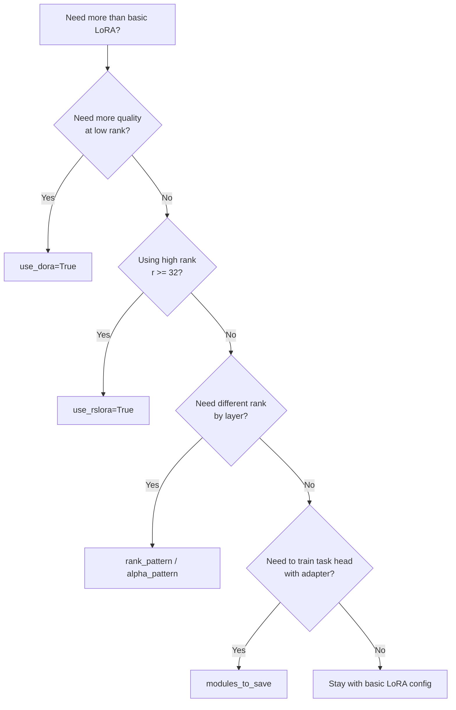

## 9. Initialization Options

Initialization controls how LoRA matrices start before training.

| Option | Meaning |
|---|---|
| `True` | Default. A initialized, B zero, adapter starts as no-op. |
| `False` | Random A and B. Not a no-op; mainly for debugging. |
| `"gaussian"` | Gaussian A, B zero. |
| `"pissa"` | SVD-based PiSSA initialization. Faster convergence in many cases. |
| `"pissa_niter_16"` | Fast iterative PiSSA approximation. |
| `"loftq"` | Initialization for quantization-aware LoftQ flow. |
| `"eva"` | Data-driven EVA initialization. |
| `"olora"` | OLoRA initialization. |
| `"corda"` | CorDA initialization. |
| `"orthogonal"` | Orthogonal A/B initialization for supported linear layers. |

For a first LoRA class, use the default. Introduce PiSSA/LoftQ only after
students understand normal LoRA.

### Diagram: Initialization Choices

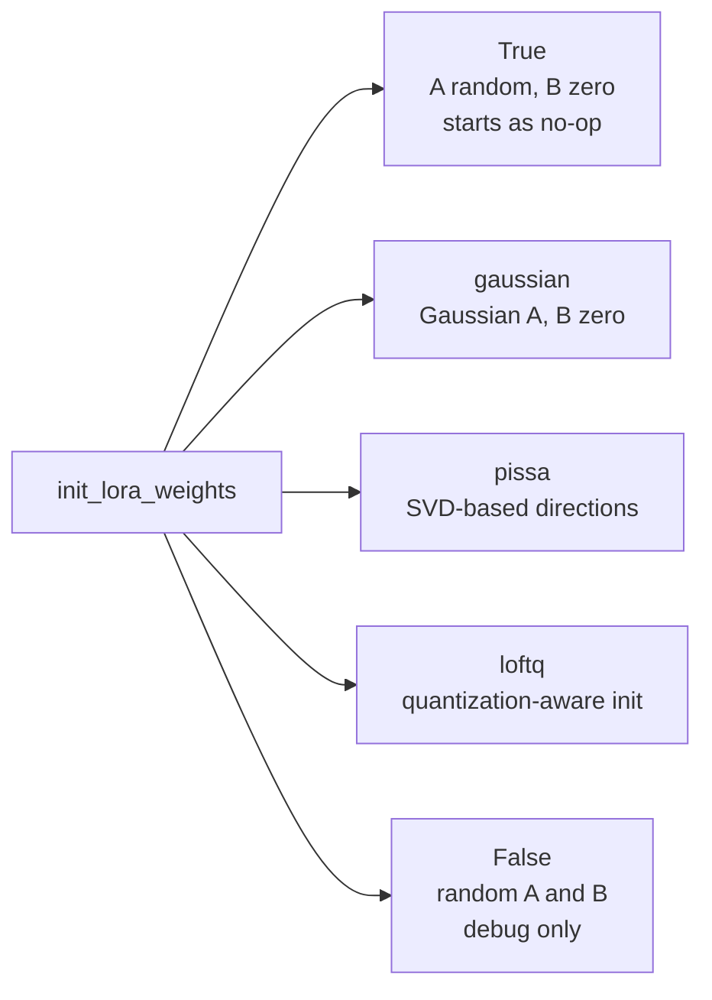

## 10. QLoRA

LoRA reduces trainable parameters, but the base model still has to be loaded.
For a 7B model:

```text
FP16 base weights ~= 14 GB
```

That may still be too large for many GPUs once activations and training buffers
are included.

QLoRA solves this by loading the frozen base model in 4-bit precision and
training LoRA adapters on top.

```text
QLoRA = 4-bit quantized base model + trainable LoRA adapters
```

Common QLoRA pattern:

```python
from transformers import BitsAndBytesConfig
from peft import prepare_model_for_kbit_training

bnb_config = BitsAndBytesConfig(
    load_in_4bit=True,
    bnb_4bit_quant_type="nf4",
    bnb_4bit_compute_dtype=torch.bfloat16,
    bnb_4bit_use_double_quant=True,
)

model = AutoModelForCausalLM.from_pretrained(
    model_id,
    quantization_config=bnb_config,
    device_map="auto",
)

model = prepare_model_for_kbit_training(model)
model = get_peft_model(model, lora_config)
```

### QLoRA Parameters

| Parameter | Meaning |
|---|---|
| `load_in_4bit=True` | Load base model weights in 4-bit. |
| `bnb_4bit_quant_type="nf4"` | Use NormalFloat4, usually better for normally distributed weights. |
| `bnb_4bit_compute_dtype=torch.bfloat16` | Compute in BF16 while storing weights in 4-bit. |
| `bnb_4bit_use_double_quant=True` | Quantize quantization constants too, saving extra memory. |
| `device_map="auto"` | Let Accelerate place model layers on available devices. |
| `prepare_model_for_kbit_training` | Prepares norms/checkpointing/etc. for stable k-bit training. |

QLoRA is mainly a GPU workflow. It usually requires CUDA and `bitsandbytes`.
Students on CPU should read the code and run the LoRA section only.

### Diagram: QLoRA Pipeline

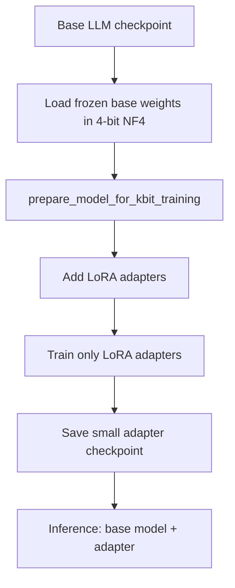

### Diagram: LoRA vs QLoRA Memory Idea

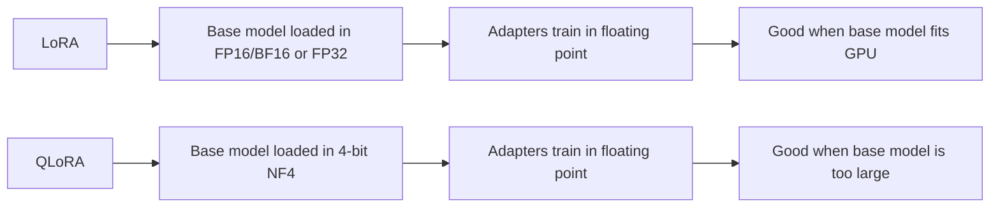

## 11. TrainingArguments: Why Each Setting Matters

LoRA uses the same Trainer API as ordinary fine-tuning. The difference is that
only adapter parameters have `requires_grad=True`.

Important settings:

| Parameter | Meaning | Practical note |
|---|---|---|
| `num_train_epochs` | How many passes through data | Tiny datasets need more epochs; real datasets usually fewer |
| `per_device_train_batch_size` | Batch size per GPU/CPU | Lower this if memory fails |
| `gradient_accumulation_steps` | Accumulate gradients across mini-batches | Effective batch = batch size x accumulation |
| `learning_rate` | Update step size | LoRA often uses `1e-4` to `3e-4` |
| `warmup_steps` or `warmup_ratio` | Gradually ramp up LR | Helps stability |
| `weight_decay` | Regularization | Small values like `0.01` are common |
| `fp16` / `bf16` | Mixed precision training | Use on compatible GPUs |
| `optim` | Optimizer choice | QLoRA often uses paged optimizers |
| `max_grad_norm` | Gradient clipping | Useful for QLoRA stability |
| `report_to` | Logging integrations | Use `"none"` for classroom demos |
| `save_strategy` | Checkpoint frequency | Use `"no"` for quick demos |

### Diagram: LoRA Training Loop

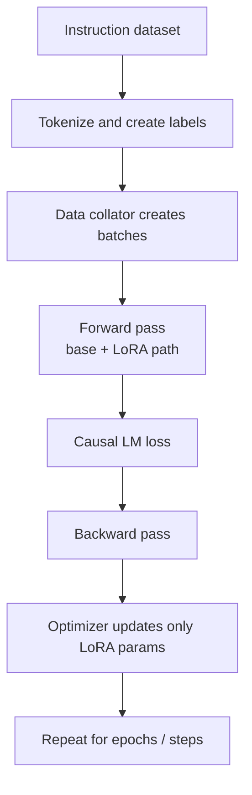

### Diagram: Effective Batch Size

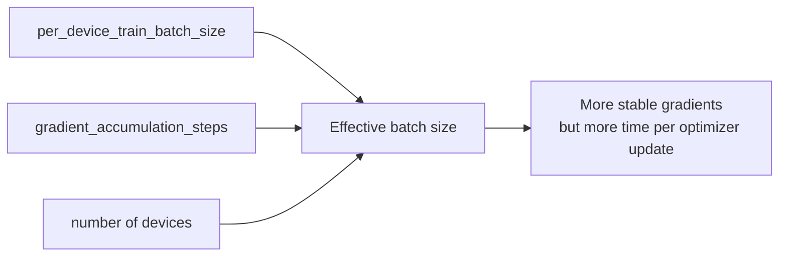

## 12. Saving, Loading, and Merging

### Save only adapter

```python
peft_model.save_pretrained("./lora_adapter")
tokenizer.save_pretrained("./lora_adapter")
```

This saves the small adapter, not the full base model.

### Load adapter

```python
base = AutoModelForCausalLM.from_pretrained(model_id)
model = PeftModel.from_pretrained(base, "./lora_adapter")
```

### Merge for deployment

```python
merged_model = model.merge_and_unload()
```

Merging combines LoRA weights into the base model weights. After merging, the
model can run like a normal model without separately loading the adapter.

Do not merge if you want to switch adapters dynamically.

### Diagram: Adapter Save, Load, and Merge

```mermaid
flowchart TB
    Train["Train PEFT model"] --> Save["save_pretrained(adapter_dir)"]
    Save --> Adapter["Small adapter files"]
    Base["Same base model checkpoint"] --> Load["PeftModel.from_pretrained(base, adapter_dir)"]
    Adapter --> Load
    Load --> Dynamic["Dynamic inference<br/>base + adapter"]
    Load --> Merge["merge_and_unload()"]
    Merge --> Standalone["Standalone merged model<br/>no separate adapter at inference"]
```

### Diagram: Many Adapters on One Base Model

```mermaid
flowchart LR
    Base["One frozen base model"] --> A1["Support adapter"]
    Base --> A2["Legal adapter"]
    Base --> A3["Coding adapter"]
    Base --> A4["Medical adapter"]
    A1 --> Serve["Choose adapter per task"]
    A2 --> Serve
    A3 --> Serve
    A4 --> Serve
```

## 13. LoRA Variants

### rsLoRA

Normal LoRA scaling:

```text
lora_alpha / r
```

rsLoRA scaling:

```text
lora_alpha / sqrt(r)
```

Why it matters: at high rank, `alpha/r` can shrink the update too much. rsLoRA
keeps high-rank adapters better scaled.

Use:

```python
LoraConfig(..., use_rslora=True)
```

### DoRA

DoRA decomposes weight updates into direction and magnitude. Normal LoRA handles
direction; DoRA adds learnable magnitude parameters.

Use:

```python
LoraConfig(..., use_dora=True)
```

Good for:

- Low-rank adapters.
- Quality-sensitive fine-tuning.

Tradeoff:

- More overhead than plain LoRA.
- Merge for inference when possible.

### AdaLoRA

AdaLoRA does not use the same rank everywhere. It dynamically reallocates rank
budget toward more important layers.

Good for:

- Fixed parameter budget.
- Research/advanced training loops.

Important: AdaLoRA may require training-loop hooks such as updating allocation
during training.

### PiSSA

PiSSA initializes adapters from principal singular vectors of existing weights.
It can converge faster than random/default initialization.

Use:

```python
LoraConfig(..., init_lora_weights="pissa")
```

### LoRA+

LoRA+ gives A and B different learning rates, commonly with B learning faster.
This is an optimizer setup, not just a `LoraConfig` flag.

### Diagram: LoRA Variant Map

```mermaid
flowchart TB
    L["Plain LoRA<br/>baseline"] --> RS["rsLoRA<br/>better high-rank scaling"]
    L --> D["DoRA<br/>direction + magnitude"]
    L --> P["PiSSA<br/>SVD-based initialization"]
    L --> A["AdaLoRA<br/>adaptive rank budget"]
    L --> LP["LoRA+<br/>different LR for A and B"]
    L --> Q["QLoRA<br/>4-bit base + LoRA"]
    Q --> QD["QDoRA<br/>4-bit base + DoRA"]
```

### Diagram: Which Variant Should I Try?

```mermaid
flowchart TB
    Start["Start with plain LoRA"] --> NeedMem{"Base model does not fit GPU?"}
    NeedMem -- "Yes" --> Q["Use QLoRA"]
    NeedMem -- "No" --> Quality{"Need better quality at low rank?"}
    Quality -- "Yes" --> D["Try DoRA"]
    Quality -- "No" --> HighRank{"Using r >= 32?"}
    HighRank -- "Yes" --> RS["Enable rsLoRA"]
    HighRank -- "No" --> Fast{"Need faster convergence?"}
    Fast -- "Yes" --> P["Try PiSSA init"]
    Fast -- "No" --> Base["Stay with LoRA baseline"]
```

## 14. Common Mistakes

### Mistake 1: Wrong `target_modules`

Symptom:

```text
ValueError: Target modules not found
```

Fix: print `model.named_modules()` and use module names that actually exist.

### Mistake 2: Expecting LoRA to shrink inference memory

LoRA reduces training memory, not the base model size. For smaller inference
memory, use quantization or a smaller base model.

### Mistake 3: Too much rank on tiny data

High rank on a tiny dataset can overfit. Start small.

### Mistake 4: Forgetting `prepare_model_for_kbit_training`

For QLoRA, prepare the model before adding LoRA.

### Mistake 5: Saving only the adapter, then loading without the base model

The adapter is not a complete standalone model. Load the same compatible base
model first, then attach the adapter.

## 15. What Students Should Be Able To Explain

After this module, students should answer:

1. Why full fine-tuning requires more memory than inference.
2. What `Delta_W ~= B @ A` means.
3. Why `r` controls trainable parameter count.
4. Why `lora_alpha` changes update strength.
5. Why `target_modules` must match architecture-specific names.
6. Why LoRA starts as a no-op.
7. How QLoRA differs from LoRA.
8. What `prepare_model_for_kbit_training` does conceptually.
9. Why adapters are easy to share.
10. When to merge adapters before deployment.

## 16. Minimal LoRA Code Skeleton

```python
from transformers import AutoModelForCausalLM, AutoTokenizer, TrainingArguments, Trainer
from peft import LoraConfig, TaskType, get_peft_model

model_id = "distilgpt2"
tokenizer = AutoTokenizer.from_pretrained(model_id)
tokenizer.pad_token = tokenizer.eos_token

base_model = AutoModelForCausalLM.from_pretrained(model_id)

peft_config = LoraConfig(
    task_type=TaskType.CAUSAL_LM,
    r=8,
    lora_alpha=16,
    target_modules=["c_attn", "c_proj"],
    lora_dropout=0.1,
    bias="none",
)

model = get_peft_model(base_model, peft_config)
model.print_trainable_parameters()

training_args = TrainingArguments(
    output_dir="./lora_demo",
    num_train_epochs=3,
    per_device_train_batch_size=2,
    gradient_accumulation_steps=2,
    learning_rate=3e-4,
    report_to="none",
)

trainer = Trainer(
    model=model,
    args=training_args,
    train_dataset=tokenized_dataset,
    data_collator=data_collator,
)

trainer.train()
model.save_pretrained("./lora_adapter")
```

## 17. Quick Decision Guide

| Your situation | Recommended approach |
|---|---|
| CPU-only classroom demo | Small model + LoRA |
| 8 GB CUDA GPU | QLoRA with 7B if dependencies work, otherwise small LoRA |
| 16-24 GB CUDA GPU | LoRA or QLoRA on 7B/8B |
| Highest quality and large budget | Full fine-tuning or high-rank LoRA/DoRA |
| Many clients/tasks | One base model + many LoRA adapters |
| Need dynamic adapter switching | Do not merge adapters |
| Need fastest single-task inference | Merge adapter into base model |

### Diagram: Method Decision Guide

```mermaid
flowchart TB
    Start["Choose fine-tuning strategy"] --> VRAM{"GPU memory available?"}
    VRAM -- "80GB+ / multi GPU" --> Full["Full fine-tuning<br/>if you need max flexibility"]
    VRAM -- "16-24GB" --> LoRA["LoRA or DoRA<br/>7B/8B model"]
    VRAM -- "8-12GB CUDA" --> QLoRA["QLoRA<br/>4-bit base + adapters"]
    VRAM -- "CPU only" --> Small["Small model LoRA demo<br/>or use cloud GPU"]
    LoRA --> Data{"Tiny dataset?"}
    Data -- "Yes" --> LowRank["Use low rank + dropout"]
    Data -- "No" --> HigherRank["Try higher rank / more target modules"]
```

## 18. References

- Hugging Face PEFT LoRA package reference:
  https://huggingface.co/docs/peft/package_reference/lora
- Hugging Face PEFT LoRA conceptual guide:
  https://huggingface.co/docs/peft/main/en/conceptual_guides/lora
- Hugging Face LoRA task guide:
  https://huggingface.co/docs/peft/en/task_guides/lora_based_methods
- Original LoRA paper:
  https://arxiv.org/abs/2106.09685
- QLoRA paper:
  https://arxiv.org/abs/2305.14314
